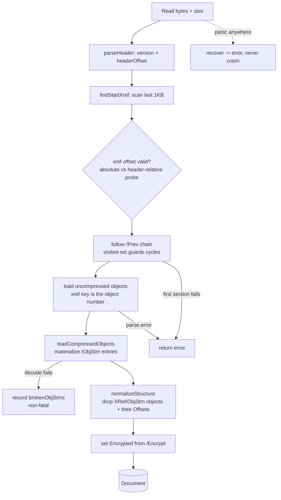
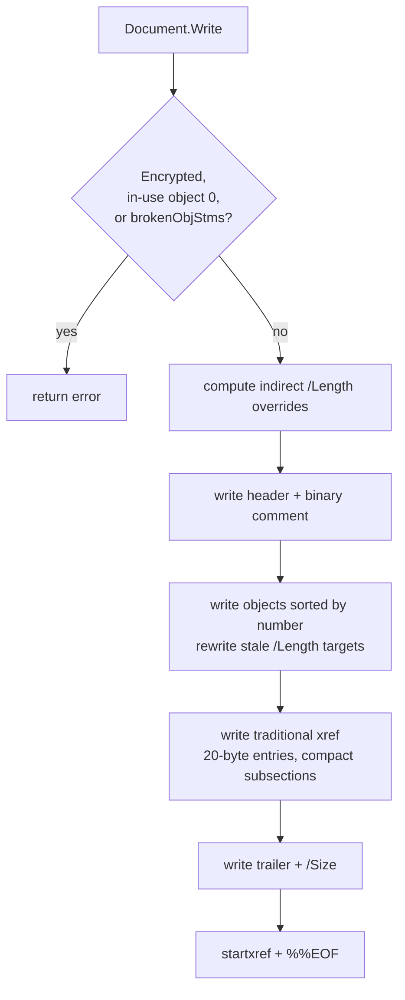
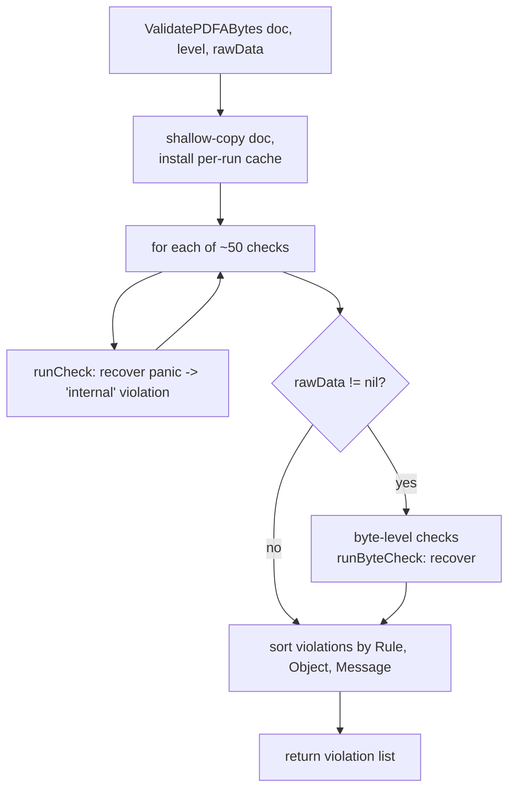

# Architecture

How bytes flow through pdf0. This is the map to read before changing the parser,
serializer, or validator. For the public API surface, see the package godoc; for
the file-by-file layout, see the table in the [README](../README.md#layout).

pdf0 has three pipelines — **Read** (bytes → object model), **Write** (object
model → bytes), and **Validate** (object model → PDF/A violations) — over one
shared, typed object model.

## The object model

Every PDF value implements the `Object` interface (`object.go`): `Boolean`,
`Integer`, `Real`, `String`, `Name`, `Array`, `Dictionary`, `Stream`, `Null`,
`IndirectObject`, `IndirectRef`. A `Document` holds `Objects` (object number →
`IndirectObject`), the `Trailer` dictionary, and — after `Read` — `Offsets`
(object number → absolute byte offset, used by the byte-level validation rules).
`Dictionary` uses parallel `Keys`/`Values` slices to preserve key order for
faithful round-tripping.

## Read

`Read` (`document.go`) slurps the file and rebuilds the object model. It recovers
from common malformations and, by design, **never panics** — any panic escaping
the parse is recovered and returned as an error.

**Recovery model.** Some defects are *soft* (recovered, the document still
parses): a wrong or wrong-typed stream `/Length` falls back to searching for
`endstream`; an offset-shifted cross-reference is probed absolute-vs-header-
relative; an undecodable object stream is recorded in `brokenObjStms` and its
objects are simply absent. Others are *hard* (abort `Read` with an error): a
parse failure on an uncompressed object, or a broken newest cross-reference
section. This split lets the PDF/A validator *report* a malformation instead of
failing to open the file.

## Write

`Document.Write` (`document.go`) regenerates a clean file. It refuses documents
it cannot faithfully serialize, and it rewrites cross-reference-stream inputs as
a traditional table.

`Write` is idempotent: `Read → Write → Read → Write` produces byte-identical
output (guarded by `TestWriteIsIdempotent`).

## Validate

`ValidatePDFABytes` (`pdfa.go`) runs a fixed list of ~50 check functions, then —
if raw bytes are supplied — the byte-level file-structure checks. Each check runs
behind a `recover()` boundary so a bug or an adversarial structure in one check
cannot crash the caller. Validation runs against a shallow copy of the
`Document`, so it never mutates the caller's document and is safe to run
concurrently on the same document.

`ValidatePDFA(doc, level)` is `ValidatePDFABytes(doc, level, nil)`: it skips the
byte-level rules because they need the file bytes.

**Executed-content model.** Many PDF/A rules apply only to content that is
actually *used*, not merely present. Colour spaces, fonts, and ExtGState
parameters are checked when a page (or a form XObject / pattern / Type3 glyph it
invokes) actually references them — see `walkExecutedContent` and
`collectFontTextUsage`. A form XObject that is never drawn does not trigger
font-embedding or colour rules. This mirrors what a conformance checker like
veraPDF does and is why the corpus is the oracle for rule semantics (see
[CONTRIBUTING](../CONTRIBUTING.md)).

## Where the rules live

The validation checks are spread across files by concern, all dispatched from the
`checks` slice in `ValidatePDFABytes`:

| File | Rules |
|------|-------|
| `pdfa.go` | Dispatch + most rules (fonts-embedding, colour, metadata, annotations, output intents, transparency) |
| `final_rules.go` | Catalog prohibitions, trigger events, halftones, inherited XObjects |
| `content_operators.go` | Content-stream operator whitelist, named resources |
| `filestructure.go` | Byte-level structure rules over the raw file (`Document.Offsets`) |
| `fonts.go` / `fontprog.go` | Font-dictionary rules; sfnt/CFF/Type1 program parsing |
| `xmp.go` / `xmp_schemas.go` | XMP metadata parsing and schema validation |
