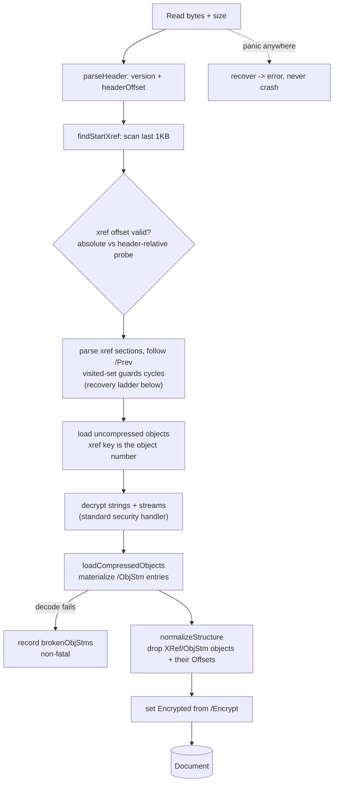
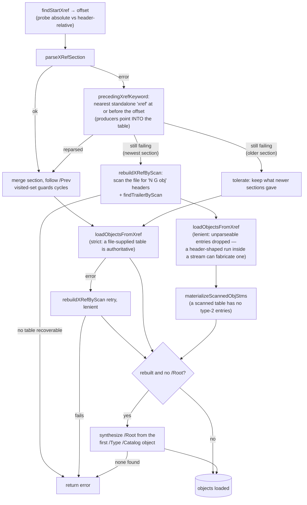
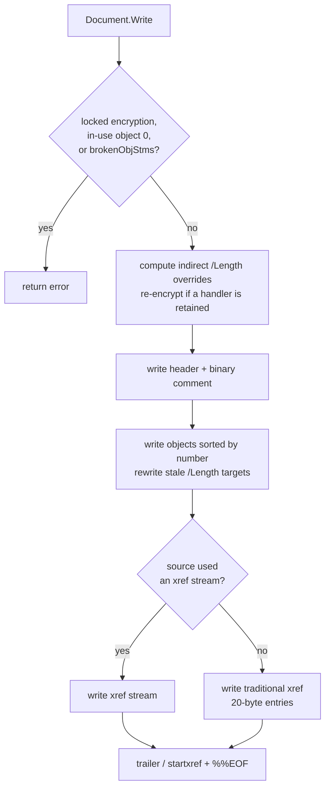

# Architecture

How bytes flow through pdf0's core: **Read** (bytes → object model) and **Write**
(object model → bytes), over one shared, typed object model. Read this before
changing the parser or serializer. For the public API surface, see the package
godoc.

Each subsystem built on that core has its own map:

| Subsystem | Doc |
|-----------|-----|
| The validator family (PDF/A, PDF/UA, PDF/X, PDF/VT, PDF/R, DPart, Factur-X) | [validators.md](validators.md) |
| Signing, verification, PAdES, timestamps, revocation | [signing.md](signing.md) |
| Image extraction and the codec stack | [images.md](images.md) |
| The `pdf0` command-line tool | [cli.md](cli.md) |
| Test data, oracles, fuzzing and CI | [testing.md](testing.md) |
| Symptom-first troubleshooting | [troubleshooting.md](troubleshooting.md) |
| Decisions that keep coming up | [adr/](adr/README.md) |

## The object model

Every PDF value implements the `Object` interface (`object.go`): `Boolean`,
`Integer`, `Real`, `String`, `Name`, `Array`, `Dictionary`, `Stream`, `Null`,
`IndirectObject`, `IndirectRef`. A `Document` holds `Objects` (object number →
`IndirectObject`), the `Trailer` dictionary, and — after `Read` — `Offsets`
(object number → absolute byte offset, used by the byte-level validation rules).
`Dictionary` uses parallel `Keys`/`Values` slices to preserve key order for
faithful round-tripping, with a lazy name→slot index above 64 keys — see
[ADR 0005](adr/0005-parallel-slice-dictionary.md).

## Read

`Read` (`document.go`) slurps the file and rebuilds the object model. It recovers
aggressively from malformed files and, by design, **never panics** — any panic
escaping the parse is recovered and returned as an error.

```mermaid
flowchart TD
    A[Read bytes + size] --> B[parseHeader: version + headerOffset]
    B --> C[findStartXref: scan last 1KB]
    C --> D{xref offset valid?<br/>absolute vs header-relative probe}
    D --> E["parse xref sections, follow /Prev<br/>visited-set guards cycles<br/>(recovery ladder below)"]
    E --> F[load uncompressed objects<br/>xref key is the object number]
    F --> G["decrypt strings + streams<br/>(standard security handler)"]
    G --> H[loadCompressedObjects<br/>materialize /ObjStm entries]
    H -->|decode fails| H2[record brokenObjStms<br/>non-fatal]
    H --> I[normalizeStructure<br/>drop XRef/ObjStm objects + their Offsets]
    I --> J[set Encrypted from /Encrypt]
    J --> K[(Document)]
    A -.panic anywhere.-> R[recover -> error, never crash]
```

**Decryption runs before object streams are materialized**, and the order is
load-bearing: an `/ObjStm` container is itself an encrypted stream, but the
objects stored inside it are *not* separately encrypted. Materializing first
would decrypt the inner objects a second time and corrupt them.

### The recovery ladder

Most defects are recovered rather than fatal. A wrong or wrong-typed stream
`/Length` falls back to searching for `endstream`; an offset-shifted
cross-reference is probed absolute-vs-header-relative; an undecodable object
stream is recorded in `brokenObjStms` and its objects are simply absent.

The cross-reference table has the deepest recovery, because a damaged xref is the
most common way a real-world file is broken. `Read` escalates through a ladder
and only fails when every rung is exhausted:

```mermaid
flowchart TD
    ST["findStartXref → offset<br/>(probe absolute vs header-relative)"] --> PS[parseXRefSection]
    PS -->|ok| MERGE["merge section, follow /Prev<br/>visited-set guards cycles"]
    PS -->|error| PK["precedingXrefKeyword:<br/>nearest standalone 'xref' at or before the offset<br/>(producers point INTO the table)"]
    PK -->|reparsed| MERGE
    PK -->|"still failing<br/>(older section)"| TOL[tolerate: keep what newer sections gave]
    PK -->|"still failing<br/>(newest section)"| RB["rebuildXRefByScan:<br/>scan the file for 'N G obj' headers<br/>+ findTrailerByScan"]
    RB -->|no table recoverable| ERR[return error]

    MERGE --> LOAD["loadObjectsFromXref<br/>(strict: a file-supplied table is authoritative)"]
    TOL --> LOAD
    RB --> LOADL["loadObjectsFromXref<br/>(lenient: unparseable entries dropped —<br/>a header-shaped run inside a stream can fabricate one)"]

    LOAD -->|error| RB2[rebuildXRefByScan retry, lenient]
    RB2 -->|fails| ERR
    RB2 --> ROOT
    LOAD --> ROOT
    LOADL --> OBJSTM["materializeScannedObjStms<br/>(a scanned table has no type-2 entries)"]
    OBJSTM --> ROOT{rebuilt and no /Root?}

    ROOT -->|yes| SYN["synthesize /Root from the<br/>first /Type /Catalog object"]
    SYN -->|none found| ERR
    ROOT -->|no| OK[(objects loaded)]
    SYN --> OK
```

**What is actually fatal.** `Read` returns an error only when: the header or
`startxref` cannot be found at all; the newest cross-reference section fails to
parse *and* a full rebuild by scanning finds no usable table; a rebuilt document
contains no `/Type /Catalog` to synthesize `/Root` from; or the input is short
(a truncated read would otherwise look like trailing whitespace). A parse failure
on an individual uncompressed object is fatal only for a table the file itself
supplied — it triggers the scan-rebuild first.

This depth is deliberate: it lets the PDF/A validator *report* a malformation
instead of failing to open the file. A validator that cannot read a broken file
cannot tell you why it is broken.

## Write

`Document.Write` (`document.go`) regenerates a clean file. It refuses documents
it cannot faithfully serialize, re-encrypts a document decrypted on Read (and
writes a still-locked one back verbatim), and regenerates the cross-reference
section in the same form the source used — a cross-reference stream, or a
traditional table.

```mermaid
flowchart TD
    A[Document.Write] --> B{locked encryption,<br/>in-use object 0,<br/>or brokenObjStms?}
    B -->|yes| X[return error]
    B -->|no| C[compute indirect /Length overrides<br/>re-encrypt if a handler is retained]
    C --> D[write header + binary comment]
    D --> E[write objects sorted by number<br/>rewrite stale /Length targets]
    E --> F{source used<br/>an xref stream?}
    F -->|yes| G1[write xref stream]
    F -->|no| G2[write traditional xref<br/>20-byte entries]
    G1 --> H[trailer / startxref + %%EOF]
    G2 --> H
```

`Write` is idempotent: `Read → Write → Read → Write` produces byte-identical
output (guarded by `TestWriteIsIdempotent`).

`Write` regenerates rather than preserves the on-disk layout. The object model
round-trips exactly, but object order and which objects share an `/ObjStm` are
regenerated. To amend a file without rewriting it, use `WriteIncremental`
(`incremental.go`), which appends a new section listing only the changed object
numbers and leaves the original bytes untouched — this is what signature
workflows require, since rewriting would break every existing signature.

## Validate

Validation reads the object model and reports findings; it never mutates the
document. Ten standards are supported and the PDF/A engine has its own dispatch,
executed-content model and rule-file map — all of that lives in
[validators.md](validators.md).
