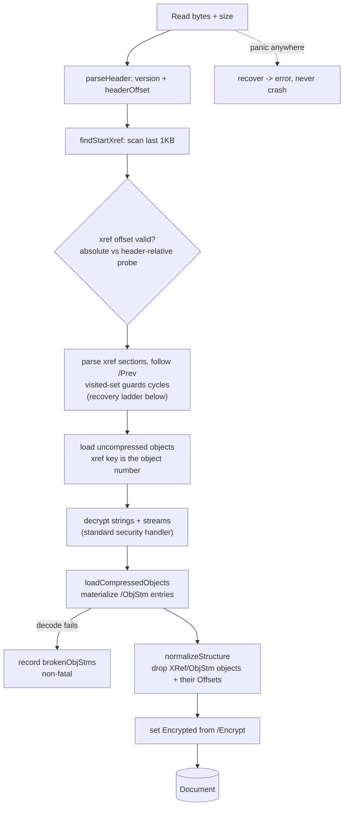
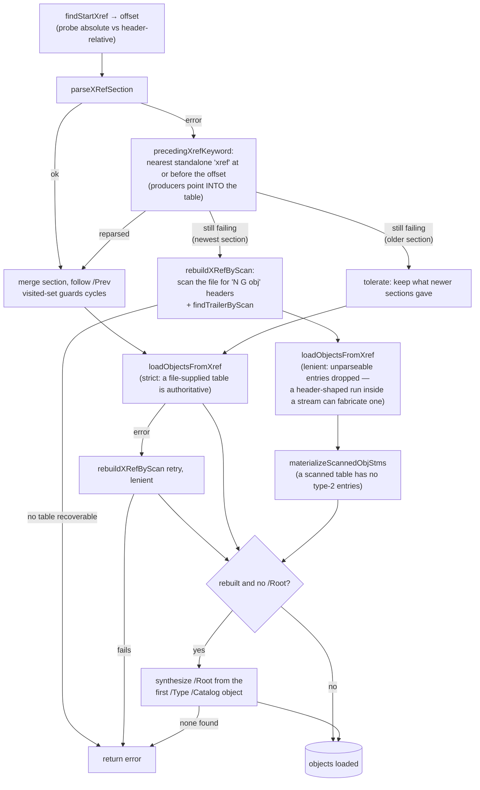
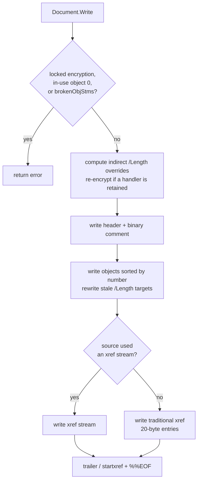

# Architecture

How bytes flow through pdf0's core: **Read** (bytes → object model) and **Write**
(object model → bytes), over one shared, typed object model. Read this before
changing the parser or serializer. For the public API surface, see the package
godoc.

Each subsystem built on that core has its own map:

| Subsystem | Doc |
|-----------|-----|
| The validator family (PDF/A, PDF/UA, PDF/X, PDF/VT, PDF/R, DPart, Factur-X) | [validators.md](validators.md) |
| Inside the PDF/A rule engine | [pdfa.md](pdfa.md) |
| PDF/UA accessibility validation | [pdfua.md](pdfua.md) |
| Fonts and font programs | [fonts.md](fonts.md) |
| XMP metadata | [xmp.md](xmp.md) |
| Encryption (standard security handler) | [encryption.md](encryption.md) |
| Signing, verification, PAdES, timestamps, revocation | [signing.md](signing.md) |
| Image extraction and the codec stack | [images.md](images.md) |
| `cmd/pdf0`, the command-line dev aid | [cli.md](cli.md) |
| Test data, oracles, fuzzing and CI | [testing.md](testing.md) |
| Symptom-first troubleshooting | [troubleshooting.md](troubleshooting.md) |
| Decisions that keep coming up | [adr/](adr/README.md) |

## The object model

Every PDF value implements the `Object` interface (`object.go`): `Boolean`,
`Integer`, `Real`, `String`, `Name`, `Array`, `Dictionary`, `Stream`, `Null`,
`IndirectObject`, `IndirectRef`. A `Document` holds `Objects` (object number →
`IndirectObject`), the `Trailer` dictionary, and — after `Read` — `Offsets`
(object number → absolute byte offset, used by the byte-level validation rules).
`Dictionary` uses parallel `Keys`/`Values` slices to preserve key order for
faithful round-tripping, with a lazy name→slot index above 64 keys — see
[ADR 0005](adr/0005-parallel-slice-dictionary.md).

## Read

`Read` (`document.go`) slurps the file and rebuilds the object model. It recovers
aggressively from malformed files and, by design, **never panics** — any panic
escaping the parse is recovered and returned as an error.


```mermaid
flowchart TD
    A[Read bytes + size] --> B[parseHeader: version + headerOffset]
    B --> C[findStartXref: scan last 1KB]
    C --> D{xref offset valid?<br/>absolute vs header-relative probe}
    D --> E["parse xref sections, follow /Prev<br/>visited-set guards cycles<br/>(recovery ladder below)"]
    E --> F[load uncompressed objects<br/>xref key is the object number]
    F --> G["decrypt strings + streams<br/>(standard security handler)"]
    G --> H[loadCompressedObjects<br/>materialize /ObjStm entries]
    H -->|decode fails| H2[record brokenObjStms<br/>non-fatal]
    H --> I[normalizeStructure<br/>drop XRef/ObjStm objects + their Offsets]
    I --> J[set Encrypted from /Encrypt]
    J --> K[(Document)]
    A -.panic anywhere.-> R[recover -> error, never crash]
```

**Decryption runs before object streams are materialized**, and the order is
load-bearing: an `/ObjStm` container is itself an encrypted stream, but the
objects stored inside it are *not* separately encrypted. Materializing first
would decrypt the inner objects a second time and corrupt them.

### The recovery ladder

Most defects are recovered rather than fatal. A wrong or wrong-typed stream
`/Length` falls back to searching for `endstream`; an offset-shifted
cross-reference is probed absolute-vs-header-relative; an undecodable object
stream is recorded in `brokenObjStms` and its objects are simply absent.

The cross-reference table has the deepest recovery, because a damaged xref is the
most common way a real-world file is broken. `Read` escalates through a ladder
and only fails when every rung is exhausted:


```mermaid
flowchart TD
    ST["findStartXref → offset<br/>(probe absolute vs header-relative)"] --> PS[parseXRefSection]
    PS -->|ok| MERGE["merge section, follow /Prev<br/>visited-set guards cycles"]
    PS -->|error| PK["precedingXrefKeyword:<br/>nearest standalone 'xref' at or before the offset<br/>(producers point INTO the table)"]
    PK -->|reparsed| MERGE
    PK -->|"still failing<br/>(older section)"| TOL[tolerate: keep what newer sections gave]
    PK -->|"still failing<br/>(newest section)"| RB["rebuildXRefByScan:<br/>scan the file for 'N G obj' headers<br/>+ findTrailerByScan"]
    RB -->|no table recoverable| ERR[return error]

    MERGE --> LOAD["loadObjectsFromXref<br/>(strict: a file-supplied table is authoritative)"]
    TOL --> LOAD
    RB --> LOADL["loadObjectsFromXref<br/>(lenient: unparseable entries dropped —<br/>a header-shaped run inside a stream can fabricate one)"]

    LOAD -->|error| RB2[rebuildXRefByScan retry, lenient]
    RB2 -->|fails| ERR
    RB2 --> ROOT
    LOAD --> ROOT
    LOADL --> OBJSTM["materializeScannedObjStms<br/>(a scanned table has no type-2 entries)"]
    OBJSTM --> ROOT{rebuilt and no /Root?}

    ROOT -->|yes| SYN["synthesize /Root from the<br/>first /Type /Catalog object"]
    SYN -->|none found| ERR
    ROOT -->|no| OK[(objects loaded)]
    SYN --> OK
```

**What is actually fatal.** `Read` returns an error only when: the header or
`startxref` cannot be found at all; the newest cross-reference section fails to
parse *and* a full rebuild by scanning finds no usable table; a rebuilt document
contains no `/Type /Catalog` to synthesize `/Root` from; or the input is short
(a truncated read would otherwise look like trailing whitespace). A parse failure
on an individual uncompressed object is fatal only for a table the file itself
supplied — it triggers the scan-rebuild first.

This depth is deliberate: it lets the PDF/A validator *report* a malformation
instead of failing to open the file. A validator that cannot read a broken file
cannot tell you why it is broken.

## Write

`Document.Write` (`document.go`) regenerates a clean file. It refuses documents
it cannot faithfully serialize, re-encrypts a document decrypted on Read (and
writes a still-locked one back verbatim), and regenerates the cross-reference
section in the same form the source used — a cross-reference stream, or a
traditional table.


```mermaid
flowchart TD
    A[Document.Write] --> B{locked encryption,<br/>in-use object 0,<br/>or brokenObjStms?}
    B -->|yes| X[return error]
    B -->|no| C[compute indirect /Length overrides<br/>re-encrypt if a handler is retained]
    C --> D[write header + binary comment]
    D --> E[write objects sorted by number<br/>rewrite stale /Length targets]
    E --> F{source used<br/>an xref stream?}
    F -->|yes| G1[write xref stream]
    F -->|no| G2[write traditional xref<br/>20-byte entries]
    G1 --> H[trailer / startxref + %%EOF]
    G2 --> H
```

`Write` is idempotent: `Read → Write → Read → Write` produces byte-identical
output (guarded by `TestWriteIsIdempotent`).

`Write` regenerates rather than preserves the on-disk layout. The object model
round-trips exactly, but object order and which objects share an `/ObjStm` are
regenerated. To amend a file without rewriting it, use `WriteIncremental`
(`incremental.go`), which appends a new section listing only the changed object
numbers and leaves the original bytes untouched — this is what signature
workflows require, since rewriting would break every existing signature.

## Validate

Validation reads the object model and reports findings; it never mutates the
document. Ten standards are supported and the PDF/A engine has its own dispatch,
executed-content model and rule-file map — all of that lives in
[validators.md](validators.md).

## Resource limits

pdf0 parses untrusted input, so every unbounded loop and every allocation sized
by a number the file supplies is capped. Those caps are defaults chosen to be
safe: **a caller who configures nothing gets exactly the behaviour pdf0 has
always had.**

A fixed number cannot be right for every caller, though. A batch converter on a
workstation and a public upload endpoint want genuinely different answers to
"how much may one untrusted document cost me". Eleven limits are therefore
settable per document, as variadic options on `Read`:

```go
doc, err := pdf0.Read(r, size,
	pdf0.WithMaxDecodedStreamBytes(8<<20),   // stricter bomb ceiling
	pdf0.WithMaxDecodedContentBytes(64<<20), // stricter whole-run budget
)
```

`Option` values resolve once at the entry point into an unexported struct that
is stored on the `Document`, so every validator and extractor run on that
document inherits the same configuration. The struct travels by value and is
never mutated after resolution, so validating one `Document` from several
goroutines stays safe — the property package-level `var`s would have lost.

| Option | Default | Bounds |
|--------|---------|--------|
| `WithMaxDecodedStreamBytes` | 100 MB | decompressed size of any one stream — the bomb ceiling |
| `WithMaxDecodedContentBytes` | 512 MB | total content decoded by one validation run |
| `WithMaxObjectStreamBytes` | 512 MB | total decompressed `/ObjStm` in one document |
| `WithMaxContentStreamBytes` | 64 MB | one content stream or image sample buffer |
| `WithMaxICCProfileBytes` | 8 MiB | a decoded ICC profile |
| `WithMaxXMPPacketBytes` | 4 MiB | an XMP packet the property checks build a tree for |
| `WithMaxCIDRangeSpan` | 65536 | CIDs one `/W` range entry may span |
| `WithMaxRoleMapSteps` | 1<<20 | `/RoleMap` chain-follow steps per PDF/UA check |
| `WithMaxTableGridFills` | 1<<24 | grid slots filled for one PDF/UA table |
| `WithMaxPostScriptSteps` | 1<<20 | operators one type-4 function evaluation may run |
| `WithMaxCmapWork` | 1<<18 | work spent expanding one TrueType cmap subtable of format 4 or 12 |

Defaults are evidence-based where the evidence exists: the figures come from
measuring the veraPDF corpus (2,907 files) and a 978-file Common Crawl sample.
No real file in either comes within 2x of any of these.

Two things are deliberately *not* knobs:

- **The write-side object-stream cap derives from `WithMaxDecodedStreamBytes`**
  rather than being settable on its own. A container the writer emits but the
  reader then refuses loses every object it holds, and setting the two
  independently is exactly how that happens. The writer follows the reader by
  construction.
- **Depth caps** (`maxParseDepth`, `maxPageTreeDepth`, the serializer and
  compare depths, the 64-hop `Resolve` bound) stay internal. They guard against
  exhausting the goroutine stack, which is an *uncatchable* fatal error, so
  raising one trades a clean error for a process abort. No real file comes close:
  the deepest object nesting measured is 6 of 1000, the deepest page tree 4 of 64.

The JBIG2 pixel budgets and the lexer's token-gap bound are also internal, for
threading cost rather than principle;
[proposals/configurable-limits.md](proposals/configurable-limits.md) records the
measurement behind each decision.

Configuring a limit is only half the story: a caller also has to be able to tell
that one fired. A guard that trips leaves a check with an incomplete result, and
the rule the package follows is that **no check may assert a violation on the
basis of one**. Instead the trip is reported as its own finding under the
reserved rule identifier `"limit"`, which `IsCheckerFinding` distinguishes from a
real non-conformance; the message names the guard and says whether the bound it
hit was pdf0's default or one the caller set. [limits.md](limits.md) classifies
every guard in the package on exactly this axis.

## Cancellation

A limit answers "how much may one document cost me". It does not answer "I need
an answer within five seconds, whatever it costs". That is what a
`context.Context` is for, and `cancel.go` is where it lives.

The motivating case was pdf0's own `cmd/corpusprobe`, which ran each file in a
goroutine and gave up on it with `select`/`time.After`. Giving up on a goroutine
is not stopping it: the work carried on burning a core and holding its memory
until it finished by itself. With eight workers and a 25-second file that is
real leakage, and there was nothing a caller could do about it.

### The shape: `…Context` variants, not an option

pdf0 already has variadic functional options, so `WithContext(ctx)` was
available and would have been the smaller change. It was rejected:

- An `Option` is *stored*. Options resolve into a struct that lives on the
  `Document` and is inherited by every later call — the right lifetime for a
  limit ("what this document may cost") and the wrong one for a context ("how
  long this operation may take"). A context captured at `Read` would still
  govern a validation started minutes later. This is the case the Go
  documentation has in mind when it says not to store a `Context` in a struct.
- It would hide cancellation from the call site. `ValidatePDFA(doc, level)`
  would be cancellable or not depending on an argument to a `Read` twenty lines
  earlier.

So `ctx` is an explicit first parameter, and the two mechanisms stay separate.
Every original signature is unchanged.

### Which entry points have one

The line is **cost proportional to the document's content** — bytes, pages,
images — rather than to a bounded structural count.

| Has a `…Context` variant | Deliberately does not | Why not |
|---|---|---|
| `Read`, `ReadWithPassword` | `PageList`, `PageCount`, `Resolve`, `Equal`, `DocumentEqual` | Structural lookups; microseconds. |
| `Write` | `WriteIncremental`, `SetEncryption` | Bounded by the changed-object set. |
| All nine validators (`ValidatePDFA`, `ValidatePDFABytes`, `ValidatePDFUA`, `ValidatePDFUA2`, `ValidatePDFX`, `ValidatePDFVT`, `ValidatePDFVT2`, `ValidatePDFR`, `ValidateDParts`) | `ValidateFacturX`, `ValidateOrderX` | The cost is the XML rule engine in `formalis`, which takes no context; a variant here would advertise cancellation pdf0 cannot deliver. |
| `ExtractText`, `ExtractImages` | `ExtractPageText` | One page *is* the unit of work; a caller iterating pages already has a loop to check a context in. |
| | `Images` | An iterator is already cancellable by `break`, and because each image is decoded only as it is yielded, breaking after image N skips exactly what a context checked between images would have. |
| | `VerifySignatures`, `ValidatePAdES`, `WriteSigned*` | Bounded by the signature count (single digits), and each signature's crypto is bounded. |

### Where the check happens, and what latency that buys

`ctx.Err()` in the innermost loop is not free: `forEachContentItem` and
`forEachContentToken` are together about two thirds of a large document's
validation time. The check is therefore layered, coarsest first:

| Boundary | Unit of work between checks | Implied latency |
|---|---|---|
| Per check | one of ~50 PDF/A or ~45 PDF/UA checks | seconds on a large file — never sufficient alone |
| Per page / per content stream / per embedded PDF | one stream's scan | tens of ms |
| Per `cancelScanBytes` (1 MiB) inside the three token scanners | ~1 MiB tokenized | ~10 ms |
| Per `cancelReadChunk` (1 MiB) inside flate and LZW decoding | ~1 MiB inflated | ~10 ms |
| Per object in `Read`'s load loops and `Write`'s emit loop | one object | sub-ms |

The scanner check is gated on the scan position, not on a token counter: one
comparison of the loop index against a local `int` per token, with the poll
itself once per megabyte. The poll is a non-blocking receive on a `ctx.Done()`
channel hoisted at construction, because both `Done` and `Err` take the
context's mutex on a cancellable context; a run that cannot be cancelled has a
nil channel, so the `default` case is taken.

The scanners do **not** branch on "is this cancellable" to skip the bookkeeping,
and that is deliberate. The obvious version — set the gate past the end of the
data when the signal can never fire, so the comparison never succeeds — added
two statements to `tokenizeContent`'s loop and pushed its inline cost from under
the compiler's 800-node budget to 805. The range-over-func closure then stopped
being inlined into its consumers, and PDF/UA validation of a 71 MB file slowed
by 5% — far more than the one nil-channel poll per megabyte it was avoiding.
The lesson generalises: in these loops, check `go build -gcflags=-m=2` for
"function too complex" before trusting a wall-clock measurement. With the
smaller version, PDF/A and PDF/UA on that file are indistinguishable from the
pre-cancellation code (PDF/A 10.24 s vs 10.57 s, PDF/UA 2.70 s vs 2.76 s;
medians of six runs, the difference within run-to-run noise).

Measured on a 71 MB, 1256-page real-world file whose full PDF/A validation takes
10.7 s: **cancellation takes effect in about 60 ms**, and an already-cancelled
context returns in about 10 µs. The decompression layer was worth having — with
only the scanner checks in place the same measurement was 903 ms, essentially
all of it one 100 MB stream inflating uninterruptibly.

### What a cancelled run returns

The same thing a tripped resource guard returns, through the same machinery: a
finding under the rule identifier `"limit"`, which `IsCheckerFinding` reports as
a checker finding. The reasoning of [limits.md](limits.md) transfers unchanged —
the checker stopped before it had seen everything, so the honest answer is
"unknown", not "conformant" — and routing cancellation through `runLimitTrips`
gives all nine validators the finding without any of them learning a second
mechanism.

The findings gathered before the cancellation are kept. They are true, just
incomplete. What cannot happen is an empty result: **a cancelled validation
never looks like a clean bill of health**, so a caller testing `len(result) == 0`
gets "not clean" and a caller filtering with `IsCheckerFinding` gets "unknown".

`Read`, `Write`, `ExtractTextContext` and `ExtractImagesContext` instead return
an error wrapping `ctx.Err()` — the "loud" class of [limits.md](limits.md) —
because they have no finding channel. `ReadContext` returns a nil `Document`
rather than a partial one: a document missing an arbitrary subset of its objects
is indistinguishable from one whose file genuinely lacks them, and every
validator would then report the absence as a conformance failure. The extractors
return their partial result *and* the error, because discarding the work would
be as dishonest as presenting it as complete.
