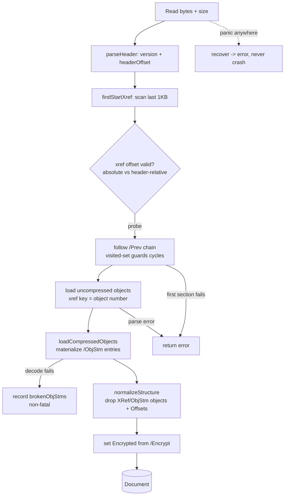
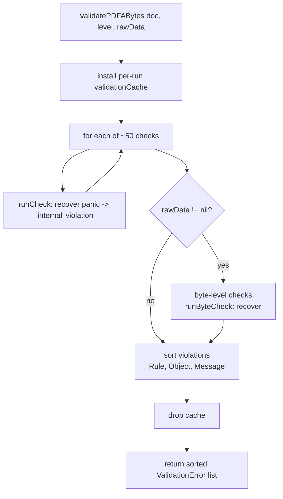
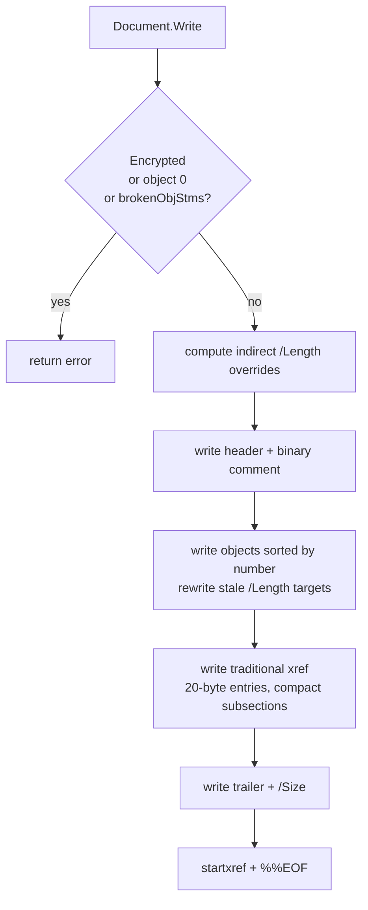

# pdf0 Documentation Audit — 2026-07-08

Audit of every reader-facing surface as a first-class artifact: truth against the code,
inverted-pyramid structure, sizing, architecture-as-drawn, audience fit, coverage, single source
of truth, findability. Audited on branch `fix/docs-and-dx` (the current working tree, which
includes the recently rewritten README and new CI).

**Bottom line.** The prose that exists is now *accurate* — the README was rewritten in the
preceding code-fix stack and every claim in it verifies against the code (module path, error
format, corpus workflow, `gofmt`-clean, the quick-start snippet compiles, the layout table matches
the files). The gaps are **absence, not drift**: the library has no package-level godoc comment
(so pkg.go.dev — the primary discovery surface — shows a bare function list), no architecture doc
or a single diagram (the Read/Write/Validate pipelines live only as prose inside historical audit
reports), and no contributor guide for the ratchet workflow that is the project's core quality
mechanism. One reader task — "understand how a PDF flows through Read" — is served nowhere a
maintained doc lives.

Severity counts: **2 High, 3 Medium, 3 Low.** No High/Medium accuracy (drift) findings — the
drift was already fixed. All findings below are absence/structure/wording.

---

## 1. Summary table

| ID  | Sev | Document | Issue | Status |
|-----|-----|----------|-------|--------|
| D1 | High | package godoc (no `doc.go`) | No `// Package pdf0` comment; pkg.go.dev shows a bare synopsis, the README's orientation invisible to every godoc reader | CONFIRMED |
| D2 | High | (missing) docs/architecture.md | Read (6-step), Write, and Validate pipelines exist only as prose in historical audit reports; no maintained architecture doc, zero diagrams | CONFIRMED |
| D3 | Medium | (missing) CONTRIBUTING.md | The ratchet workflow — run the corpus, update the baselines in `pdfa_test.go` after an intended change — is the core quality mechanism and is documented nowhere | CONFIRMED |
| D4 | Medium | README.md §"Build and test" | `testdata/pdf20examples/` (reference PDFs for the round-trip suite) is gitignored with no documented way to fetch it; the round-trip tests silently skip on a fresh clone | CONFIRMED |
| D5 | Medium | README.md:119 → docs/audits/ | README links `docs/audits/` as "the detailed audit history"; it is two ~40 KB internal findings reports (one silently superseding the other) with no index — a reader routing there for understanding is misled | CONFIRMED |
| D6 | Low | README.md:104 | "never panics on adversarial input" is an absolute claim that is hard to guarantee (an unrecoverable stack overflow is always possible); reads as a stronger promise than the code makes | CONFIRMED |
| D7 | Low | Makefile:1 | `corpus` target is not in `.PHONY`; a stray file named `corpus` would make `make corpus` a silent no-op | CONFIRMED |
| D8 | Low | (missing) cmd/extract_spec_examples | The spec-example regeneration pipeline (needs the gitignored `spec/` PDFs and `pdftotext`) is undocumented; the committed JSON keeps it non-blocking | CONFIRMED |

---

## 2. Doc map

### Current

| Surface | What it is | Audience | Found via |
|---------|-----------|----------|-----------|
| `README.md` (139 lines) | Orientation + quick start + build/test + corpus + status + layout | User, newcomer | Repo root |
| `Makefile` | `test`, `corpus`, `test-corpus`, `clean-corpus` targets | Contributor | Repo root |
| `examples/simple_pdf*/main.go` | Three runnable build-a-PDF programs (well-commented) | User (how-to) | README link |
| `docs/audits/codebase-audit-2026-07-07.md` + `-v2.md` | Two adversarial code-audit findings reports | Maintainer (historical) | README link |
| `.github/workflows/ci.yml` | gofmt/vet/build/test on push & PR | Contributor | (implicit) |
| Godoc (doc comments) | Per-symbol API reference; the load-bearing entry points (`Read`, `Write`, `ValidatePDFA(Bytes)`, `NewPDFADocument*`) are documented | API user | `go doc` / pkg.go.dev |
| `LICENSE` | License | All | Repo root |

Verdict: the README is a healthy single entry point with correct inverted-pyramid order (what it
is → quick start → build → corpus → status → layout). The problem is what has *no* home.

### Proposed

```
README.md              orientation + quick start + links out (unchanged; already good)
doc.go                 NEW — package doc comment: one paragraph "what/when", the four entry
                       points, and the Document.Encrypted / no-decryption caveat (godoc entry)
docs/
  architecture.md      NEW — explanation: the Read / Write / Validate pipelines with Mermaid
                       diagrams; the soft-vs-hard recovery model; the executed-content model
  audits/
    README.md          NEW — one-line index: which audit is current, what each covers
    codebase-audit-*   (retitled in README link as "audit history", not "how it works")
CONTRIBUTING.md        NEW — how-to: run tests, the corpus ratchet workflow (update baselines
                       in pdfa_test.go), where a new PDF/A rule lives and how it's dispatched
```

Purpose/audience per new doc: `doc.go` serves the pkg.go.dev browser deciding whether to adopt the
library; `docs/architecture.md` serves the newcomer/agent that must reason about the flow before
touching it; `CONTRIBUTING.md` serves the contributor adding a rule or updating the ratchet.

---

## 3. Drift verification (accuracy checks run)

Every checkable claim in the README and Makefile was verified against the code. **All passed** —
there are no accuracy findings. Recorded here because "verified correct" is itself the result.

| Claim | Check run | Result |
|-------|-----------|--------|
| `go get github.com/mgilbir/pdf0` | `cat go.mod` → `module github.com/mgilbir/pdf0` | ✅ match |
| "no third-party dependencies" | `go.mod` has no `require` block | ✅ true |
| Quick-start snippet compiles | Built it verbatim as an external module (`replace` onto the repo) | ✅ compiles |
| Error format `[PDF/A-4 6.2.10] object 12: …` | `ValidationError.Error()` = `[%s %s] object %d: %s`; `PDFALevel.String()` → `PDF/A-4` | ✅ exact |
| `ValidatePDFA` / `ValidatePDFABytes`, levels 1b/2b/3b/4 | `PDFA1b…PDFA4` constants + both funcs exist | ✅ present |
| `NewPDFADocument` builds a doc | Exists; `NewPDFADocumentWithInfo` too | ✅ present |
| `make corpus` / `make test-corpus` | Targets exist; clone into `testdata/verapdf-corpus`, run `-run TestCorpus` | ✅ match |
| `VERAPDF_CORPUS` env (implied by Makefile) | `TestCorpus` reads `os.Getenv("VERAPDF_CORPUS")`, falls back to `testdata/verapdf-corpus` | ✅ honored |
| "corpus test skips if absent" | `os.Stat` → skip on `IsNotExist` | ✅ true |
| `gofmt -l .` "should print nothing" | `gofmt -l .` | ✅ clean |
| Layout table paths | All listed files exist; groupings accurate | ✅ match |
| Examples run | `go build ./examples/...` + ran `simple_pdfa` | ✅ build & run |
| Encryption "detected, not decrypted; Write refuses" | `doc.Encrypted` set from trailer; `Write` refuses | ✅ true |

Inverse drift (real behavior no doc mentions): the `runCheck`/`Read` `recover()` panic boundary,
the `Document.Offsets` / `brokenObjStms` fields, and the executed-content validation model are all
undocumented — but these are internal, and the appropriate home is `docs/architecture.md` (D2), not
the README.

---

## 4. Findings by category (severity order)

### High

**D1 — No package-level doc comment (godoc entry point is bare).**
`grep '^// Package pdf0'` returns nothing; `go doc .` opens with `package pdf0 // import …` and
jumps straight into the function list. Reader scenario: a Go developer evaluating the library on
pkg.go.dev — the canonical discovery surface — sees no "what is this / when would I use it"; the
README's orientation never reaches them because pkg.go.dev renders the package comment, not the
repo README, at the top. CONFIRMED. *Direction:* add a `doc.go` with a `// Package pdf0 …` comment
carrying the README's opening paragraph, the four entry points (`Read`, `Document.Write`,
`ValidatePDFA`/`ValidatePDFABytes`, `NewPDFADocument`), and the no-decryption caveat.

**D2 — No architecture doc and not a single diagram.**
The three central processes — the six-step `Read` pipeline (header → startxref → `/Prev` chain →
uncompressed objects → object-stream materialization → normalize), the `Write` pipeline, and the
`ValidatePDFABytes` dispatch (≈50 checks + byte-level checks, each behind a `recover()` boundary,
over a per-run cache) — are described in prose *only* inside the historical
`docs/audits/*.md` "System map" sections. Reader scenario: a newcomer or an agent given the docs as
its spec must understand how bytes become a `Document` before changing the parser, and has no
maintained, diagrammed map; they must reverse-engineer it from `document.go` or mine a 40 KB audit
report. CONFIRMED (absence). *Direction:* create `docs/architecture.md` with the Mermaid diagrams
drafted in §5 (Read flowchart, Validate flowchart, Write flowchart) plus a short paragraph on the
soft-vs-hard recovery model and the executed-content validation model.

### Medium

**D3 — No contributor guide for the ratchet workflow.**
The corpus ratchet (`corpusMaxFalsePositives`/`Missed`/`ParseErrors` in `pdfa_test.go`, all 0) is
the project's core quality gate, and CI cannot enforce it (the corpus isn't committed). Reader
scenario: a contributor adds a PDF/A rule, the corpus counts change, and nothing tells them the
workflow is "run `make test-corpus`, inspect the logged `falsePositives=… missed=…` line, update
the baseline constants only for intended changes." Nor is it documented where a new rule goes (the
`checks` slice in `ValidatePDFABytes`) or how the executed-content model constrains it. CONFIRMED.
*Direction:* `CONTRIBUTING.md` covering the test tiers (unit / spec-example / corpus), the ratchet
update procedure, and the anatomy of a validation check.

**D4 — Round-trip test data is unobtainable from the docs.**
`.gitignore` excludes `testdata/pdf20examples/`; the README documents fetching the veraPDF *corpus*
(`make corpus`) but never mentions the reference PDFs the round-trip tests need. Reader scenario: a
contributor on a fresh clone runs `go test ./...`, sees green, and believes the headline round-trip
guarantee is exercised — it silently skipped (`roundtrip_test.go` `t.Skip`s when the directory is
absent). CONFIRMED. *Direction:* add a `make refpdfs` target (or a documented source — the
pdf-association PDF 2.0 examples) and one README line; note that the round-trip suite skips without
it.

**D5 — `docs/audits/` is mislabeled and unindexed.**
README:119 links it as "the detailed audit history," and the two files
(`codebase-audit-2026-07-07.md` and `…-v2.md`) are near-identically named, ~40 KB each, with the
second silently superseding ~90% of the first. Reader scenario: a reader clicks expecting to learn
how the system works and instead lands in a findings backlog; a reader wanting the current audit
can't tell which file is live. CONFIRMED. *Direction:* add `docs/audits/README.md` (one line per
report: date, scope, "superseded by …"); keep the README link but label it "audit history
(findings, not architecture)" and point architecture questions at `docs/architecture.md` (D2).

### Low

**D6 — README overclaims panic-immunity.**
README:104 "never panics on adversarial input" is absolute. The code is genuinely hardened (offset
guards, recursion/depth caps, a `recover()` boundary in `Read` and around each check), but an
unrecoverable stack overflow from some unforeseen recursion is always *possible*, and "never" is a
promise the code can't fully back. CONFIRMED (wording). *Direction:* soften to "recovers from
malformed input and converts panics into errors rather than crashing."

**D7 — Makefile `corpus` not phony.**
Makefile:1 declares `.PHONY: test test-corpus clean-corpus` but not `corpus`; a stray file named
`corpus` would make `make corpus` a no-op. CONFIRMED. *Direction:* add `corpus` to `.PHONY`.

**D8 — Spec-example pipeline undocumented.**
`cmd/extract_spec_examples/main.py` regenerates `testdata/spec_examples*.json` from the gitignored
`spec/` ISO PDFs via `pdftotext`; nothing documents the inputs or the command. The committed JSON
makes this non-blocking. CONFIRMED. *Direction:* a short comment block in the command, or a note in
`CONTRIBUTING.md`.

Discarded during audit (did not survive): committed `output.pdf` artifacts (they are gitignored —
`output.pdf` in `.gitignore`, not tracked); missing doc comments on exported symbols (the only
uncommented ones are `String()`/`Error()` stringers, which Go convention does not require);
inverted-pyramid violations in the README (it already opens with what/when and orders detail
correctly).

---

## 5. Diagram backlog

Value order. Top three drafted below; target doc `docs/architecture.md` (new, per D2).

1. **Read pipeline** (flowchart) — highest value; the single most-asked "how does it work."
2. **Validate dispatch** (flowchart) — explains the check pipeline, cache, and panic boundary.
3. **Write pipeline** (flowchart) — explains xref regeneration and the refusal conditions.
4. Object model (C4/class) — the `Object` interface and its implementors; medium value, mostly
   covered by the README layout table + godoc.
5. Soft-vs-hard recovery decision (flowchart) — niche; fold into the Read prose.

### D-1 · Read pipeline → `docs/architecture.md`



### D-2 · Validate dispatch → `docs/architecture.md`



### D-3 · Write pipeline → `docs/architecture.md`



---

## 6. Missing-docs backlog

By unblocking value:

1. **`doc.go` package comment** (D1) — unblocks pkg.go.dev adoption; ~15 lines, highest ratio.
2. **`docs/architecture.md`** (D2) — unblocks every "how does the flow work" question for
   newcomers and agents; carries the §5 diagrams + recovery/executed-content models.
3. **`CONTRIBUTING.md`** (D3) — unblocks contributors; must cover the ratchet update procedure and
   where a rule lives.
4. **`make refpdfs` + README line** (D4) — unblocks running the round-trip suite locally.
5. **`docs/audits/README.md` index** (D5) — one line per report; unblocks "which audit is current."
6. **Troubleshooting/runbook** — a short "common validation errors and what they mean" section
   would serve the user reading `[PDF/A-2b 6.2.10] …` output; medium value, no current home.
7. **Spec-pipeline note** (D8) — lowest; a comment block in `cmd/extract_spec_examples`.

---

## 7. Open questions (maintainer-only)

1. Is this library intended for public pkg.go.dev consumption (making D1 High) or primarily a
   personal/experimental project (making it Medium)? The `go get` instruction implies the former.
2. Should the historical `docs/audits/` reports remain in-repo long-term, or be archived once their
   findings are resolved? Their size and near-duplicate names (D5) are a findability cost that only
   grows as more audits land (this one included).
3. Is the round-trip reference set (`testdata/pdf20examples/`) redistributable? That determines
   whether D4's fix is a `make` target (fetch) or a committed fixture.
