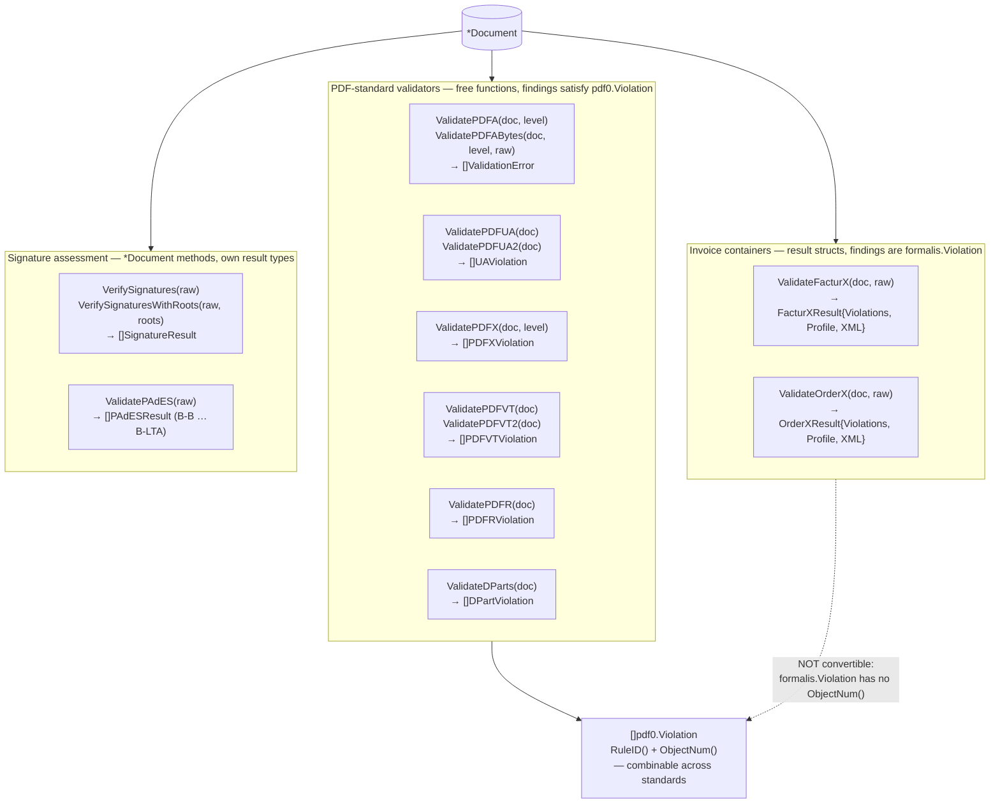
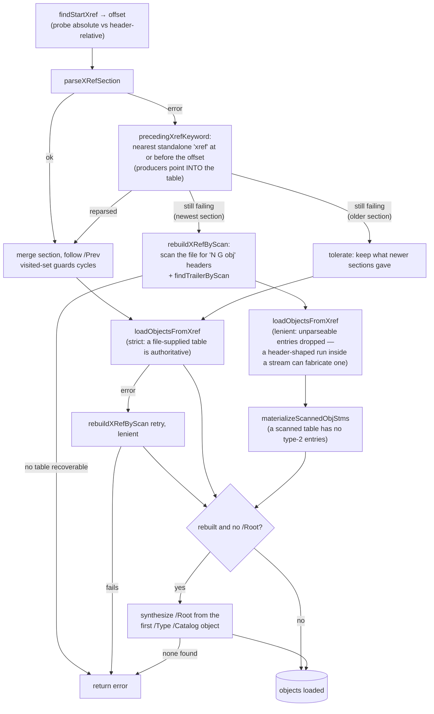
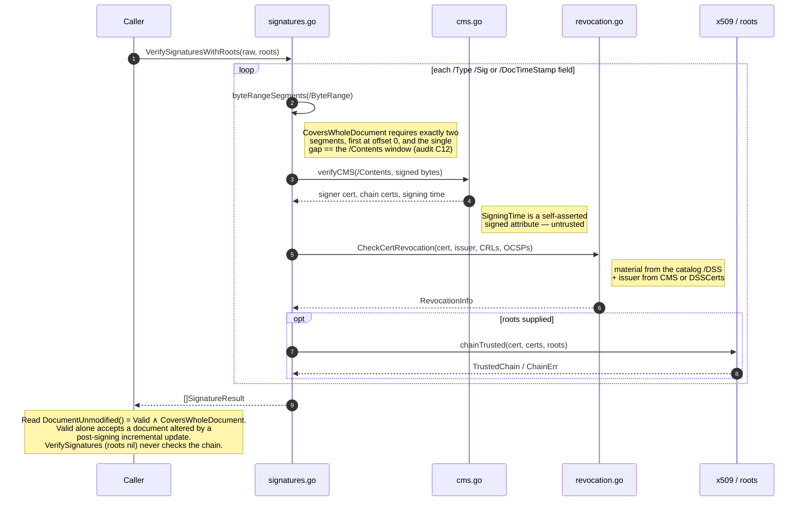
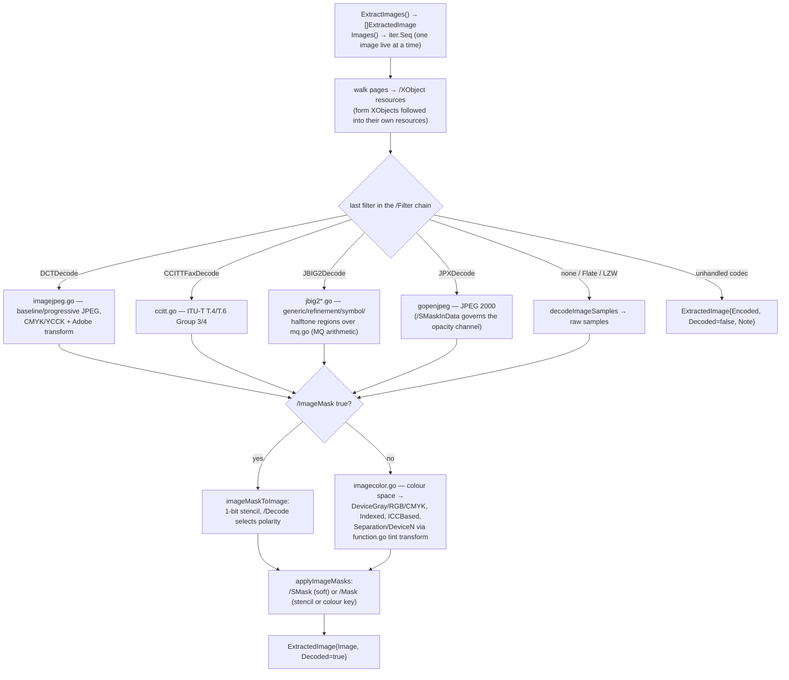

# pdf0 Documentation Audit — 2026-07-27

Audit of every reader-facing surface as a first-class artifact: truth against the code,
inverted-pyramid structure, sizing, architecture-as-drawn, audience fit, coverage, single source of
truth, findability. Audited against the working tree at `main` (`19b0582`), which includes the two
uncommitted 2026-07-26 audit reports.

**Bottom line.** The docs that exist are well built — the README opens correctly, `docs/architecture.md`
already carries three Mermaid diagrams, `CONTRIBUTING.md` explains the ratchet, and the 2026-07-08
audit's D1–D8 are all closed. The problem is that **the docs describe the library pdf0 was in
July, and pdf0 has roughly tripled since.** `docs/architecture.md` maps three pipelines over
`object.go`/`parser.go`/`pdfa.go`; the package is now 64 non-test files including a JBIG2/CCITT/JPX
codec stack, a PAdES signature stack with revocation and RFC 3161 timestamps, an encryption writer,
and nine validators beyond PDF/A. The README's own file-map covers 29 of those 64 files. Two claims
are not merely incomplete but **wrong**: `docs/architecture.md` states that a broken newest
cross-reference section aborts `Read` (it now rebuilds by scanning — merged two commits ago), and
README + `doc.go` promise that every validator's findings satisfy the shared `Violation` interface
(the Factur-X and Order-X results do not — verified by compile error).

The most consequential single gap is **security-shaped**: README and `doc.go` document
`VerifySignatures` and never mention `SignatureResult.DocumentUnmodified()` or
`VerifySignaturesWithRoots`, so a reader following the docs writes the exact check the code's own
godoc warns against ("Callers that read only `Valid` accept a document whose content was altered by a
post-signing incremental update").

Severity counts: **5 High, 8 Medium, 7 Low, 1 Info** (21 findings). Three are accuracy/drift
findings that mislead; the rest are absence, structure, or wording.

Baseline health at audit time: `go test ./...` green (91.7 s, corpus present, exit 0); `gofmt -l .`
clean; `go vet ./...` clean; `CGO_ENABLED=0 go build ./...` succeeds; all three examples run.

---

## 1. Summary table

| ID  | Sev | Document | Issue | Status |
|-----|-----|----------|-------|--------|
| D1 | High | `docs/architecture.md:44-51` + Read diagram | States a broken newest xref section is a *hard* error aborting `Read`; `Read` now relocates via `precedingXrefKeyword` and rebuilds the whole table by scanning (`rebuildXRefByScan`) | CONFIRMED |
| D2 | High | `README.md:23-25`, `doc.go:46-49` | "Every validator is a free function … every finding satisfies the shared `Violation` interface" — `ValidateFacturX`/`ValidateOrderX` return structs whose `formalis.Violation` values do **not** implement `pdf0.Violation` | CONFIRMED |
| D3 | High | `README.md:29-31`, `doc.go` | Signature docs name only `VerifySignatures`; `DocumentUnmodified()` and `VerifySignaturesWithRoots` are undocumented, so the documented path yields the unsafe verdict the code warns about | CONFIRMED |
| D4 | High | (missing) CLI reference; `README.md:39-40` | 8 commands, per-command flags, 4 exit codes and several behavioural restrictions documented only inside the binary; and "a command-line tool wraps these" overclaims — the CLI reaches none of signing, PDF/X, PDF/VT, PDF/R, DPart, Factur-X, Level A, PDF/UA-2, or image extraction | CONFIRMED |
| D5 | High | `docs/architecture.md` (whole) | Maps Read / Write / PDF-A-Validate only; the signature stack, image-codec stack, encryption writer and the nine non-PDF/A validators (≈60% of non-test source) have no architectural map | CONFIRMED |
| D6 | Medium | `README.md:160-179` "Layout" | The file map lists 29 of 64 non-test `.go` files; the 35 missing include every image codec, every non-PDF/A validator and the entire signature stack. `docs/architecture.md:5` routes readers here for the file-by-file layout | CONFIRMED |
| D7 | Medium | `CONTRIBUTING.md:15-27`, `README.md:90-107` | 12 of 16 Makefile targets and all three env vars (`VERAPDF_CORPUS`, `VERAPDF_PROFILES`, `ARLINGTON_MODEL`) are undocumented; the tests they feed self-skip silently | CONFIRMED |
| D8 | Medium | `CONTRIBUTING.md:17` | "Two sets of test PDFs are not committed" — there are at least nine (refpdfs, corpus, wtpdf, arlington, ccitt, jbig2, facturx, pdfvt, PDF/UA reference files) | CONFIRMED |
| D9 | Medium | `doc.go:5-13` | "It offers four things"; levels given as "PDF/A-1b, -2b, -3b, and -4" — Level A (1a/2a/3a) is implemented and `README.md:19` says so. godoc is the primary discovery surface | CONFIRMED |
| D10 | Medium | (missing) CI documentation | `.github/workflows/ci.yml` gates gofmt/vet/build/test **and a live example run**; no doc mentions CI exists | CONFIRMED |
| D11 | Medium | `docs/architecture.md:21-52` "Read" | Omits step 4.5: decryption runs *before* object-stream materialization because an `/ObjStm` container is encrypted but its contents are not separately encrypted — a load-bearing ordering constraint | CONFIRMED |
| D12 | Medium | `README.md:135-144` | Bullet led by **"Decryption is read-only."** then spends eight lines describing writing encryption (`Write` re-encrypts, `SetEncryption` encrypts with AES-256); the lead contradicts its own body and `README.md:26-28` | CONFIRMED |
| D13 | Medium | (missing) how-to / troubleshooting | No task doc for the three highest-value user tasks: sign a PDF, extract images, use `WriteIncremental`; no "my file failed validation, now what" | CONFIRMED |
| D14 | Low | `docs/audits/README.md` | Index omits both 2026-07-26 reports present in the tree; mis-genres the live remediation plan as a "historical snapshot"; "Start there" points at a report the 2026-07-26 audit re-triages | CONFIRMED |
| D15 | Low | `Makefile:1` | `.PHONY` omits `facturx` and `clean-facturx` — the exact bug class the 2026-07-08 audit (D7) fixed for `corpus` | CONFIRMED |
| D16 | Low | (missing) fuzzing docs | `FuzzRead` / `FuzzRoundTrip` exist; no doc says how to run them or where the (gitignored) seed corpus lives | CONFIRMED |
| D17 | Low | `CONTRIBUTING.md:82-86` | Explains only the false-*negative* direction of the clause match; the tool now prints "181/181 clauses matched", so the unstated caveat (a matched clause may implement 1 of N rules) is the load-bearing one | CONFIRMED |
| D18 | Low | `README.md:151-154` | "no missed violations … (tracked by `TestCorpus`)" while `corpusMaxIsartorMissed = 1`; the Isartor suite is part of the same corpus, ratcheted by a different test | CONFIRMED |
| D19 | Low | 63 of 64 non-test `.go` files | Open straight at `package pdf0` with no orienting header; the convention exists (`pdfx.go`, `pdfua.go`, `pdfa_levela.go` do it) but is unapplied to the most opaque files (`jbig2.go`, `imageextract.go`, `crypt.go`, `document.go`) | CONFIRMED |
| D20 | Low | `README.md:11-40`, repo root | The Validate bullet is one nine-line sentence naming ten validators; and the README leads with `go get` while the repo has no tags and no stability statement | CONFIRMED |
| D21 | Info | 4 locations | The "empty result ≠ conformance" caveat is stated verbatim in README, `doc.go`, and both `pdfa.go` godocs; the level list already drifted between two of them (D9) | CONFIRMED |

---

## 2. Doc map

### Current

| Surface | What it is | Audience | Found via |
|---------|-----------|----------|-----------|
| `README.md` (183 ln) | Orientation, feature list, quick start, build/test, corpus ratchet, status, file map | User, newcomer | Repo root |
| `doc.go` (53 ln) | Package godoc: what/when, four entry points, encryption caveat, validator family | API user | pkg.go.dev / `go doc` |
| `CONTRIBUTING.md` (102 ln) | Build/test, corpus ratchet workflow, adding a rule, rule coverage, style, PDF/UA oracle | Contributor | README link |
| `docs/architecture.md` (124 ln) | Read / Write / PDF-A-Validate pipelines, 3 Mermaid diagrams, recovery + executed-content models, rule-file table | Newcomer, agent, maintainer | README link |
| `docs/audits/README.md` (14 ln) | Index of audit reports | Maintainer | README link |
| `docs/audits/*.md` (5 files, 274–558 ln) | Four point-in-time findings reports + one **live** remediation plan | Maintainer | Index (2 of 5 unlisted) |
| `Makefile` (comments) | 16 targets fetching 8 external oracle datasets; the comments are the only prose on several | Contributor | Repo root only |
| `.github/workflows/ci.yml` | The actual merge gate | Contributor | Not linked from any doc |
| `cmd/pdf0` `usage()` + `main.go:1-6` | The *only* CLI reference: 8 commands, flags, exit codes | CLI user | `pdf0 --help` |
| `cmd/{corpusprobe,corpustime,rulecoverage}/main.go` headers | Well-written tool docs (rulecoverage's is exemplary) | Maintainer | Source only |
| `examples/simple_pdf{,17,a}/main.go` | Three runnable build-a-PDF programs, well commented | User (how-to) | README link |
| Per-symbol godoc | API reference. Strong and honest on the core (`Repair`, `DocumentUnmodified`, `Violation`); thin on codecs | API user | `go doc` |
| `LICENSE` | MIT | All | Repo root |

Verdict: the *shape* is right and there are no dead links (all 12 internal links resolve). The
failure is coverage-vs-growth. `docs/architecture.md` is a good doc about a smaller program.

### Proposed

```
README.md                orientation + quick start + links out. SHED the CLI section
                         to docs/cli.md; FIX the Violation and layout claims; replace the
                         29-row file map with a 6-row subsystem map linking the new docs.
doc.go                   package godoc. Add Level A; add DocumentUnmodified; state the
                         Factur-X/Order-X exception to the Violation contract.
docs/
  architecture.md        SPLIT — keep: object model, Read, Write, the recovery ladder,
                         the shared-cache/panic-boundary model. Audience: anyone touching
                         the parser or serializer. Target ≤180 lines.
  validators.md          NEW (split out of architecture.md §Validate). The validator family:
                         one map of standard → entry point → result type → does it satisfy
                         Violation; the PDF/A dispatch; the executed-content model; Level A
                         dispatch; the rule-file table. Audience: rule authors, agents.
  signing.md             NEW. Sign / verify / PAdES B-B→B-LTA / timestamps / revocation /
                         DSS. Leads with "which verdict do I read" (DocumentUnmodified).
                         Audience: anyone integrating signatures. Fixes D3.
  images.md              NEW. Image extraction and the codec stack (DCT, CCITT, JBIG2, JPX
                         via gopenjpeg), colour/function/mask handling, ExtractImages vs the
                         lazy Images iterator and why the latter exists. Audience: extraction
                         users, codec maintainers.
  cli.md                 NEW. Full `pdf0` command reference: per-command flags, exit codes,
                         worked examples, and an explicit "what the CLI does NOT expose"
                         list. Audience: CLI users. Fixes D4.
  testing.md             NEW (split out of CONTRIBUTING.md §Test data). The nine external
                         oracle datasets: what each proves, its make target, its env var,
                         which tests skip without it. Audience: contributor on a fresh
                         clone. Fixes D7/D8/D16.
  troubleshooting.md     NEW. "Read returned an error", "validation reports X", "repair
                         didn't fix it", "signature says Valid but I still don't trust it".
                         Audience: user. Fixes D13.
  adr/                   NEW. Retro-ADRs for decisions currently living in code comments,
    0001-corpus-as-oracle.md         CLAUDE.md, or nowhere: the corpus outranks the spec;
    0002-formalis-extraction.md      EN 16931 lives in a separate module; Arlington is a
    0003-arlington-as-oracle.md      parser-faithfulness oracle, not a second validator;
    0004-executed-content-model.md   rules apply to invoked content only; Dictionary uses
    0005-parallel-slice-dictionary.md parallel slices, not a map.
  audits/
    README.md            Index — list all reports; separate "reports" from "live plans".
    *.md                 (unchanged)
CONTRIBUTING.md          KEEP the ratchet workflow (its best content) + style + how to add
                         a rule. Move test-data inventory to docs/testing.md; add a "what
                         CI checks" line. Target ≤90 lines.
```

Splits (§3 of the brief): `docs/architecture.md` → `architecture.md` + `validators.md` +
`signing.md` + `images.md`; `CONTRIBUTING.md` §Test data → `docs/testing.md`; `README.md` §CLI →
`docs/cli.md`. Merges: none needed — no fragment is too small. The audits directory is the one
place where consolidation would help, but its files are immutable historical records; the fix is
the index (D14), not a merge.

---

## 3. Drift verification

Every checkable claim, the exact check, and the result. Failures become findings; passes are
recorded because "verified correct" is itself the deliverable.

| Claim | Check run | Result |
|-------|-----------|--------|
| `docs/architecture.md:49-51` "hard (abort `Read`): … a broken newest cross-reference section" | Read `document.go:126-241`: on failure it tries `precedingXrefKeyword`, then `rebuildXRefByScan` + `findTrailerByScan`, then a lenient reload, then `/Root` synthesis from the first `/Type /Catalog` | ❌ **FAIL → D1** |
| `README.md:23-25` / `doc.go:46-49` "every finding satisfies the shared `Violation` interface" | Compiled an external module appending `ValidateFacturX(doc, raw).Violations` to `[]pdf0.Violation` | ❌ **FAIL → D2** — `formalis.Violation does not implement pdf0.Violation (missing method ObjectNum)` |
| `README.md:23` "Every validator is a free function taking the `*Document` first" | `grep`: `ValidatePAdES`, `VerifySignatures` are `*Document` methods; `ValidateFacturX`/`ValidateOrderX` return structs, not slices | ⚠️ partial → D2 |
| `README.md:29-31` signature API is `WriteSigned` / `VerifySignatures` / `ValidatePAdES` | `grep` for exported signature API: also `VerifySignaturesWithRoots`, `SignatureResult.DocumentUnmodified()` — the latter's godoc says prefer it over `Valid` | ❌ **FAIL → D3** (inverse drift) |
| `README.md:39-40` "A command-line tool (`cmd/pdf0`) wraps these: info, validate, ua, decrypt, encrypt, extract, repair, merge" | `cmd/pdf0/main.go:57-81` — the eight commands match exactly | ✅ command list exact |
| …but "wraps **these**" (the preceding feature list) | Built the CLI and ran it: no subcommand for signing, PDF/X, PDF/VT, PDF/R, DPart, Factur-X, PDF/UA-2, page extraction or incremental write; `-level` accepts only `1b\|2b\|3b\|4` (`pdf0 validate -level 1a` → `error: unknown level "1a"`, exit 2); `extract` prints text only | ❌ **FAIL → D4** |
| `README.md:19` PDF/A levels include 1a/2a/3a vs `doc.go:11` "1b, -2b, -3b, and -4" | `pdfa.go:15-27` defines `PDFA1a/2a/3a`; `pdfa.go:127` dispatches `level.isA()` → `validatePDFALevelA` | ❌ **FAIL → D9** (`doc.go` stale) |
| `README.md:160-179` layout table | Diffed table entries against `ls *.go`: 29 listed, 64 non-test files exist, 35 unlisted | ❌ **FAIL → D6** |
| `CONTRIBUTING.md:17` "Two sets of test PDFs are not committed" | Makefile + `.gitignore`: refpdfs, verapdf-corpus, wtpdf, arlington, ccitt, jbig2, facturx, pdfvt, and `spec/pdfua/reference-files` | ❌ **FAIL → D8** |
| Makefile targets documented | 16 targets exist; README/CONTRIBUTING mention `corpus`, `test-corpus`, `refpdfs`, `rule-coverage` only | ❌ **FAIL → D7** |
| `Makefile:1` `.PHONY` completeness | `.PHONY` lists 16 names; targets `facturx` and `clean-facturx` are absent from it | ❌ **FAIL → D15** |
| `docs/architecture.md:80` "runs a fixed list of ~60 check functions" | Counted entries in the `checks` slice, `pdfa.go:133-234` → **59** | ✅ accurate |
| `docs/architecture.md:75-76` "`Write` is idempotent … guarded by `TestWriteIsIdempotent`" | `write_roundtrip_bytelevel_test.go:42` — asserts `bytes.Equal(w1, w2)` and `DocumentEqual(r1, r2)` over builder docs + every reference PDF | ✅ accurate |
| `docs/architecture.md:83-85` validation is non-mutating and concurrency-safe | `ValidatePDFABytes` shallow-copies and installs a per-run cache; `validation_concurrency_test.go` exists | ✅ accurate |
| `docs/architecture.md:112-124` "where the rules live" table | All six file groups exist and match; omits `pdfa_levela.go`, `function*.go` | ✅ accurate (minor omission, folded into D5) |
| `docs/architecture.md` Read diagram step order | Matches `document.go` steps 1–6 **except** the missing step 4.5 (decrypt before `loadCompressedObjects`) and the missing rebuild paths | ⚠️ → D1, D11 |
| `README.md:3-5` / `doc.go:1-3` "only dependencies are the author's own pure-Go modules" | `go.mod` → formalis, gopenjpeg, golittlecms only; `CGO_ENABLED=0 go build ./...` succeeds | ✅ true |
| `README.md:46-70` quick-start snippet | Copied verbatim into an external module with a `replace` onto the repo; `go build` | ✅ compiles, gofmt-clean |
| `README.md:77` error format `[PDF/A-4 6.2.10] object 12: …` | `ValidationError.Error()` = `[%s %s] object %d: %s`; live run printed `[PDF/A-4 6.2.10.4.1] object 9: embedded Type1 font program is damaged…` | ✅ exact |
| `README.md:87-88` "run one with `go run ./examples/simple_pdfa`" | Ran all three; each wrote `output.pdf` (640 / 640 / 2830 bytes). `simple_pdfa` also prints one expected violation, which its own output explains | ✅ runs |
| `README.md:92-97` build/test commands | `go build ./...`, `go test ./... -count=1` (exit 0, 91.7 s with corpus present), `go vet ./...`, `gofmt -l .` (empty) | ✅ all clean |
| `README.md:115-117` `make corpus` / `make test-corpus` | Targets exist; clone into `testdata/verapdf-corpus`; run `-run TestCorpus` with `VERAPDF_CORPUS` set | ✅ match |
| `README.md:151-154` "no false positives, no missed violations, no parse errors" | `pdfa_test.go`: `corpusMaxFalsePositives=0`, `corpusMaxMissed=0`, `corpusMaxParseErrors=0` — but `corpusMaxIsartorMissed=1` | ⚠️ → D18 |
| `CONTRIBUTING.md:75-86` `make rule-coverage` "printing the clauses with no matching pdf0 rule" | Ran `VERAPDF_PROFILES=spec/verapdf-profiles go run ./cmd/rulecoverage` → "Overall: 181/181 veraPDF clauses matched"; no gap list is printed any more | ⚠️ → D17 |
| `CONTRIBUTING.md:24-27` spec-example pipeline in `cmd/extract_spec_examples/` | `cmd/extract_spec_examples/{main.py,main17.py}` exist | ✅ present |
| `docs/audits/README.md` table completeness | 3 reports listed; 5 exist in the tree | ❌ **FAIL → D14** |
| All internal markdown links (12) | Resolved every `](…)` target across README, CONTRIBUTING, architecture.md, audits/README.md, including `#layout` and `#where-the-rules-live` anchors | ✅ zero dead links |
| CI enforces what the docs say | `.github/workflows/ci.yml` runs gofmt / vet / build / `go test -count=1` / `go run ./examples/simple_pdfa && test -s output.pdf` | ✅ CI is real → but undocumented, D10 |

**Inverse drift** — real behaviour, parameters and results no doc mentions:
`SignatureResult.DocumentUnmodified()` and `VerifySignaturesWithRoots` (D3); PDF/A Level A dispatch
(D9); the decrypt-before-`/ObjStm` ordering (D11); `rebuildXRefByScan` / `precedingXrefKeyword` /
`materializeScannedObjStms` / `/Root` synthesis (D1); `PAdESLevel` and the `PAdESResult.Issues`
list; `Images()` vs `ExtractImages()` memory trade-off (README mentions it in half a clause);
`ExtractedImage.Note`/`Encoded`/`Decoded` (what you get when a codec is unhandled); `Repair`'s honest
"only removes forbidden document-level constructs" caveat, which lives in godoc but not the README;
CLI exit codes 1/2/3; the `VERAPDF_CORPUS` / `VERAPDF_PROFILES` / `ARLINGTON_MODEL` env vars.

**Discarded during audit** (did not survive an attempt to disprove):
*"`ValidatePAdES` is a method, not the free function README implies"* — README lists it inside a
bullet that also names `WriteSigned`/`VerifySignatures`, both methods; the "free function" sentence
is scoped to the validator list in the preceding bullet, and is true of all seven names in it (the
Factur-X problem is the return type, not the receiver — see D2).
*"`examples/*/output.pdf` are committed artifacts"* — untracked; `output.pdf` is gitignored.
*"`spec/verapdf-profiles/README.md` is an undocumented project doc"* — it is the cloned upstream
repo's own README under a gitignored path, not a pdf0 surface.
*"`docs/architecture.md` says ~60 checks but the count drifted"* — it is 59.
*"README's `go test` claim is stale"* — verified green, exit 0.
*"Missing doc comments on exported symbols"* — spot-checked the load-bearing ones; godoc quality is
genuinely high, and several comments (`Repair`, `DocumentUnmodified`, `Violation`, `loadObjectsFromXref`)
are better than the prose docs. The gap is prose coverage, not godoc.

---

## 4. Findings by category, severity order

### High

**D1 — `docs/architecture.md` misstates `Read`'s failure model.**
`docs/architecture.md:44-51` ("Recovery model") splits defects into *soft* (recovered) and *hard*
(abort `Read`), and puts "a broken newest cross-reference section" in the hard column. The Read
diagram encodes the same rule: `E -->|first section fails| X[return error]`. Both are now false.
`document.go:126-241` escalates through a ladder: reparse at the nearest preceding `xref` keyword
(`precedingXrefKeyword`, for producers whose `startxref` points *into* the table); then
`rebuildXRefByScan` over object headers plus `findTrailerByScan`; then a lenient reload that drops
entries which don't parse; then `/Root` synthesis from the first `/Type /Catalog`. Only if *all* of
that fails does `Read` return an error. `README.md:130-132` enumerates the same recovery set and is
stale in the same way, one level less precisely. **Reader scenario:** an agent or contributor given
`docs/architecture.md` as spec concludes that a file with a corrupt trailing xref cannot be opened,
and either writes a redundant pre-scan or files a bug for behaviour that is by design; a maintainer
extending recovery reads the soft/hard table and puts a new path on the wrong side of it.
CONFIRMED. *Direction:* replace the Read diagram with the recovery-ladder diagram in §5, rewrite the
soft/hard paragraph around "hard = every recovery exhausted", and update the README's one-line
recovery list. This is the highest-value single edit in the audit.

**D2 — The `Violation` contract is promised more broadly than it holds.**
`README.md:23-25`: "Every validator is a free function taking the `*Document` first, and every
finding satisfies the shared `Violation` interface, so results combine across validators" — in a
sentence whose enumeration includes `ValidateFacturX` / `ValidateOrderX`. `doc.go:46-49` repeats it.
Both are false for those two: they return `FacturXResult` / `OrderXResult` structs whose
`Violations` field holds `formalis.Violation`, an external type. Verified by compiling the exact
pattern the docs invite:
`cannot use e (variable of struct type formalis.Violation) as pdf0.Violation value … (missing method ObjectNum)`.
`violations.go:18-19` documents the exception precisely — the prose docs dropped it while copying
the promise. **Reader scenario:** anyone building a combined report across standards writes the
aggregation loop from the README, and it fails to compile with a message that reads like a version
problem. CONFIRMED. *Direction:* in README and `doc.go`, split the sentence: the six PDF-standard
validators are free functions returning `Violation`-satisfying slices; Factur-X and Order-X return a
result struct carrying `formalis.Violation` (external type, not convertible). Make `violations.go`
the canonical statement and link the others to it (see D21).

**D3 — The documented signature-verification path is the unsafe one.**
`README.md:29-31` and `doc.go` name `WriteSigned` / `VerifySignatures` / `ValidatePAdES` and stop.
Neither mentions `SignatureResult.DocumentUnmodified()`, whose own godoc
(`signatures.go:40-43`) says: "Callers that read only `Valid` accept a document whose content was
altered by a post-signing incremental update; prefer this." Neither mentions
`VerifySignaturesWithRoots`, the only way to get `TrustedChain` — with `VerifySignatures` (roots
`nil`) the chain is never checked, and no doc says so. **Reader scenario:** a developer wires up
"is this PDF validly signed?", reads the README, calls `VerifySignatures`, branches on
`r.Valid`, and ships a check that accepts a tampered document from an untrusted signer. This is the
one finding where the docs' silence has a security consequence. CONFIRMED. *Direction:* `docs/signing.md`
(§2) opening with the verdict table — `Valid`, `CoversWholeDocument`, `DocumentUnmodified()`,
`TrustedChain` + `ChainErr`, `Revocation` — and stating plainly that `VerifySignatures` performs no
trust-chain check. Add one sentence and the method name to README and `doc.go` in the meantime.

**D4 — No CLI reference exists, and the README overstates what the CLI covers.**
`cmd/pdf0` is a real public surface: 8 commands, 4 flags, 4 exit codes (0/1/2/3, with the
violations-vs-operational split from audit C47), plus undocumented behavioural facts verified by
running it — `-level` rejects `1a`/`2a`/`3a` (exit 2) though the library implements them; `merge`
takes no `-password` and refuses encrypted inputs; `extract` emits text only; `repair` re-validates
its own output and exits 1 with the remaining count; `<cmd> -h` exits 0. All of this lives only in
`usage()` and the `main.go` header comment. Meanwhile `README.md:39-40` says the CLI "wraps these"
directly after a list containing signing, PAdES, PDF/X, PDF/VT, PDF/R, DPart, Factur-X, image
extraction, page extraction and incremental write — none of which the CLI exposes.
**Reader scenario:** a user installs the tool expecting `pdf0 sign` or `pdf0 validate -level 3a`,
finds neither, and cannot tell whether it's unimplemented or renamed; a scripter has no documented
exit-code contract to branch on without reading Go source. CONFIRMED. *Direction:* `docs/cli.md`
with a section per command (synopsis, flags, exit codes, one worked example), an exit-code table,
and an explicit "not exposed by the CLI — use the library" list. Reduce the README to a pointer.

**D5 — `docs/architecture.md` maps under half the system.**
It opens "pdf0 has three pipelines — Read, Write, and Validate (object model → PDF/A violations)".
That was true in July. The package now also contains: a signature/PKI stack (`sign.go`,
`signatures.go`, `pades.go`, `timestamp.go`, `doctimestamp.go`, `revocation.go`, `cms.go` — ~2 400
lines), an image-extraction and codec stack (`imageextract.go`, `imagejpeg.go`, `ccitt.go`, six
`jbig2*.go`, `mq.go`, `imagecolor.go`, `imagemask.go`, `function.go`, `function_ps.go` — ~4 500
lines), an encryption *writer* (`crypt_encrypt.go`, `objstm_write.go`, `incremental.go`), and nine
validators beyond PDF/A (`pdfua*.go`, `pdfx*.go`, `pdfvt.go`, `pdfr.go`, `dpart.go`, `facturx*.go`,
`order_x.go`). None appear in any architecture doc, and the README's file map (D6) doesn't list them
either — so for roughly 60% of the source there is *no* maintained map at any altitude.
**Reader scenario:** a contributor is asked to fix a JBIG2 halftone bug or a PAdES B-LTA
mis-classification; `docs/architecture.md` tells them nothing, the README file map doesn't list the
files, and their entry point is `grep`. This is also what makes the codebase audits necessary as
orientation documents, which is a poor use of a findings report. CONFIRMED. *Direction:* the split
in §2 — `validators.md`, `signing.md`, `images.md` — each ≤150 lines, each opening with a
one-paragraph "what this subsystem is and when you'd touch it", each carrying one diagram from §5.

### Medium

**D6 — The README file map covers 29 of 64 files.**
`README.md:160-179`, and `docs/architecture.md:5` sends readers there ("for the file-by-file layout,
see the table in the README"). Unlisted: `ccitt.go`, `jbig2*.go` (6), `mq.go`, `imagecolor.go`,
`imageextract.go`, `imagejpeg.go`, `imagemask.go`, `function.go`, `function_ps.go`, `pdfx.go`,
`pdfx_color.go`, `pdfvt.go`, `pdfr.go`, `pdfua2.go`, `pdfua_content.go`, `pdfua_struct.go`,
`pdfua_tablegrid.go`, `dpart.go`, `facturx.go`, `facturx_write.go`, `order_x.go`, `pades.go`,
`timestamp.go`, `doctimestamp.go`, `revocation.go`, `violations.go`, `incremental.go`,
`objstm_write.go`, `pdfa_levela.go`, `doc.go`. **Reader scenario:** "where does JPEG 2000 decoding
live?" — the map is silent and reads as complete, so the reader concludes the feature is absent.
CONFIRMED. *Direction:* replace the 29-row file list with a ~6-row subsystem table (core object
model / validators / fonts+XMP / images / crypto+signatures / CLI+builders), each row linking to the
subsystem doc that owns its detail. A per-file map at 64 files and growing is the wrong granularity
for a README and will drift again.

**D7 — Most of the test-data machinery is undocumented.**
16 Makefile targets exist; the docs name four (`corpus`, `test-corpus`, `refpdfs`, `rule-coverage`).
Undocumented: `wtpdf`, `arlington`, `test-arlington`, `ccitt`, `jbig2`, `facturx`, `profiles`, and
five `clean-*`. Each fetches an oracle dataset whose tests **self-skip when absent**, so their
absence is invisible. The three env vars (`VERAPDF_CORPUS`, `VERAPDF_PROFILES`, `ARLINGTON_MODEL`)
appear only inside the Makefile. The Makefile's own comments are good — they are just not
reader-facing. **Reader scenario:** a contributor changes the JBIG2 decoder, runs `go test ./...`,
sees green, and never learns that `make jbig2` would have run the real decode oracle against it;
Arlington's parser-faithfulness ratchet is likewise never exercised. CONFIRMED. *Direction:*
`docs/testing.md` with one row per dataset: what it proves, licence/source, make target, env var,
which tests skip without it, and roughly how long it takes. Link from CONTRIBUTING.

**D8 — "Two sets of test PDFs are not committed" is now false.**
`CONTRIBUTING.md:15-27`. There are at least nine. Same fix as D7; called out separately because this
is an *incorrect statement*, not an omission — a reader who acts on it believes they have full
coverage after `make refpdfs && make corpus`. CONFIRMED.

**D9 — `doc.go` understates the package on the surface most readers see first.**
`doc.go:5-13` "It offers four things" and "PDF/A-1b, -2b, -3b, and -4". Level A (1a/2a/3a) is
implemented (`pdfa_levela.go`, dispatched at `pdfa.go:127`), and `README.md:19` advertises it — so
the two disagree. "Four things" now omits encryption, signing, extraction, repair and nine
validators; the later paragraphs partly compensate, but the lead sets the reader's model.
**Reader scenario:** a developer on pkg.go.dev evaluating pdf0 for a PDF/A-2a workflow reads the
package doc, concludes Level A is unsupported, and leaves. CONFIRMED. *Direction:* correct the level
list; recast "four things" as a short capability list matching the README's; add one line for the
signature verdict (D3) and one for the Factur-X `Violation` exception (D2).

**D10 — CI is invisible to contributors.**
`.github/workflows/ci.yml` gates gofmt, `go vet`, `go build`, `go test ./... -count=1`, **and**
running `examples/simple_pdfa` and asserting it produces a non-empty `output.pdf` (a guard from
audit C9). No doc mentions any of it. **Reader scenario:** a contributor edits
`examples/simple_pdfa` or `NewPDFADocument`, is surprised by a red CI job whose existence they were
unaware of, and cannot reproduce the failing step locally because nothing tells them what it runs.
CONFIRMED. *Direction:* a five-line "What CI checks" section in CONTRIBUTING listing the five steps
verbatim, noting explicitly that corpus-gated tests do **not** run in CI — which is precisely why
the local ratchet workflow matters.

**D11 — The decrypt-before-`/ObjStm` ordering is undocumented.**
`document.go` step 4.5: decryption must run before `loadCompressedObjects` because an `/ObjStm`
container is itself an encrypted stream while the objects inside it are not separately encrypted.
`docs/architecture.md`'s Read diagram shows neither the decryption step nor the constraint, and puts
`set Encrypted from /Encrypt` after normalization as though that were the whole encryption story.
**Reader scenario:** someone reordering the Read pipeline (say, to materialize object streams lazily)
breaks every encrypted-with-object-streams file, and the doc that should have stopped them is
silent. CONFIRMED. *Direction:* add the step to the Read diagram with the reason as an edge label,
and one sentence to the Read prose.

**D12 — The encryption limitation's headline contradicts its own body.**
`README.md:135-144`, under "Known limitations", is led by bold **"Decryption is read-only."** The
eight lines that follow describe: `Write` re-encrypting with the retained key, re-emitting the
preserved `/Encrypt`, and `Document.SetEncryption` encrypting a previously-unencrypted document with
AES-256. `README.md:26-28` lists "**Encrypt / decrypt**" as a headline feature. The real limitation
being described is narrower and worth stating: *a file that could not be decrypted cannot be
modified* (`Locked()` → `Write` passes it through verbatim). **Reader scenario:** a reader scanning
bold leads — which is how a limitations list is read — concludes pdf0 cannot write encryption, and
reaches for another library for a feature that exists. CONFIRMED. *Direction:* re-lead the bullet
with what is actually limited: "**A file that could not be decrypted cannot be modified.**" Move the
capability sentences up into the feature list where they belong.

**D13 — No how-to or troubleshooting layer.**
The four Diátaxis modes are unevenly served: reference (godoc) is strong, explanation
(`docs/architecture.md`) is good but narrow, tutorial (`examples/`) exists for exactly one task —
building a PDF from scratch — and how-to/troubleshooting is **absent**. There is no worked example
for signing, verifying, extracting images, or `WriteIncremental(w, original, changed)` — whose
`changed []int` parameter has no prose explanation anywhere. Nor is there any guidance for the most
common user moment: a validation report the reader doesn't know how to act on.
**Reader scenario:** "how do I sign a PDF with pdf0?" — answerable today only by reading
`sign.go` and `pades_test.go`. CONFIRMED. *Direction:* `docs/troubleshooting.md` plus two new runnable
examples (`examples/sign_verify`, `examples/extract_images`); both would also be cheap CI guards
against exactly the kind of API drift D2/D3 record.

### Low

**D14 — The audit index is stale and mixes genres.**
`docs/audits/README.md` lists three reports; five are present (`codebase-audit-2026-07-26.md`,
`remediation-plan-2026-07-26.md` are missing, and this report makes six). Its framing sentence —
"a report is a historical snapshot, not the current state of the code" — is wrong for
`remediation-plan-2026-07-26.md`, which is a *live* stacked-PR plan someone is executing. And "Start
there" points at `codebase-audit-2026-07-07-v2.md`, which the 2026-07-26 audit explicitly re-triages.
CONFIRMED. *Direction:* add the missing rows; split the table into "Reports (historical)" and
"Plans (live)"; move "start here" to the newest report.

**D15 — `Makefile` `.PHONY` omits `facturx` / `clean-facturx`.**
`Makefile:1`. Identical to the 2026-07-08 audit's D7 (fixed for `corpus`), reintroduced by later
targets. A stray file named `facturx` silently no-ops the fetch. CONFIRMED. *Direction:* add both
names; consider `.PHONY` immediately above each target so new targets can't forget.

**D16 — Fuzzing is undocumented.**
`fuzz_test.go` defines `FuzzRead` and `FuzzRoundTrip`; `testdata/fuzz/` is gitignored. Nothing tells
a contributor these exist, how to run them (`go test -fuzz=FuzzRead -fuzztime=…`), or what to do
with a crasher. For a library whose stated design goal is surviving hostile input, this is the
cheapest unexercised guard in the repo. CONFIRMED. *Direction:* a short section in `docs/testing.md`.

**D17 — The rule-coverage caveat explains the direction that no longer occurs.**
`CONTRIBUTING.md:82-86` warns that a clause reported as *uncovered* may in fact be implemented under
different numbering. Running the tool today (`VERAPDF_PROFILES=spec/verapdf-profiles go run ./cmd/rulecoverage`)
prints "Overall: 181/181 veraPDF clauses matched" — nothing is reported uncovered, so the documented
caveat is inert, and the *unstated* one now carries all the weight: a matched clause may implement
one of its N rules. Unqualified, "181/181" contradicts `README.md:151-154` ("implements a subset").
CONFIRMED. *Direction:* add the opposite-direction caveat and one sentence on how to read a 100%
clause match. `cmd/rulecoverage/main.go`'s own header comment is a good model.

**D18 — "no missed violations" is true of `TestCorpus` and not of the corpus.**
`README.md:151-154` says the validator reports no false positives, no missed violations and no parse
errors against the veraPDF corpus, attributing it to `TestCorpus`. `pdfa_test.go:1274` sets
`corpusMaxIsartorMissed = 1`; the Isartor suite ships with the same corpus and is ratcheted by
`TestCorpusIsartor`. The sentence is defensible as written but reads as a stronger claim than the
baselines support. CONFIRMED. *Direction:* "…and one known missed violation in the Isartor PDF/A-1b
fail suite (`corpusMaxIsartorMissed`)". Accuracy here is cheap and the claim is load-bearing for
adoption.

**D19 — Doc-bearing code: 63 of 64 non-test files have no orienting header.**
The convention exists and is used well where it exists — `pdfx.go`, `pdfua.go` and `pdfa_levela.go`
each open with a paragraph naming the standard and the approach — but the files a newcomer is most
likely to be dropped into cold (`jbig2.go`, `imageextract.go`, `crypt.go`, `document.go`,
`signatures.go`, `fonts.go`) begin at `package pdf0` with no statement of scope or spec reference.
In a flat 64-file package these headers are the de-facto module boundaries. CONFIRMED.
*Direction:* a 3–5 line header on the ~15 largest files: what this file owns, which spec clause or
external format it implements, what it deliberately does not do. Highest value on the codec files,
where the spec reference (JBIG2 = ITU-T T.88, CCITT = T.4/T.6) is the single most useful pointer.

**D20 — README scannability and the missing stability statement.**
Two small things in one place. (a) `README.md:18-25`: the Validate bullet is one nine-line sentence
naming ten validators and their entry points — the densest text in the doc, and the part a reader
most often scans to answer "does it do X?". A three-column table (standard / entry point / result
type) would carry it, and would be the natural home for the D2 correction. (b) The README opens with
`go get github.com/mgilbir/pdf0` while `git tag` is empty and no doc states an API-stability
position; a reader cannot tell whether to pin a pseudo-version or expect breakage.
CONFIRMED. *Direction:* table for (a); one line under Status for (b).

### Info

**D21 — Four copies of the conformance caveat.**
"An empty result means no implemented check fired, not a guarantee of full conformance" appears in
`README.md:81-85`, `doc.go:39-43`, and both godocs at `pdfa.go:83-88` and `pdfa.go:118-122`.
Duplication in godoc is appropriate (readers arrive at one symbol). But the surrounding *facts* have
already drifted between copies — the level list differs between README and `doc.go` (D9), and the
`Violation` promise differs between `violations.go` and README/`doc.go` (D2). CONFIRMED.
*Direction:* no mechanical dedup. Pick canonical homes and keep the copies to the invariant sentence
only: levels and capabilities → README; the `Violation` contract → `violations.go`; the caveat text
itself may repeat. Terminology is otherwise consistent (the docs say "violation"/"finding" and mean
the same thing; `ValidationError` appears in prose only where the type is meant).

---

## 5. Diagram backlog

Value order. Top four drafted; the drafts are written to be pasted as-is.

1. **Validator family map** → `docs/validators.md` — highest value: it is simultaneously the fix for
   D2 (the `Violation` contract made visual and therefore hard to overstate) and the missing index
   for ten entry points currently listed only as prose.
2. **Read recovery ladder** → `docs/architecture.md` (replaces the failure edges of the current Read
   diagram) — fixes D1, the audit's most misleading claim.
3. **Signature verification** → `docs/signing.md` — fixes D3; a sequence diagram is the right form
   because the value comes from the *order* (ByteRange → CMS → time → revocation → chain) and from
   showing which stage each result field comes from.
4. **Image extraction and codec dispatch** → `docs/images.md` — fixes the largest unmapped
   subsystem (D5).
5. **Read pipeline, revised** → `docs/architecture.md` — add the step-4.5 decryption node and the
   `materializeScannedObjStms` branch to the existing diagram (D11). Small edit to a diagram that is
   otherwise still accurate.
6. **Write refusal conditions** — the existing Write diagram is accurate; no change needed.
7. **PDF/A executed-content walk** (page → invoked form/pattern/Type3 → resource) — explanatory,
   medium value; the prose at `docs/architecture.md:104-110` currently carries it adequately.

### Diagram 1 · Validator family map → `docs/validators.md`



### Diagram 2 · Read recovery ladder → `docs/architecture.md`



### Diagram 3 · Signature verification → `docs/signing.md`



### Diagram 4 · Image extraction and codec dispatch → `docs/images.md`



---

## 6. Missing-docs backlog

By unblocking value.

1. **`docs/cli.md`** (D4) — the only wholly undocumented *public* surface. Highest ratio: the content
   already exists in `usage()` and the code; it needs a home, exit codes, and the honest
   "not exposed by the CLI" list. ~120 lines.
2. **`docs/signing.md`** (D3, D5) — the only gap with a security consequence. Must open with the
   verdict table, then Diagram 3, then PAdES levels and DSS/LTV. ~150 lines.
3. **Fix D1 + D2 in place** — three paragraph-sized edits to `docs/architecture.md`, `README.md` and
   `doc.go`. Cheapest correctness win in the audit; do these before any new doc.
4. **`docs/validators.md`** (D5, D2, D9) — Diagram 1 plus the PDF/A dispatch, Level A, and the
   executed-content model moved out of `architecture.md`. ~150 lines.
5. **`docs/testing.md`** (D7, D8, D16) — the nine oracle datasets, their targets, env vars, what each
   proves, and fuzzing. Unblocks a contributor's first hour. ~100 lines.
6. **`docs/images.md`** (D5) — Diagram 4 plus the spec references per codec and the
   `ExtractImages` vs `Images` memory contract. ~130 lines.
7. **`examples/sign_verify/` and `examples/extract_images/`** (D13) — two runnable programs; add
   both to the CI "example runs" step so the API drift in D2/D3 cannot recur silently.
8. **`docs/troubleshooting.md`** (D13) — validation output, `Read` errors, `Locked()` vs `Encrypted`,
   "repair applied 0 fixes", "signature Valid but not trusted".
9. **"What CI checks" in CONTRIBUTING** (D10) — five lines.
10. **`docs/adr/`** (§2) — five retro-ADRs for decisions currently recorded only in code comments or
    an assistant-memory file: corpus-as-oracle, the formalis extraction, Arlington-as-parser-oracle,
    the executed-content model, parallel-slice `Dictionary`. Lowest urgency, highest half-life: these
    are the decisions a maintainer will otherwise re-litigate.
11. **File headers on the ~15 largest files** (D19) — mechanical, parallelizable, and the fastest way
    to make the flat package navigable while the subsystem docs are being written.

---

## 7. Open questions (maintainer-only)

1. **Is the CLI a product or a demo?** It shapes D4's size: a supported tool needs `docs/cli.md`,
   an exit-code contract and probably subcommands for the validators it can't currently reach; a demo
   needs one honest README paragraph saying so. The current text implies the former, the feature
   coverage implies the latter.
2. **Is `docs/audits/` the right long-term home for findings reports?** Six reports totalling ~2 300
   lines now sit one click from the README, and they are being used as de-facto architecture
   documentation because `docs/architecture.md` covers less than half the system (D5). Archiving
   resolved reports (or moving them out of `docs/`) would sharpen what `docs/` means.
3. **API stability and tagging** (D20b) — the README leads with `go get` on an untagged module. Is
   a v0 tag + a one-line stability statement wanted, or is "expect breakage" the intended message?
4. **Should `remediation-plan-2026-07-26.md` live in `docs/` at all?** It is a live work plan, not a
   document; an issue or a branch-local file may serve it better than the audit archive (D14).
5. **PDF/A Level A support level** — is 1a/2a/3a considered shipped (in which case the CLI should
   accept it and `doc.go` should say so, D9/D4) or still provisional?
