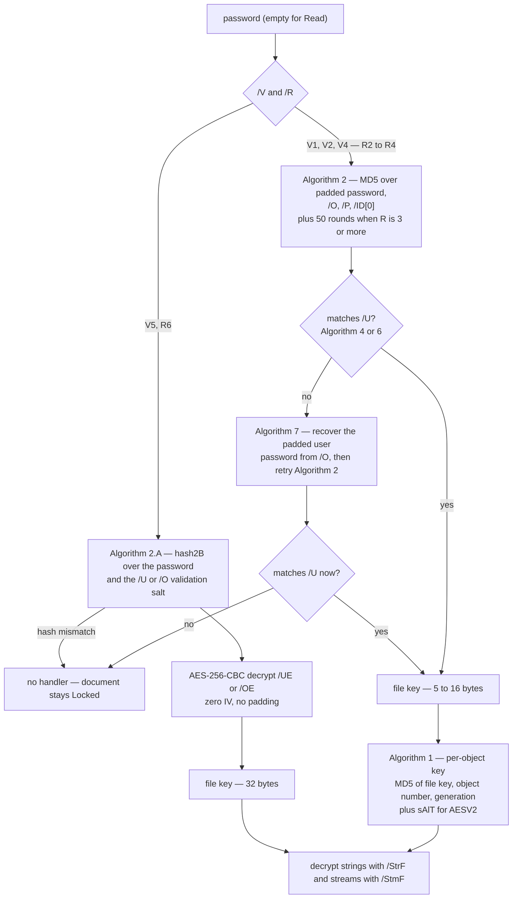

# Encryption

The standard security handler (ISO 32000-1 §7.6, ISO 32000-2 §7.6), in both
directions: deriving a file key from a password and decrypting every string and
stream on `Read`, then enciphering them again on `Write`. It lives in `crypt.go`
(read side, key derivation, both ciphers) and `crypt_encrypt.go` (the write-side
`/Encrypt` builder). Open this doc when a file will not decrypt, when an encrypted
round-trip loses data, or before touching either file — the two sides must change
together, since what `crypt_encrypt.go` writes is exactly what `crypt.go`
re-derives and validates.

## The user-facing model

`Read` decrypts with the **empty password**, which covers the common
"owner-restricted, no user password" file. `ReadWithPassword(r, size, pw)` takes
**either the user or the owner password** — pdf0 tries it as the user password
first, then recovers the user password from `/O` and tries again (ISO 32000-1
Algorithm 7). A wrong password is **not an error**: the file still parses
structurally and comes back with its content as ciphertext.

Two states people conflate. **`Document.Encrypted`** means the file carried an
`/Encrypt` dictionary — it stays `true` after a *successful* decryption.
**`Document.Locked()`** is `Encrypted && d.security == nil`: no usable handler,
because the password was wrong or the scheme is unsupported, so **the strings and
streams in the model are still ciphertext** and validators, `ExtractText` and the
image extractors will happily process them into nonsense. `Encrypted` is *"was it
encrypted"*, `Locked()` is *"is it still encrypted"* — check the latter before
reading content. The CLI does this per subcommand, see
[troubleshooting.md](troubleshooting.md#encrypted-files) for those messages.

| State | `Encrypted` | `Locked()` | `d.security` | What `Write` does |
|---|---|---|---|---|
| Plaintext file | `false` | `false` | `nil` | writes plaintext |
| Decrypted (right password) | `true` | `false` | handler | re-encrypts with the retained key, re-emits the preserved `/Encrypt` |
| Locked (wrong password / unsupported scheme) | `true` | `true` | `nil` | verbatim passthrough of the ciphertext under the preserved `/Encrypt` and `/ID` |
| After `RemoveEncryption` | `false` | `false` | `nil` | writes plaintext, no `/Encrypt` |

A decrypted document round-trips: the file key and every `/Encrypt` parameter
stay on the `Document`, and `Write` serializes *encrypted copies*, leaving the
caller's in-memory plaintext untouched (`TestReEncryptRoundTrip`). A locked
document is written back verbatim rather than corrupted, and must still decrypt
afterwards with the real password (`TestEncryptedPassthroughRoundTrip`). The
passthrough refuses in exactly two cases (unresolvable `/Encrypt`, undecodable
object streams), both in
[troubleshooting.md](troubleshooting.md#encrypted-files).

- `SetEncryption(userPw, ownerPw)` encrypts a previously-unencrypted document and
  **only ever produces AES-256 (V5/R6)** — the legacy revisions are read-only. It
  installs a fresh random 32-byte file key and a new `/Encrypt` object,
  synthesizes an `/ID` if the trailer lacks one, and leaves the in-memory document
  in the clear. It **refuses a `Locked()` document**: re-enciphering ciphertext
  would double-encrypt it.
- `RemoveEncryption()` drops the handler, deletes the `/Encrypt` object and the
  trailer key, and clears `Encrypted`, so `Write` emits plaintext. It is a
  **no-op on a locked document** (`TestLockedDocumentState`).
- **PDF/A forbids encryption outright**: `checkNoEncrypt` reports
  `trailer must not contain /Encrypt` at clause 6.1.3 for every level, and
  `Repair` calls `RemoveEncryption` (only when `d.security != nil` — never on a
  locked file). PDF/X (ISO 15930-7 6.1) and PDF/R refuse encrypted documents,
  as do `WriteIncremental` and every signing entry point.

## What is supported

Method selection and key derivation are independent: `/V` picks the derivation,
the crypt filter picks the cipher.

| `/V` | `/R` | Derivation | Cipher | Read | Write |
|---|---|---|---|---|---|
| 1 | 2 | Algorithm 2, MD5, 40-bit | RC4 | yes | re-encrypt only |
| 2 | 3 | Algorithm 2 + 50 MD5 rounds | RC4, `/Length`-bit | yes | re-encrypt only |
| 4 | 4 | Algorithm 2 + 50 rounds, `/EncryptMetadata` folded in | crypt filter: `V2` = RC4, `AESV2` = AES-128-CBC | yes | re-encrypt only |
| 5 | 6 | Algorithm 2.A / 2.B, SHA-256/384/512 | `AESV3` = AES-256-CBC | yes | **produced by `SetEncryption`** |
| 5 | 5 | — | — | **no** (deprecated draft, rejected) | no |
| any | any | `/Filter` other than `/Standard` | — | **no** | no |

Anything in a "no" row leaves the document `Locked()`. At `/V` 4 and above the
methods come from `/CF` via `/StmF` (streams) and `/StrF` (strings), resolved
separately, and **anything unrecognised — a missing name, the name `Identity`,
an unknown `/CFM` — becomes `Identity`, so that half of the document is not
enciphered at all.** Below `/V` 4 both are RC4 unconditionally. `/Length` is read
as bits and divided by 8, with `/R` 2 (or a missing/zero `/Length`) forcing 5
bytes. `/EncryptMetadata false` does two things: it appends four `0xFF` bytes in
Algorithm 2 for `/R` ≥ 4, and leaves a `/Type /Metadata` stream in the clear on
both the read and the write side.

## Key derivation and the object key

**The padding string.** Revisions 2–4 pad every password to exactly 32 bytes:
the password truncated to 32, then as much of the fixed `passwordPad`
(`0x28 0xBF 0x4E 0x5E …`) as fits. An empty password pads to exactly that
constant — "no password" is really "a known password".

**File key, R2–R4** (Algorithm 2). `MD5(paddedPassword ‖ /O[:32] ‖ /P as a
little-endian int32 ‖ /ID[0] ‖ 0xFFFFFFFF when R ≥ 4 and /EncryptMetadata is
false)`, then for `/R` ≥ 3 re-hashed 50 times over its own first `keyLen` bytes.
The key is the first `keyLen` bytes.

**Password check** (Algorithms 4 and 6). R2: RC4-encrypt the padding string with
the file key and compare all 32 bytes against `/U`. R3–4: `MD5(pad ‖ /ID[0])`,
then a 20-round RC4 cascade — the file key, then the key XOR'd with 1…19 — and
compare only the **first 16 bytes** of `/U` (the rest is arbitrary padding).

**Owner password** (Algorithm 7). `MD5` of the padded owner password (plus 50
rounds for R ≥ 3) gives an owner key that decrypts `/O` — R2 with one RC4 pass,
R3–4 with the cascade reversed (19 down to 0). The result is the *padded user
password*, fed back through Algorithm 2. This is why one `ReadWithPassword`
argument serves both roles.

**File key, R6** (Algorithms 2.A/2.B). No MD5 anywhere. `/U` is 48 bytes: a
32-byte hash, an 8-byte validation salt, an 8-byte key salt. If
`hash2B(pw, validationSalt)` equals `/U[:32]`, the password is right; the
intermediate key `hash2B(pw, keySalt)` then decrypts `/UE` with AES-256-CBC, a
zero IV and no padding, yielding the 32-byte file key. The owner path is
identical over `/O` and `/OE` with `/U[:48]` appended to every hash input.
`hash2B` itself seeds with SHA-256 and then loops: build `(pw ‖ K ‖ udata)`
repeated 64 times, AES-128-CBC-encrypt it under `K[0:16]` with IV `K[16:32]`,
and let the first 16 output bytes mod 3 choose SHA-256, SHA-384 or SHA-512 for
the next round — stopping once at least 64 rounds have run and the last output
byte is ≤ round − 32.

**The per-object key** (Algorithm 1) exists for RC4 and AES-128 only:
`MD5(fileKey ‖ objNum as 3 low-endian bytes ‖ generation as 2 bytes ‖ "sAlT"
for AESV2)`, truncated to `min(keyLen + 5, 16)` bytes, so two objects never share
a key. **AES-256 (`AESV3`) skips this entirely and uses the file key directly** —
its per-object variation comes from the random IV instead. AES payloads are
`16-byte IV ‖ CBC ciphertext` with PKCS#7 padding, and decryption **validates
every padding byte**, not just the length byte (audit C37): trusting the length
alone lets crafted ciphertext be silently mis-truncated into a wrong plaintext.
A failed AES decrypt returns the input unchanged rather than erroring.

## The ordering constraint, and what is exempt

`decryptDocument` runs at step 4.5 of `Read` — **after uncompressed objects are
loaded and before `/ObjStm` contents are materialized**. The order is
load-bearing: an object-stream container is itself an encrypted stream, while the
objects stored inside it are *not* separately encrypted. See the Read pipeline in
[architecture.md](architecture.md#read).

The same constraint reaches the write side. `buildWriteSet` (`objstm_write.go`)
keeps the `/Encrypt` dictionary **and everything transitively reachable from it**
(`encryptReachable` — typically an indirect `/CF`) out of object streams: the
handler needs those objects before object streams exist, so a packed one resolves
to nothing, stream decryption silently becomes `Identity`, and every object in
the container is lost. Packing also runs *before* `encryptCopy`, so container
bodies are plaintext inside an encrypted container.

Not enciphered, verified in the source:

- **The `/Encrypt` dictionary's own strings** (`/O`, `/U`, `/UE`, `/OE`,
  `/Perms`). Skipped by object number *and* by pointer identity: a malformed file
  can point several xref entries at the same offset, and `Read` shares one parsed
  value across those numbers, so number-only skipping would decrypt an alias and
  destroy the shared key material. A `seen` set likewise stops any shared value
  being decrypted twice.
- **The trailer**, and therefore `/ID` — `decryptDocument` walks `doc.Objects`
  only, never the trailer dictionary. (An `/ID` moved into an indirect object
  would not be exempt, though no such file is known.)
- **`/Type /XRef` streams**, on both the read and the write side.
- **`/Type /Metadata` streams** when `/EncryptMetadata` is false.
- Objects **inside** an `/ObjStm`, by construction of the ordering above.

One deviation: **a signature dictionary's `/Contents` is *not* exempted**, though
ISO 32000-2 §7.6.2 says it must not be encrypted. pdf0 never produces such a file
(signing refuses encrypted documents), and verifying a third-party
encrypted-and-signed file fails rather than falsely succeeding —
`contentsGapIsSignature` compares the parsed value against the raw hex window.
See [signing.md](signing.md).

## Security notes

pdf0 implements what real files use, which is not what is safe:

- **RC4 (V1/V2, R2–R4) and AES-128 with R4 are weak by modern standards.** RC4 is
  broken, and both derive their key with MD5 from a 32-byte-padded password with
  no work factor. They are supported for compatibility with existing files and
  are **read-only** — no pdf0 API produces them. `SetEncryption` always produces
  AES-256 (V5/R6), the only revision here with a modern KDF, and even that is
  only as strong as the password.
- **Permissions are advisory and pdf0 enforces none of them.** `/P` is an input to
  the R2–R4 key derivation and nothing else. `SetEncryption` writes `/P = -4`
  (permit everything) and a matching `/Perms` block. Once a password opens a
  document — user *or* owner — every API operates on the full content. The only
  place `/P` is inspected is the PDF/UA rule `checkUASecurity`, which *reports*
  that permission bit 10 disables text extraction for accessibility (Matterhorn
  26-001/002) — a validation finding, not an enforcement.
- **A wrong password is silent.** No error: the document comes back `Locked()`
  with ciphertext in place — deliberate, since a file you cannot open is still
  inspectable and round-trippable, and the reason every consumer must check
  `Locked()`. The **owner password is not a second factor** either: both
  passwords yield the same file key, so "owner-only" restrictions do not survive
  contact with any library.
- Encrypted output is **not byte-reproducible** for AES: `aesCBCEncrypt` draws a
  fresh random IV per object per write, so the byte-identity guarantee in
  [architecture.md](architecture.md#write) is measured on unencrypted documents.
  pdf0 also implements no public-key security handler and no password recovery.

## File map and tests

| File | Owns |
|---|---|
| `crypt.go` | `/Encrypt` parsing, key derivation (R2–R4 and R6), crypt-filter resolution, per-object keys, both ciphers, `decryptDocument`, `encryptCopy`, `Locked`, `RemoveEncryption` |
| `crypt_encrypt.go` | `SetEncryption` and the AES-256 `/Encrypt` builder (`/U`, `/UE`, `/O`, `/OE`, `/Perms`) |
| `document.go` | `ReadWithPassword`, the step-4.5 call site, the `security` field, `Write`'s re-encrypt and passthrough |
| `objstm_write.go` | `encryptReachable` and the object-stream packing exclusions |

Tests, and what each actually pins:

- `crypt_test.go`, `reencrypt_test.go` — corpus files at each scheme (RC4 V2/R3,
  AES-128 V4/R4, AES-256 V5/R6) decrypt, and re-encrypt, such that their
  FlateDecode streams still inflate — a wrong key yields bytes zlib rejects.
- `crypt_password_test.go` — builds a real RC4 V2/R3 file from the *producer* side
  of Algorithms 2/3/5, then checks the user, owner, wrong and empty passwords.
- `crypt_matrix_test.go` — the systematic grid. `TestEncryptRoundTripMatrix`
  crosses object-streams × direct-vs-indirect `/CF` × indirect `/O` × encrypted
  vs unencrypted metadata (8 variants), asserting no object loss and equal
  content modulo stream `/Length`; `TestEncryptPassthroughMatrix` does the same
  for the undecryptable side. It varies the *structural* dimensions only — every
  variant is AES-256, because that is all `SetEncryption` produces.
- Regressions: `crypt_alias_test.go` (duplicate-offset `/Encrypt` alias),
  `objstm_encrypt_test.go` (indirect `/CF` must not be packed),
  `crypt_locked_test.go` (the `Locked()` state machine, the C6/C7/C8 guard),
  `crypt_passthrough_test.go` (verbatim passthrough, both refusals, and that
  `Write` does not mutate the in-memory ciphertext), `crypt_encrypt_test.go`
  (`SetEncryption` / `RemoveEncryption`, plaintext absent from the output).

Confirmed limitations: R5 and non-`Standard` handlers are unsupported (both land
in `Locked()`); only AES-256 can be *produced*; `WriteIncremental` refuses
encrypted documents; a signature `/Contents` is not exempted from the crypt
filter; and `buildStdSecurityHandler` currently returns `(nil, nil)` on every
failure path, so the `encryption: …` error listed in
[troubleshooting.md](troubleshooting.md#read-returned-an-error) is not reachable
today — a malformed `/Encrypt` produces a locked document, not an error.
