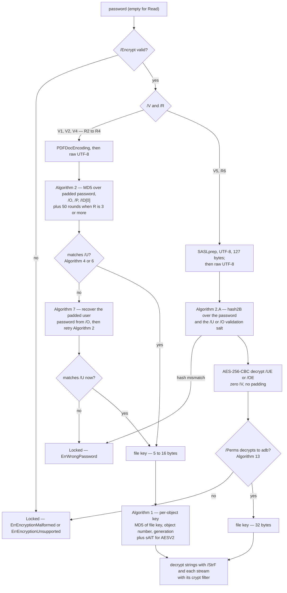

# Encryption

The standard security handler (ISO 32000-1 §7.6, ISO 32000-2 §7.6), in both
directions: validating a file's `/Encrypt` dictionary, deriving a file key from a
password and decrypting every string and stream on `Read`, then enciphering them
again on `Write`. It lives in `internal/crypt`: `params.go` validates the
dictionary, `password.go` prepares passwords, `crypt.go` derives keys, chooses
crypt filters and runs both ciphers, and `encrypt.go` builds the `/Encrypt`
dictionary `SetEncryption` installs. `crypt_api.go` is the `Document` side. Open
this doc when a file will not decrypt, when an encrypted round-trip loses data,
or before touching any of those files — the two sides must change together,
since what `encrypt.go` writes is exactly what `crypt.go` re-derives and
validates.

## The user-facing model

`Read` decrypts with the **empty password**, which covers the common
"owner-restricted, no user password" file. `ReadWithPassword(r, size, pw)` takes
**either the user or the owner password** — pdf0 tries it as the user password
first, then recovers the user password from `/O` and tries again (ISO 32000-1
Algorithm 7). A wrong password is **not an error**: the file still parses
structurally and comes back with its content as ciphertext. Neither is anything
else about `/Encrypt`: **an `/Encrypt` dictionary never makes `Read` fail.**

Two states people conflate. **`Document.Encrypted`** means the file carried an
`/Encrypt` dictionary — it stays `true` after a *successful* decryption.
**`Document.Locked()`** means the document carries `/Encrypt` but has no usable
security handler, so **the strings and streams in the model are still
ciphertext** and validators, `ExtractText` and the image extractors will happily
process them into nonsense. `Encrypted` is *"was it encrypted"*, `Locked()` is
*"is it still encrypted"* — check the latter before reading content. The CLI
does this per subcommand, see
[troubleshooting.md](troubleshooting.md#encrypted-files) for those messages.

**Why it is Locked** is always recorded: `Document.LockReason()` returns an
error wrapping exactly one of

| Sentinel | Meaning |
|---|---|
| `ErrWrongPassword` | The password is neither the user nor the owner password. |
| `ErrEncryptionUnsupported` | A handler, revision or crypt-filter method pdf0 does not implement: a non-`/Standard` `/Filter`, `/V` 0 or 3, the deprecated `/R` 5, a crypt filter with `/CFM /None` or a method not defined for the file's revision. |
| `ErrEncryptionMalformed` | The dictionary violates ISO 32000-2 7.6: a missing or mistyped required entry, a `/Length` outside 40–128 bits, a `/P` that is not a 32-bit value, a `/V`–`/R` pair the spec does not define, a `/StmF` naming an undefined crypt filter, an R6 `/Perms` that does not decrypt under the recovered key. |

and its text names the entry at fault. Two more accessors report what did not
stop decryption: **`DecryptFailures()`** lists objects whose content could not be
decrypted in a document that is *not* Locked (see
[Crypt filters](#crypt-filters)), and **`EncryptionWarnings()`** reports an R6
`/Perms` entry that disagrees with `/P` or `/EncryptMetadata`
(`ErrPermsMismatch`, see [Key derivation](#key-derivation-and-the-object-key)).

| State | `Encrypted` | `Locked()` | `d.security` | What `Write` does |
|---|---|---|---|---|
| Plaintext file | `false` | `false` | `nil` | writes plaintext |
| Decrypted (right password) | `true` | `false` | handler | re-encrypts with the retained key, re-emits the preserved `/Encrypt` |
| Locked (wrong password, unsupported or malformed scheme) | `true` | `true` | `nil` | verbatim passthrough of the ciphertext under the preserved `/Encrypt` and `/ID` |
| After `RemoveEncryption` | `false` | `false` | `nil` | writes plaintext, no `/Encrypt` |

A decrypted document round-trips: the file key and every `/Encrypt` parameter
stay on the `Document`, and `Write` serializes *encrypted copies*, leaving the
caller's in-memory plaintext untouched (`TestReEncryptRoundTrip`). A locked
document is written back verbatim rather than corrupted, and must still decrypt
afterwards with the real password (`TestEncryptedPassthroughRoundTrip`). The
passthrough refuses in exactly two cases (unresolvable `/Encrypt`, undecodable
object streams), both in
[troubleshooting.md](troubleshooting.md#encrypted-files). A *decrypted* document
has a third refusal: an object whose ciphertext did not decrypt (see below).

- `SetEncryption(userPw, ownerPw)` encrypts the document and **only ever
  produces AES-256 (V5/R6)** — the legacy revisions are read-only. It installs a
  fresh random 32-byte file key and a new `/Encrypt` object, synthesizes an
  `/ID` if the trailer lacks one, and leaves the in-memory document in the
  clear. It **refuses a `Locked()` document** (re-enciphering ciphertext would
  double-encrypt it) and **an empty user password**: that opens the file for
  anyone, and `SetEncryption` writes `/P −4` (every permission), so the result
  would be encrypted without being protected. **An empty owner password is
  replaced by a random 256-bit one**, generated and discarded, so the file opens
  with the user password alone; writing `""` as the owner password would let
  every reader — they all try the empty password — open the file (audit
  2026-09-22 C23). Both passwords are prepared as [Passwords](#passwords)
  describes, and one SASLprep prohibits is refused.
- `SetEncryption` on a document that was **decrypted on `Read`** replaces its
  encryption entirely: the old `/Encrypt` dictionary, the objects only it
  referenced (an indirect `/CF`, say) and any per-stream `/Crypt` filters are
  removed. Left in place, the old dictionary was encrypted as ordinary content
  and written out as an orphan. The record of objects that did not decrypt is
  kept — a new key does not bring their content back.
- `RemoveEncryption()` drops the handler, removes the trailer key, the `/Encrypt`
  object, the objects only it referenced and every per-stream `/Crypt` filter,
  and clears `Encrypted`, so `Write` emits plaintext. It is a **no-op on a
  locked document** (`TestLockedDocumentState`).
- **PDF/A forbids encryption outright**: `checkNoEncrypt` reports
  `trailer must not contain /Encrypt` at clause 6.1.3 for every level, and
  `Repair` calls `RemoveEncryption` (only when `d.security != nil` — never on a
  locked file). PDF/X (ISO 15930-7 6.1) and PDF/R refuse encrypted documents,
  as do `WriteIncremental` and every signing entry point.

## What is supported

Method selection and key derivation are independent: `/V` picks the derivation,
the crypt filter picks the cipher.

| `/V` | `/R` | Derivation | Cipher | Key length | Read | Write |
|---|---|---|---|---|---|---|
| 1 | 2 or 3 | Algorithm 2, MD5 (+ 50 rounds at R3) | RC4 | 40 bits | yes | re-encrypt only |
| 2 | 3 | Algorithm 2 + 50 MD5 rounds | RC4 | `/Length`, 40–128 bits, default 40 | yes | re-encrypt only |
| 4 | 4 | Algorithm 2 + 50 rounds, `/EncryptMetadata` folded in | crypt filter: `V2` = RC4, `AESV2` = AES-128-CBC | 128 bits (see below) | yes | re-encrypt only |
| 5 | 6 | Algorithm 2.A / 2.B, SHA-256/384/512 | `AESV3` = AES-256-CBC | 256 bits | yes | **produced by `SetEncryption`** |
| 5 | 5 | — | — | — | **no** (deprecated extension, `ErrEncryptionUnsupported`) | no |
| 0, 3 | any | undocumented / unpublished | — | — | **no** (`ErrEncryptionUnsupported`) | no |
| any | any | `/Filter` other than `/Standard` | — | — | **no** (`ErrEncryptionUnsupported`) | no |

Any other `/V`–`/R` pair is `ErrEncryptionMalformed` (ISO 32000-2 Table 21
defines exactly these). Every row marked "no" leaves the document `Locked()`.

**Validation happens once, at the boundary** (`internal/crypt/params.go`), before
any value is used: `/Filter`, `/V`, `/R`, `/P`, `/O` and `/U` are required and
typed; `/Length` must be a multiple of 8 between 40 and 128 where it is used;
`/P` must be a 32-bit value in its signed or unsigned reading; `/O` and `/U` must
be at least 32 bytes (R2–R4) or 48 (R6), and `/OE`, `/UE` and `/Perms` at least
32, 32 and 16 bytes at R6 — longer values are tolerated and only the defined
prefix used, since producers write 127-byte `/O` and `/U` at R6 (the veraPDF
corpus has one). A `/Length` of
−8, 256 or 4096 once sliced a 16-byte MD5 digest out of range, and `Read` failed
with a recovered panic (audit 2026-09-22 C59); now it is a Locked document with
`ErrEncryptionMalformed`, as is every other value the handler does not define.

**Key length at V4.** Table 20 gives V4 a 128-bit key. An RC4 (`/CFM /V2`)
crypt filter may declare its own `/Length` — in bytes (5–16, as Table 25
specifies for the standard handler) or in bits (40–128, as most producers write
it; the ranges do not overlap) — and failing that the top-level `/Length`, which
many V4 producers write although the spec reserves it for V2 and V3. `AESV2` is
always 128 bits. A V4 file with no top-level `/Length` used to get a 40-bit key,
which left every such AESV2 file Locked (audit C154).

**Crypt filters** (V4 and V5) are described in [Crypt filters](#crypt-filters).
Below V4 strings and streams are both RC4, and `/CF`, `/StmF`, `/StrF`, `/EFF`
and `/EncryptMetadata` mean nothing.

`/EncryptMetadata false` (V4 and V5 only) does two things: it appends four
`0xFF` bytes in Algorithm 2 at R4, and leaves **the document-level metadata
stream** — the catalog's `/Metadata` — in the clear on both the read and the
write side. Every other `/Type /Metadata` stream (a page's, an image's) is
encrypted like any stream: ISO 32000-2 Table 21 and Algorithm 2's NOTE 1 limit
the exemption to document-level metadata. pdf0 used to exempt every metadata
stream, so it wrote a page's XMP in the clear and read a conforming producer's
as ciphertext — measured on a real file in a Common Crawl sample, whose
non-document metadata stream inflates only when decrypted.

## Passwords

A password is text; the handler hashes bytes. Each revision says how one becomes
the other (ISO 32000-2 7.6.4.1 and Algorithms 2 and 2.A), and a reader and
writer that disagree produce a file whose password "does not work"
(`internal/crypt/password.go`):

- **Revision 6**: SASLprep (RFC 4013, a stringprep profile) with the Normalize
  and BiDi options, then UTF-8, then the first **127 bytes**. SASLprep maps
  non-ASCII spaces to SPACE, removes characters such as the soft hyphen,
  normalizes to NFKC (so `"ä"` composed and decomposed are one password, and
  `"fi"` is `"fi"`), and prohibits control, private-use and — in a password
  being set — Unicode-3.2-unassigned characters, and right-to-left text mixed
  with left-to-right.
- **Revisions 2–4**: PDFDocEncoding, then the first **32 bytes**, padded with the
  fixed padding string.

pdf0 hashed the raw UTF-8 bytes at every revision, untruncated (audit C58).
Setting a password (`SetEncryption`, R6 only) is now strict: it applies SASLprep
as a stored string and refuses a password SASLprep prohibits. Checking one (`Read`,
`ReadWithPassword`) prepares it as a SASLprep *query*, or PDFDocEncodes it, and
then **also tries its raw UTF-8 bytes** when they differ — pdf0 before this
change and other producers skip the preparation, and a file they wrote still
opens with the password its author typed. Either candidate must reproduce the
`/U` or `/O` hash, so the second cannot open anything the password does not.

SASLprep lives in `internal/saslprep`. There is none in the standard library.
Its tables — which characters are mapped, prohibited, right-to-left or
unassigned — are generated from the text of RFC 3454 itself
(`go run -tags devtools ./internal/cmd/gensaslprep`, which checks the RFC's
SHA-256 first) and cross-checked against Python's `stringprep` module at every
code point. NFKC comes from `golang.org/x/text/unicode/norm`, which implements
current Unicode rather than the 3.2 stringprep pins; measured against Python's
frozen Unicode 3.2 database, the two differ at exactly five CJK compatibility
ideographs (Unicode Corrigendum #4), and a query's code points unassigned in 3.2
are passed through un-normalized, as 3.2 would. `golang.org/x/text/secure/precis`
was not used: its OpaqueString profile is SASLprep's successor, not SASLprep —
NFC rather than NFKC, and different prohibitions — and ISO 32000-2 names
SASLprep. PDFDocEncoding is `internal/pdfdoc`, checked against ISO 32000-2
Table D.3 (whose 0x16 row misprints U+0017).

Interoperability, measured with the tools on the development machine: MuPDF
1.26 opens pdf0's R6 file with a 200-byte password, and with its 127-byte
prefix, and not with 126 bytes; it opens an RC4 file whose password was
PDFDocEncoded with the typed Unicode password. Poppler's command-line tools keep
only the first 32 characters of a password (a fixed argument buffer), so they
cannot test a longer one — which is also why the audit's `pdfinfo` repro
rejected a 200-byte password.

## Key derivation and the object key

**The padding string.** Revisions 2–4 pad every password to exactly 32 bytes:
the prepared password truncated to 32, then as much of the fixed `PasswordPad`
(`0x28 0xBF 0x4E 0x5E …`) as fits. An empty password pads to exactly that
constant — "no password" is really "a known password".

**File key, R2–R4** (Algorithm 2). `MD5(paddedPassword ‖ /O[:32] ‖ /P as a
little-endian int32 ‖ /ID[0] ‖ 0xFFFFFFFF when R ≥ 4 and /EncryptMetadata is
false)`, then for `/R` ≥ 3 re-hashed 50 times over its own first `keyLen` bytes.
The key is the first `keyLen` bytes. A missing `/ID` is derived with an empty
identifier, as other readers do; a wrong guess only fails the `/U` check.

**Password check** (Algorithms 4 and 6). R2: RC4-encrypt the padding string with
the file key and compare all 32 bytes against `/U`. R3–4: `MD5(pad ‖ /ID[0])`,
then a 20-round RC4 cascade — the file key, then the key XOR'd with 1…19 — and
compare only the **first 16 bytes** of `/U` (the rest is arbitrary padding).

**Owner password** (Algorithm 7). `MD5` of the padded owner password (plus 50
rounds for R ≥ 3) gives an owner key that decrypts `/O` — R2 with one RC4 pass,
R3–4 with the cascade reversed (19 down to 0). The result is the *padded user
password*, fed back through Algorithm 2. This is why one `ReadWithPassword`
argument serves both roles. Algorithm 3 step c is read two ways: its text
re-hashes the whole 16-byte digest in each of the 50 rounds, while poppler,
MuPDF and qpdf re-hash only the first `keyLen` bytes (measured: poppler 24.02
and MuPDF 1.26 accept an owner password only in that form). The two agree for
128-bit keys; below that pdf0 tries the readers' form, then the spec's literal
one.

**File key, R6** (Algorithms 2.A/2.B). No MD5 anywhere. `/U` is 48 bytes: a
32-byte hash, an 8-byte validation salt, an 8-byte key salt. If
`hash2B(pw, validationSalt)` equals `/U[:32]`, the password is right; the
intermediate key `hash2B(pw, keySalt)` then decrypts `/UE` with AES-256-CBC, a
zero IV and no padding, yielding the 32-byte file key. The owner path is
identical over `/O` and `/OE` with `/U[:48]` appended to every hash input.
`hash2B` itself seeds with SHA-256 and then loops: build `(pw ‖ K ‖ udata)`
repeated 64 times, AES-128-CBC-encrypt it under `K[0:16]` with IV `K[16:32]`,
and let the first 16 output bytes mod 3 choose SHA-256, SHA-384 or SHA-512 for
the next round — stopping once at least 64 rounds have run and the last output
byte is ≤ round − 32.

**`/Perms`, R6** (Algorithm 13). `/UE` and `/OE` are not authenticated — a
password matching `/U` decrypts whatever `/UE` holds — so `/Perms`, one AES-256
ECB block under the file key carrying the marker `"adb"`, is the only proof that
the recovered key is the file's. pdf0 did not check it (audit C154). Now:

- `/Perms` missing, short, or without `"adb"` → **Locked**,
  `ErrEncryptionMalformed`. The key is unproven, and decrypting with a wrong one
  turns every string and stream into noise. The spec says "verify".
- `"adb"` present but the permissions (bytes 0–3) differ from `/P`, or byte 8
  (`T`/`F`) from `/EncryptMetadata` → the document decrypts, and
  `EncryptionWarnings()` reports `ErrPermsMismatch`. The spec says these
  "should match"; the key is proven, only `/P` is unauthenticated, and pdf0
  enforces no permissions. Decryption follows `/EncryptMetadata`, the entry
  ISO 32000-2 defines as governing the metadata stream.

**The per-object key** (Algorithm 1) exists for RC4 and AES-128 only:
`MD5(fileKey ‖ objNum as 3 low-endian bytes ‖ generation as 2 bytes ‖ "sAlT"
for AESV2)`, truncated to `min(keyLen + 5, 16)` bytes, so two objects never share
a key. **AES-256 (`AESV3`) skips this entirely and uses the file key directly** —
its per-object variation comes from the random IV instead. AES payloads are
`16-byte IV ‖ CBC ciphertext` with PKCS#7 padding, and decryption **validates
every padding byte**, not just the length byte (audit C37): trusting the length
alone lets crafted ciphertext be silently mis-truncated into a wrong plaintext.

**A failed decrypt yields an empty value, not the ciphertext.** By the time
`Decrypt` runs the file key is known good — a wrong password never gets here, it
leaves the document `Locked()` — so a padding failure means the blob is corrupt
or was never encrypted. Handing it back unchanged dressed high-entropy
ciphertext as a `/Title`, a content stream, an XMP packet or a font program. The
string or stream body is emptied instead, the object number is recorded
(`Document.DecryptFailures()`), and `Write` refuses with *"object(s) … could not
be decrypted on read, so their content is missing"*
(`TestAESDecryptFailureIsNotPlaintext`, `TestDecryptSuccessRecordsNoFailure`).
Encryption fails the same way: `Write` returns an error rather than write a
plaintext object into an encrypted file.

## Crypt filters

At `/V` 4 and 5 the methods come from `/CF`, a dictionary of named crypt
filters, through three names: `/StmF` for streams, `/StrF` for strings and
`/EFF` for embedded file streams (ISO 32000-2 Table 20). A missing `/StmF` or
`/StrF` means `Identity` (the spec's default), and a missing `/EFF` means
`/StmF`. `Identity` is always "not encrypted"; a `/CF` entry named `Identity` is
ignored, as the spec requires. A name `/CF` does not define is malformed. A
filter's `/CFM` must be one the revision defines — `V2` or `AESV2` at R4,
`AESV3` at R6 — and a `/CFM /None` (the default!) means "decrypted by another
security handler". **What cannot be applied is never treated as `Identity`**:
pdf0 used to do exactly that, so half a document could be handed on as
ciphertext.

- `/StmF` or `/StrF` unusable → the document is **Locked**.
- `/EFF` unusable → the rest of the document decrypts, and every embedded file
  stream is reported in `DecryptFailures()`, with an empty body.

Each **stream's** filter is chosen in this order (`streamMethod`):

1. A `/Type /XRef` stream is never encrypted.
2. A stream with its own crypt filter — a `/Crypt` entry in `/Filter`, with the
   filter's name in `/DecodeParms /Name` (default `Identity`) — uses that filter
   (ISO 32000-2 7.4.10, 7.6.6). `/Crypt` must be the first filter; anywhere else,
   or naming a filter `/CF` does not define, the stream is a decrypt failure.
   After `Read` the `/Crypt` entry stays in `/Filter` (so `Write` can re-apply
   it) and decodes as a no-op.
3. The catalog's `/Metadata` stream, when `/EncryptMetadata` is false, is in the
   clear.
4. An **embedded file stream** uses `/EFF`. Embedded files are the streams a file
   specification's `/EF` or `/RF` names, and streams typed `/EmbeddedFile`.
5. Everything else uses `/StmF`.

pdf0 ignored `/EFF` and `/Crypt` (audit C61). Acrobat's "encrypt only
attachments" mode — `/StmF` and `/StrF` `Identity`, `/EFF` a real filter — came
back with each attachment's ciphertext as its content, no failure recorded, and
`ValidateFacturX` would have parsed that ciphertext as invoice XML. Poppler 24.02
and MuPDF 1.26 also ignore `/EFF` (measured: both extract the ciphertext), so
neither is an oracle here; the tests check the written bytes and the read-back
directly. One case is still coarser than it could be: an attachments-only file
whose `/EFF` filter has `/AuthEvent /EFOpen` needs the password only to open an
attachment, but without it pdf0 reports the whole document `Locked`.

## The ordering constraint, and what is exempt

Decryption runs in two phases around object-stream materialization in `Read`
(see the Read pipeline in [architecture.md](architecture.md#read)):

- **Step 4.5**, after uncompressed objects are loaded: every string, and the
  body of every object-stream container. The order is load-bearing: an
  object-stream container is itself an encrypted stream, while the objects
  stored inside it are *not* separately encrypted.
- **Step 5.5**, after object streams are materialized: every other stream.
  Which filter a stream uses can depend on the whole graph — an embedded file is
  named by a file specification that may live inside an object stream — so those
  streams wait until the graph is complete (`crypt.Pending`). A container is
  known from the cross-reference section's type-2 entries and from `/Type
  /ObjStm`.

The same constraint reaches the write side. `buildWriteSet` (`objstm_write.go`)
keeps the `/Encrypt` dictionary **and everything transitively reachable from it**
(`encryptReachable` — typically an indirect `/CF`) out of object streams: the
handler needs those objects before object streams exist, so a packed one resolves
to nothing and every object in the container is lost. Packing also runs *before*
`EncryptCopy`, so container bodies are plaintext inside an encrypted container,
and `EncryptCopy` takes its crypt-filter context from the document model rather
than the packed write set.

Not enciphered, verified in the source:

- **The `/Encrypt` dictionary's own values** (`/O`, `/U`, `/UE`, `/OE`,
  `/Perms`, …). The spec requires them to be direct; an indirect one is
  tolerated, and the object holding it is exempt on both sides
  (`encryptValueObjects`) — decrypting an indirect `/O` destroyed the key
  material, and encrypting it on write produced a file no reader can open. The
  dictionary is also skipped by pointer identity: a malformed file can point
  several xref entries at the same offset, and `Read` shares one parsed value
  across those numbers, so number-only skipping would decrypt an alias. A `seen`
  set likewise stops any shared value being decrypted twice.
- **The trailer**, and therefore `/ID` — decryption walks `doc.Objects` only,
  never the trailer dictionary. (An `/ID` moved into an indirect object would
  not be exempt, though no such file is known.)
- **`/Type /XRef` streams**, on both the read and the write side.
- **The catalog's `/Metadata` stream** when `/EncryptMetadata` is false.
- **A signature dictionary's `/Contents`** (ISO 32000-2 §7.6.2), on both sides.
  `IsSignatureDict` matches the dictionaries `VerifySignatures` treats as
  signatures: `/ByteRange` and a direct string `/Contents`, `/Type` absent,
  `/Sig` or `/DocTimeStamp`. See [signing.md](signing.md).
- Objects **inside** an `/ObjStm`, by construction of the ordering above.

## Security notes

pdf0 implements what real files use, which is not what is safe:

- **RC4 (V1/V2, R2–R4) and AES-128 with R4 are weak by modern standards.** RC4 is
  broken, and both derive their key with MD5 from a 32-byte-padded password with
  no work factor. They are supported for compatibility with existing files and
  are **read-only** — no pdf0 API produces them. `SetEncryption` always produces
  AES-256 (V5/R6), the only revision here with a modern KDF, and even that is
  only as strong as the password — of which only the first 127 bytes count.
- **Permissions are advisory and pdf0 enforces none of them.** `/P` is an input to
  the R2–R4 key derivation and nothing else. `SetEncryption` writes `/P = -4`
  (permit everything) and a matching `/Perms` block. Once a password opens a
  document — user *or* owner — every API operates on the full content. The only
  place `/P` is inspected is the PDF/UA rule `checkUASecurity`, which *reports*
  that permission bit 10 disables text extraction for accessibility (Matterhorn
  26-001/002) — a validation finding, not an enforcement. At R6 `/P` is
  authenticated only through `/Perms`; a mismatch is an `EncryptionWarnings`
  entry.
- **A wrong password is silent.** No error: the document comes back `Locked()`
  with ciphertext in place — deliberate, since a file you cannot open is still
  inspectable and round-trippable, and the reason every consumer must check
  `Locked()` (and can ask `LockReason()`). The **owner password is not a second
  factor** either: both passwords yield the same file key, so "owner-only"
  restrictions do not survive contact with any library.
- Encrypted output is **not byte-reproducible** for AES: `AESCBCEncrypt` draws a
  fresh random IV per object per write, so the byte-identity guarantee in
  [architecture.md](architecture.md#write) is measured on unencrypted documents.
  pdf0 also implements no public-key security handler and no password recovery.

## File map and tests

| File | Owns |
|---|---|
| `internal/crypt/params.go` | Validation of every `/Encrypt` value, the lock-reason sentinels, key length, crypt-filter resolution |
| `internal/crypt/password.go` | Password preparation: SASLprep + 127 bytes (R6), PDFDocEncoding + 32 bytes (R2–R4), the raw-UTF-8 candidate |
| `internal/crypt/crypt.go` | `Open`, key derivation (R2–R4 and R6), `/Perms`, per-object keys, both ciphers, per-stream crypt-filter choice, the two-phase `DecryptDocument`/`Pending.Finish`, `EncryptCopy` |
| `internal/crypt/encrypt.go` | `NewAES256`: the AES-256 `/Encrypt` builder (`/U`, `/UE`, `/O`, `/OE`, `/Perms`) |
| `internal/saslprep` | RFC 4013 SASLprep; `tables.go` is generated by `internal/cmd/gensaslprep` |
| `internal/pdfdoc` | PDFDocEncoding (ISO 32000-2 Table D.3) |
| `crypt_api.go` | `SetEncryption`, `Locked`, `LockReason`, `DecryptFailures`, `EncryptionWarnings`, `RemoveEncryption`, the error sentinels |
| `document.go` | `ReadWithPassword`, the step-4.5 and step-5.5 call sites, the `security` field, `Write`'s re-encrypt and passthrough |
| `objstm_write.go` | `encryptReachable` and the object-stream packing exclusions |

Tests, and what each actually pins:

- `crypt_test.go`, `reencrypt_test.go` — corpus files at each scheme (RC4 V2/R3,
  AES-128 V4/R4, AES-256 V5/R6) decrypt, and re-encrypt, such that their
  FlateDecode streams still inflate — a wrong key yields bytes zlib rejects.
- `crypt_password_test.go` — builds a real RC4 V2/R3 file from the *producer* side
  of Algorithms 2/3/5, then checks the user, owner, wrong and empty passwords.
- `crypt_fixture_test.go` — a document with every kind of content the crypt
  filters distinguish (content, strings, document- and page-level metadata, a
  typed and an untyped embedded file), and a producer for R2–R4 dictionaries
  written from Algorithms 2–5 independently of the reader.
- `crypt_validation_test.go` — the boundary: every malformed or unsupported
  dictionary in its table leaves the document Locked with the right sentinel and
  still writes back verbatim; V4 key length; `/EFF`, `/Crypt` and document-metadata
  semantics checked on the written bytes and the read-back, with and without
  object streams.
- `crypt_setencryption_test.go` — C23 (empty owner password, empty user
  password), password preparation at R6 and R2–R4 with MuPDF and poppler as
  independent readers, the owner-password round variants, the orphaned
  `/Encrypt`, `/Perms` validation.
- `internal/saslprep` — RFC 4013's examples, and the generated tables, NFKC and
  whole-string preparation compared with Python's `stringprep` at every code
  point (skipped without `python3`). `internal/pdfdoc` — Table D.3 read from the
  spec with `pdftotext` (skipped without either).
- `crypt_matrix_test.go` — the systematic grid. `TestEncryptRoundTripMatrix`
  crosses object-streams × direct-vs-indirect `/CF` × indirect `/O` × encrypted
  vs unencrypted metadata (8 variants), asserting no object loss and equal
  content modulo stream `/Length`; `TestEncryptPassthroughMatrix` does the same
  for the undecryptable side. Every variant is AES-256, because that is all
  `SetEncryption` produces; the legacy revisions are covered by the fixture
  producer above.
- Regressions: `crypt_alias_test.go` (duplicate-offset `/Encrypt` alias),
  `objstm_encrypt_test.go` (indirect `/CF` must not be packed),
  `crypt_locked_test.go` (the `Locked()` state machine, the C6/C7/C8 guard),
  `crypt_passthrough_test.go` (verbatim passthrough, both refusals, and that
  `Write` does not mutate the in-memory ciphertext), `crypt_encrypt_test.go`
  (`SetEncryption` / `RemoveEncryption`, plaintext absent from the output),
  `crypt_signature_test.go` (the signature `/Contents` exemption).

Confirmed limitations: R5 and non-`Standard` handlers are unsupported (both land
in `Locked()` with `ErrEncryptionUnsupported`); only AES-256 can be *produced*;
`WriteIncremental` refuses encrypted documents; an attachments-only file with
`/AuthEvent /EFOpen` is Locked as a whole without its password.
