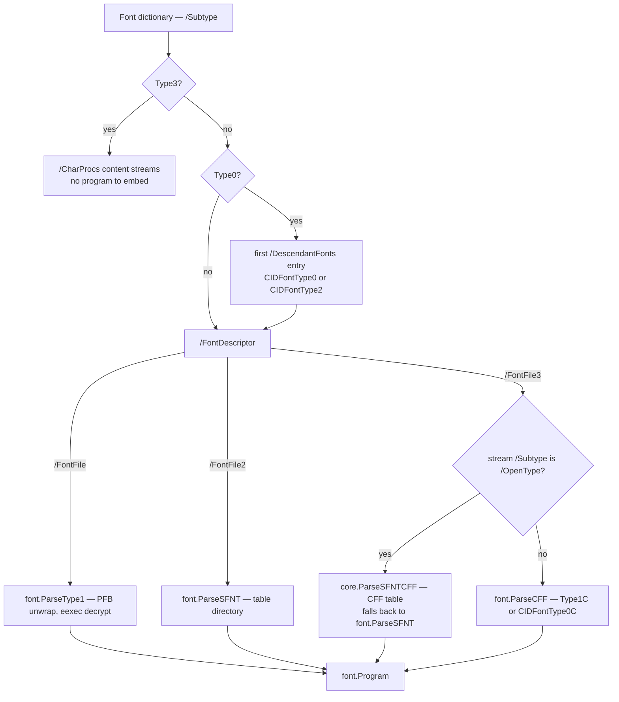
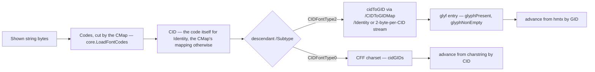

# Fonts

This doc is about reading fonts to validate them: `pdfa/fonts.go` and the
shared font-usage walk in `internal/core/fontuse.go` here, and the font
program reader they lean on, which is `font/fontprog.go` in
[github.com/mgilbir/forme](https://github.com/mgilbir/forme) along with the
generated tables `font/font_encodings.go` and `font/cff_strings.go`. Between
them they answer three questions the PDF/A and PDF/UA font rules keep asking:
*which glyphs does this file actually show*, *does the embedded font program
define them*, and *do the declared widths match the program's*. None of that is
decidable from the PDF object model, which is why sfnt, CFF and Type 1 programs
are parsed at all. Open this doc when a font rule fires and you need to know
why, when adding a rule that touches glyphs, or when chasing a false positive —
font rules are the densest rule family here and the most common source of both.
For the family view see [validators.md](validators.md).

Setting text with a font is a different subsystem and lives elsewhere.
Shaping — OpenType layout, the bidirectional algorithm, the Indic, Khmer,
Myanmar and Universal Shaping Engine models, subsetting — is forme's `shape`
package, because none of it is about PDF. What is about PDF stays in `fonts/`
here: turning positioned glyphs into content-stream operators, and writing the
font into the document as the object graph a reader needs. [Setting text and
getting it back](#setting-text-and-getting-it-back) below is about that half.

## Setting text and getting it back

`fonts.Face` has five ways to put a string on a page — `Encode`, `Shape`,
`ShapeWith`, `Draw` and `DrawShaped` — and `htmlpdf.Render` draws through
`Draw`. All of them go through one path in `fonts/draw.go`:

- **One function writes a code** (`appendCode`): `GlyphCode`'s two bytes for a
  composite face — the glyph index, or the CID for a CID-keyed CFF — and the
  WinAnsi byte for a simple or standard face. `/W`, `/CIDSet` and `/ToUnicode`
  are keyed by the same call, so they agree with the page by construction.
- **One plan decides what the text is.** `Draw` takes the text the glyphs were
  shaped from. Each glyph's ToUnicode entry is fixed the first time it is
  drawn: a ligature's is the letters it replaced ("ffi", not the U+FB03 the
  cmap registers the glyph under), a conjunct's its cluster ("क्ष"), a
  positional form's its letter, a plain character's the character the cmap
  prefers (日 over the radical ⽇). A cluster whose glyphs, read in drawing
  order, do not spell it — a vowel sign drawn before its consonant, a glyph
  already mapped to other text — is wrapped in an `/ActualText` (ISO 32000-2
  14.9.4), and so is a run drawn in an order other than the order it is read,
  which is every right-to-left run.
- **The CMap covers the glyphs used** and nothing else.

`Encode` returns bare codes, which cannot carry an `/ActualText`: a glyph the
cmap reaches from two characters extracts as the one the CMap names it by.

Embedding honours the font's licence (OS/2 `fsType`): Restricted License
embedding is refused with `fonts.ErrRestrictedLicense`, bitmap-only with
`fonts.ErrBitmapEmbeddingOnly`, and a font that forbids subsetting is embedded
whole, without a subset tag. The program, `/CIDSet` and `/ToUnicode` streams
are Flate-compressed.

`fonts_drawpaths_test.go` draws every path in a CID-keyed CFF, a TrueType face,
an Arabic face, a simple face and a standard face, and checks both that the
text extracts as written and that PDF/A-1b, -2b, -3b and -4 find nothing wrong
with the font.

## Font types and what each requires

pdf0 dispatches on the font dictionary's `/Subtype`, and for `Type0` again on
the descendant CIDFont's — everything downstream follows from that pair.

| Font | Program stream | Declared widths | Code → glyph in pdf0 | Subset set |
|------|----------------|-----------------|----------------------|------------|
| `Type1` / `MMType1` | `/FontFile` (Type 1) or `/FontFile3` `/Type1C` (CFF) | `/Widths` + `/FirstChar`, else descriptor `/MissingWidth` | code → glyph *name* via the encoding, name → charstring (`font.Program.GlyphNames`, `font.Program.WidthByName`) | `/CharSet` |
| `TrueType` | `/FontFile2` (sfnt) or `/FontFile3` `/OpenType` | same as Type 1 | code → GID through the program's `cmap` subtables (`font.TrueTypeGID`) | — |
| `Type0` → `CIDFontType0` | descendant's `/FontFile3` (CID-keyed CFF) or `/OpenType` | `/W` array + `/DW` (default 1000) | code (cut by the CMap) → CID → CFF charset entry (`font.Program.CIDGIDs`, `font.Program.WidthByCID`) | `/CIDSet` |
| `Type0` → `CIDFontType2` | descendant's `/FontFile2` | `/W` + `/DW` | code (cut by the CMap) → CID → GID via `/CIDToGIDMap` → `glyf` entry | `/CIDSet` |
| `Type3` | none — `/CharProcs` content streams | `/Widths` in glyph space, scaled by `/FontMatrix` | code → glyph name → CharProc, width from the `d0`/`d1` operand | — |

**Type 3 is exempt from embedding** (`checkOneFontEmbedded` returns early) but
not from width consistency: `checkType3Widths` reads the `w` operand of the
leading `d0`/`d1` in each CharProc, multiplies by `FontMatrix[0] * 1000`, and
compares against `/Widths`.

**The standard 14 fonts get no special case** — no built-in metrics table, no
exemption list. PDF/A requires every font embedded, so a bare `/BaseFont
/Helvetica` fails `checkFontsEmbedded` like any other unembedded font, and
nothing in forme's `font/fontprog.go` can supply its widths.

Rule identifiers differ per ISO 19005 part, so every finding routes through
`fontClause(concept, level)` rather than one parent clause — the `embed` concept
is 6.3.4 at PDF/A-1b, 6.2.11.4.1 at 2b/3b, 6.2.10.4.1 at A-4 — and the clause
values follow the veraPDF profiles, not a reading of the standard. Level-gated
rules: `/CharSet` and `/CIDSet` *presence* on subset fonts and the
CMap-must-be-embedded rule are PDF/A-1b only; the forbidden ToUnicode targets
U+0000/U+FEFF/U+FFFE are PDF/A-4 only; the CID ≤ 65535 implementation limit
applies everywhere except PDF/A-4, which has no implementation-limits clause.

## `collectFontTextUsage` — rules about text actually shown

Font rules are evaluated over the executed-content model
([ADR 0004](adr/0004-executed-content-model.md)): a font declared in
`/Resources` but never used to show text is not checked.
`core.CollectFontTextUsage` reads the content interpreter
(`internal/core/interp.go`), which executes each page's content with a graphics
state — a q/Q stack holding the current font and text rendering mode — and
follows what it invokes: form XObjects drawn with `Do` (which start in their
caller's state, font and mode included), tiling patterns painted with, and the
glyph descriptions of the Type 3 fonts it shows text in. It returns
`map[*Dictionary]*FontTextUsage` — per font dictionary, the raw shown string
bytes plus the set of text rendering modes in force when they were shown.
Because `Tr` and `Tf` are graphics state, `q 3 Tr Q` leaves the mode it found.

Executions are memoised per (content stream, resources, inherited state), so
one content stream shared by thousands of pages in the same state runs, and
records its text, once. Show operators are `Tj`, `TJ`, `'` and `"`; any other
operator clears the pending string operands.

**Rendering modes 3 and 7 are exempt.** `rendersVisibly(u)` returns false only
when every recorded mode is 3 (invisible) or 7 (add to clip, paint nothing) —
glyph shape is never painted in either. That gates the embedding rule
(`checkFontsEmbedded`, in `pdfa/pdfa.go`, builds an `exemptInvisible` set), glyph coverage, the
width rules, the damaged-program rule, `checkCIDSetProgramComplete` and the
Type 3 width check. A font with no recorded modes is treated as visible.

Two deliberate exceptions. **`.notdef` references are flagged even in invisible
text** — a text-showing operator must not reference it regardless of mode. And
**the `/CIDToGIDMap` requirement uses mode 3 only**: `checkOneFontDict` computes
its own `onlyInvisible` flag testing `m != 3`, ignoring mode 7, because the
corpus passes a mode-3 font at 1b. That is the one place in the subsystem where
the invisibility test is not `rendersVisibly`.

Two font checks bypass the model and walk every dictionary the trailer reaches
(`core.View.ReachableDicts`) — `checkCMapEmbedded` and `checkCMapCIDLimit` —
because both are about the CMap object, not about shown glyphs. The usage map
is shared well beyond PDF/A: the PDF/UA font checks iterate it too. Text
extraction (`text.go`) reads ToUnicode with
`core.ParseToUnicode` and asks each code for its full destination
(`core.ToUnicode.Runes`) rather than its first rune,
because a ligature's entry is several characters. PDF/X
is the outlier — `pdfxCheckFontsEmbedded` scans resources itself.

## Font program parsing (forme's `font/fontprog.go`)

The parsers belong to forme, and their documentation is forme's `font` package;
this section is what the PDF/A and PDF/UA rules rely on them for.
`core.LoadFontProgram` picks the parser from the descriptor key, and everything
converges on one `font.Program`.

**sfnt (`font.ParseSFNT`).** Advance widths, outline extents and code→GID come
from the font's own tables: the best Unicode `cmap` subtable into
`font.Program.Cmap`, `(3,0)` into `font.Program.SymbolCmap` (queried with the
`0xF000` prefix first), `(1,0)` into `font.Program.MacCmap`.
`font.Program.CmapSubtableCount` is kept because ISO 19005-1 6.3.7 requires a
symbolic TrueType font to declare exactly one subtable.

**Which Unicode subtable wins** (`unicodeCmapRank`). A font may carry several, so
the choice is ranked rather than "last one seen": `(3,10)` Windows full
repertoire, then `(3,1)` Windows BMP, then `(0,4)`/`(0,6)` Unicode full
repertoire, then any other `(0,x)`. `(3,10)` outranks `(3,1)` because it is a
superset that reaches past the BMP; the Windows platform outranks the Unicode
platform at equal coverage because ISO 32000-1 9.6.6.4 describes code→GID in
terms of the Windows subtables. An unreadable higher-ranked subtable never
displaces a readable lower-ranked one — nor does one that is well formed but
maps nothing.

**Subtable formats.** `font.ParseCmapSubtable` reads every format whose codes
are Unicode code points; its documentation lists them and says why format 2
(legacy CJK encodings, never at a Unicode platform/encoding pair) and format 14
(variation sequences, a different function altogether) are not among them. An
unparseable subtable — or one that parses cleanly and maps nothing — yields
`nil`, never an empty map: `font.TrueTypeGID` treats a non-nil `cmap` as
authoritative, so an empty one would read as "every code is `.notdef`" instead
of "unknown". forme's own `FuzzCmapSubtable` pins that invariant.

**Empty glyph is not missing glyph.** This distinction is the trap, and it is
why two parallel arrays exist. `glyphPresent[gid]` means the loca entry is
well-formed and lies inside `glyf` (`start <= end && end <= glyfLen`) — an empty
entry, `start == end`, is still *present*. `glyphNonEmpty[gid]` means the entry
has non-zero length, i.e. carries an actual outline. A subset must embed an
outline for every glyph it renders, so an empty `glyf` entry for a rendered CID
is a violation — *except* for whitespace, where a blank glyph is correct.
`checkCIDFontConsistency` therefore consults the font's ToUnicode map and
reports an existing-but-empty glyph only when `toUni[cid]` maps to a
non-whitespace rune (`isGlyphWhitespace` accepts `unicode.IsSpace`, U+200B and
U+FEFF). Collapsing the two predicates false-positives on every space in every
subset font. A third array, `componentGID[gid]`, is filled by `font.MarkComposite`:
a glyph referenced as a component of a composite (an accent reused across
letters) carries an outline solely as a building block and is not a directly
mapped CID, so `checkCIDFontCIDSet` skips those or a conformant `/CIDSet` looks
incomplete. The three arrays are `font.Program.GlyphPresent`,
`font.Program.GlyphNonEmpty` and `font.Program.ComponentGID`.

**CFF (`font.ParseCFF`) and Type 1 (`font.ParseType1`).** A CID-keyed CFF (one
with the `ROS` operator) fills `font.Program.CIDGIDs` and
`font.Program.WidthByCID` keyed by its charset's CIDs; a name-keyed CFF or a
Type 1 program fills `font.Program.GlyphNames` and `font.Program.WidthByName`.
Widths come from the charstrings — the optional leading width operand of a
Type 2 charstring, read through the glyph's own Private DICT and its
subroutines, or `hsbw`/`sbw` in Type 1. The Type 1 reader stops at the
standalone `end` token that closes the CharStrings dictionary
(`font.Type1CharStringsEnd`, Type 1 Font Format 10.3), never at a glyph *name*
containing "end": `endash` and `endescender` are ordinary glyphs, and breaking
on the name once truncated the glyph list, so every glyph after it read as
missing from a font that defines it (`TestType1CharStringsEndTerminator`).

**Widths are always normalised to 1/1000 text-space units**, because that is
what `/Widths` and `/W` are in: sfnt scales by `1000 / unitsPerEm`, CFF and
Type 1 by `FontMatrix[0] * 1000` (the default 0.001 matrix giving a factor of
1). The tolerance is `glyphWidthTolerance = 1.0`, one thousandth of an em. If a
descriptor carries a `FontFile*` stream no parser accepts and the font renders
visibly, `damagedFontProgramError` reports it under the `embed` clause rather
than silently exempting the font — across the corpus every valid embedded
program parses, so this raises no false positive.

## Encodings and character mapping

Two generated tables in forme back the encoding machinery, and their headers
name their provenance: `font/font_encodings.go` ("generated from ISO 32000-1
Annex D.2") holds `font.StandardEncodingNames`, `font.MacRomanEncodingNames` and
`font.WinAnsiEncodingNames`, consumed by `simpleFontCodeToName`, which layers a
base encoding (named, or `StandardEncoding` implicitly for a non-symbolic font)
with `/Differences` to produce `map[byte]string`; `font/cff_strings.go` holds
the 391 predefined CFF strings (Adobe Technical Note #5176, Appendix A). A
third table, `aglNames` in `pdfa/fonts.go`, is a hand-maintained Adobe Glyph
List subset validating `/Differences` names on non-symbolic TrueType fonts;
`aglGlyphName` also accepts the algorithmic `uniXXXX`/`uXXXX` forms.

For a Type 0 font the path from bytes to glyph is longer:

Identity CMaps and embedded CMaps are decoded; a predefined CMap other than
Identity is data this module does not carry, so the font is skipped and the
skip reported (see [CMaps](#cmaps) below).

**Identity-H/V codes are exactly two bytes**, so a shown string of odd length
ends in an incomplete code that cannot reference a defined glyph (ISO 32000-1
9.7.5, 9.10); pdf0 reports it under the `glyphs` clause. This matters more than
it sounds — a stray one-byte literal inside an otherwise well-formed Identity
run is what a veraPDF fail case tests, and it is easy to misdiagnose as an
empty-outline problem.

**ToUnicode and CMap reading.** Every CMap program — a ToUnicode CMap or an
embedded CID CMap — is read as a token stream by one reader
(`internal/core/cmapparse.go`), through the same lexer the content streams use,
and the data-carrying operators are interpreted. `core.ParseToUnicode` reads a
font's map once per run; `core.ToUnicode.First` gives a code's first rune and
`core.ToUnicode.Runes` the whole destination, which text extraction and the Private Use Area rule need because a
ligature's entry is several characters. `core.HasForbiddenUnicodeTargets` finds
the U+0000/U+FEFF/U+FFFE targets PDF/A-4 forbids, reading an array-form
`bfrange` destination as one operand. `core.CMapMaxCID` gives the largest CID a
CMap declares, for the implementation-limit rule, and `cmapContentWMode` /
`cmapUseCMap` (over `core.CMapWMode` / `core.CMapUseCMap`) pull `/WMode` and the
`usecmap` operand out of an embedded CMap to cross-check against the stream
dictionary.

The reader replaced a family of text searches that each failed on something a
token stream cannot: a keyword inside a comment, several entries on a line, CR
alone between lines, an array-form destination throwing a count out of step. It
runs over untrusted bytes, so expansion is bounded: no range may span more than
65,536 codes, and one CMap may declare no more than 65,536 mappings.

## CIDSet and CharSet

Both are subset-completeness declarations in the `FontDescriptor`, and "present
glyph" means something different per font type. `/CharSet` (Type 1 / MMType1) is
a string of `/name` tokens, parsed by `core.ParseCharSet`. `/CIDSet` is a bitmap
stream: bit *i*, MSB-first within each byte, means CID *i* is present. It is
`core.CIDSet` and membership (`core.CIDSet.Has`) is tested directly against the
bytes — deliberately, because materialising a set of every present CID turned a
64 MB CIDSet (512 M bits) into roughly 70 seconds of validation. That is pinned
by `cidset_test.go`, including a 16 MiB all-ones guard.

| Check | Level | What it asserts |
|-------|-------|-----------------|
| `checkFontSubsets` (`pdfa/pdfa.go`) | 1b only | A subset font (`ABCDEF+` BaseFont prefix) must *have* `/CharSet` or `/CIDSet`. Parts 2+ only constrain the sets when present. |
| `checkFontSubsetCompleteness` | all | When present, the set must list every glyph name / CID **used for rendering**. |
| `checkCIDSetProgramComplete` | 1b only | The `/CIDSet` must be non-empty and enumerate every glyph **present in the program**: CID-keyed CFF charset CIDs, or, for `CIDFontType2`, every CID whose glyph (through its `/CIDToGIDMap`) has an outline. |

The PDF/UA counterpart `checkType1CharSet` is stricter — it checks both
directions, program→CharSet and CharSet→program. Its sibling
`checkCIDFontCIDSet` records why the equivalent CIDFont rule is *not* enforced
beyond emptiness in the PDF/A path: a conformant `/CIDSet` legitimately omits
CIDs whose glyphs exist only as padding or composite components.

## File map

| File | Owns | Governing spec |
|------|------|----------------|
| `pdfa/fonts.go`, `internal/core/fontuse.go`, `internal/core/interp.go`, `internal/core/cmap.go`, `internal/core/cmapparse.go`, `internal/core/cmap_predefined.go`, `internal/core/tounicode.go` | Content execution (`core.CollectFontTextUsage`), the font rule functions, the predefined-CMap codespace table, encoding/AGL validation, CID width parsing, CIDSet/CharSet, CMap and ToUnicode reading | ISO 32000-2 clause 9 (9.6 simple fonts, 9.7 composite, 9.10 Unicode mapping) ISO 19005-1 6.3, -2/-3 6.2.11, -4 6.2.10 |
| forme `font/fontprog.go` | `font.Program` plus `font.ParseSFNT`, `font.ParseCFF`, `font.ParseType1` | OpenType/sfnt spec (`head`, `maxp`, `hhea`, `hmtx`, `loca`, `glyf`, `cmap`) Adobe TN #5176 (CFF), TN #5177 (Type 2 charstrings), TN #5015 (Type 1) |
| forme `font/font_encodings.go` | Generated: `font.StandardEncodingNames`, `font.MacRomanEncodingNames`, `font.WinAnsiEncodingNames` | ISO 32000-1 Annex D.2 |
| forme `font/cff_strings.go` | Generated: the 391 CFF standard strings, indexed by SID | Adobe TN #5176 Appendix A |

Font findings are also produced outside these files: `checkFontsEmbedded` and
`checkFontSubsets` live in `pdfa/pdfa.go`, the clause-7.21 PDF/UA font family in
`pdfua/pdfua.go`, and `pdfxCheckFontsEmbedded` in `pdfx/pdfx.go`.

## DoS guards

Each exists because a crafted file reached it. Checks run behind `recover()`,
but a hang or an OOM is not something `recover` catches.

One of these is configurable per document; see
[architecture.md](architecture.md#resource-limits).

- **`/W` is not expanded** — `parseCIDWidths` resolves the entries once into
  disjoint CID segments and `width` looks a CID up by binary search, so
  `[0 2000000000 500]` costs one entry, not two billion map inserts, and 2,000
  overlapping full-space ranges cost 2,000 (audit 2026-07-26 C1, 2026-09-22
  C10; `pdfa/fonts_wrange_test.go`). It runs *before* the visible-render gate, so
  merely selecting a Type 0 font with `Tf` reaches it. A `/W` named by
  reference is read once per run however many fonts share it.
- **cmap format 4 total work** (`WithMaxCmapWork`, default `1 << 18`) — a valid
  subtable partitions the BMP in ~65536 iterations, a hostile one with many
  full-range segments is O(segments × 65535) (2026-07-26 audit C10). On trip the partial
  map is returned and marked partial (`font.Program.CmapPartial`), the glyph rules
  decline, and the trip is reported — see [limits.md](limits.md).
- **cmap format 12 total work** (the same `WithMaxCmapWork` budget, charged
  per subtable) — `nGroups` is
  a `uint32` and one group may span the whole of Unicode (0x110000 codes), so the
  expansion is entirely font-controlled. The budget charges one unit per group
  *and* one per code, which bounds the group loop as well as the map; on trip the
  partial map is returned, as in format 4. `1 << 18` is four times the 65535
  glyphs an sfnt can hold, so no honest font comes near it. `nGroups` is also
  checked against the bytes actually present, and a group is skipped when
  inverted or when it starts past U+10FFFF.

### Why formats 4 and 12 share one budget

They were two separate constants, both `1 << 18`, and were collapsed into the
single `WithMaxCmapWork`. The obvious
objection is that format 12 can address sixteen times as many code points as
format 4 — the whole of Unicode rather than the BMP — so it might warrant more
room.

Measured against the veraPDF corpus, it does not. Across **358 embedded cmaps the
largest holds 4,985 entries — 1.9% of the budget**, leaving roughly 52x headroom,
and the ceiling is set by the font rather than the format: an sfnt holds at most
65,535 glyphs, so a font mapping more than `1 << 18` code points is mapping four
codes to every glyph it has.

Splitting the knob would also expose the wrong thing. A caller can reason about
"how much work may one font cost me"; they cannot reason about "how much work may
the format-12 subtable cost me", because which format a font uses is an internal
detail of the font, not a property of the document they are validating. The unit
the budget counts — one per group and one per code — is format-agnostic, and the
budget bounds a single subtable rather than the whole table, so a font carrying
several does not have them compete.

If a real font is ever found that needs different room per format, the split is
a second field and a second option; nothing here forecloses it.
- **CMap range span and entry count** and **CIDSet membership without
  materialisation** (`core.CIDSet` tests bits in place) — both described above.
- **Content lexer progress** — `core.ContentLexer`, the one content-stream
  lexer, consumes at least one byte per step (a stray `)` included, so leaked
  inline-image sample data cannot stall it), steps over `BI … EI` inline images
  honouring a declared `/L`, and drops a run of regular bytes longer than
  `core.MaxContentTokenLen` that is not a number while letting numeric tokens
  run to full Annex C precision.
- **Per-run memoization** — the validation cache holds the font-usage map, the
  per-stream event skeletons and the per-stream used-name sets.

## Third-party data

The metrics of the fourteen standard faces are generated from the **Adobe Core
14 AFM files**, and live with the rest of the shaping code in forme
(`shape/standard14.go`), which carries the Adobe copyright notices and the
licence paragraph verbatim as that licence requires. Only advance widths and
font-wide metrics are taken; no outline, no font program and no character shape
is reproduced, and no AFM file is redistributed.

The fourteen names — Helvetica, Times, Courier, Symbol, ZapfDingbats and the
variants — are the identifiers ISO 32000-2 9.6.2.2 gives these faces, and are
what a `/BaseFont` entry holds. Several are trademarks of their owners. Naming
one in a PDF is how the format says "the face the reader already has"; this
repository contains no typeface at all, and `find . -name '*.ttf' -o -name
'*.otf'` returns nothing. The bundled face a document can be written with is
forme's, under the SIL Open Font License, with its licence file beside it.

Other generated tables and their sources are listed in the table above.

## CID-keyed CFF

A CID-keyed CFF numbers its glyphs by CID and reaches them through its charset,
so the CID and the glyph index are two different numberings. Every static Noto
CJK face is one. Three things in the written document are keyed by CID rather
than by glyph, and all three come from the program rather than being assumed:

| written | keyed by | read from |
|---|---|---|
| the code in the content stream | CID | `Encode`, which asks the charset |
| `/W` | CID | `shape.Face.GlyphCode` |
| `/CIDSet` | CID | the same |
| `/ToUnicode` | CID | the same |
| `/CIDSystemInfo` | — | the CFF's ROS operator |

Getting any of them wrong is invisible on a font whose charset happens to be the
identity, and most are. In Noto Sans JP `ｱ` is glyph 15435 and CID 59158, so a
`/W` written by glyph index describes something fifteen thousand places away —
and the reader shows a plausible page with the wrong metrics.

`/CIDSystemInfo` is the font's own registry, ordering and supplement, from
`shape.Face.CharacterCollection`, because §9.7.4.2 requires it to be compatible
with the character collection of the glyph source. Noto's is
`Adobe-Identity-0`; the veraPDF corpus carries an `Adobe-Japan1-6` font, which
is what the test uses, since a font already in the Identity collection cannot
tell a read value from an assumed one.

**A CID-keyed font that cannot name its collection is refused, not defaulted.**
`CharacterCollection` returns `ok == false` for a ROS naming strings the font
does not carry, or a supplement below zero — both malformed in ways that parse,
which is what makes them dangerous. Writing `Adobe-Identity-0` there looks like
caution and is not: it is a specific claim that the CIDs are the font's own
arbitrary numbering, and a reader believing it over an Adobe-Japan1 font looks
every glyph up in the wrong collection. The check runs *before* subsetting,
since the collection is a fact about the face; a font that cannot be embedded
then says so for the reason that matters rather than reporting whatever the
subsetter met first.

Widths come from `hmtx` through `Face.GlyphAdvances`, not from the CFF
charstrings — the two disagree in Noto Sans JP (glyph 34 is 608 in `hmtx` and
742 in the CFF) and `hmtx` is what an OpenType wrapper makes authoritative. It
is also what layout measured with, so the document's `/W` and its line breaks
agree.

A face from `fonts.Adopt` is embedded exactly as a loaded one is. `GlyphCode`
answers the keying from the face, and the collection is read from the *subset* —
the program `Adopt` never saw, which carries the ROS and the charset through
untouched. For a loaded face the collection is known before subsetting, so a
font that cannot be embedded says so for the reason that matters rather than
reporting whatever the subsetter met first.

## CMaps

A Type 0 font's `/Encoding` says how the bytes in a content stream become CIDs,
and nothing else does. Until it is read, a checker cannot name a single glyph
the page uses — not to ask whether the font has it, not to compare its width,
not to notice `.notdef`.

| `/Encoding` | read | how |
|---|---|---|
| `Identity-H`, `Identity-V` | yes | built in: two bytes to a code, CID = code |
| a stream | yes | `core.ParseCMap` — codespace ranges, `cidrange`, `cidchar` |
| any other name | **no** | a predefined CMap; the data is not here, so the font is skipped — and the skip is *reported*, as the `predefined-cmap` guard, so a caller can tell "checked and clean" from "not checked" |

The corpus says where the value is: of 223 Type 0 fonts, 149 use Identity, **69
embed a CMap** and 5 name a predefined one.

**A valid code is cut by containment; an invalid one by its first byte**
(§9.7.6.2). A code that lies wholly inside a codespace range — every byte within
the range's bounds for its position — is that range's length, shortest first.
Bytes that make no valid code take their length from the first byte: a
mixed-width CMap has a one-byte space `<00>–<80>` and a two-byte one
`<8140>–<9FFC>`, and the string `81 20` is a *two-byte* code — invalid, outside
the range, but two bytes. Reading it as one byte makes the `20` the start of the
next code, so every code after it in the string is wrong. That is the whole of
mixed-width CJK and it is what `codeAt` is careful about. The two rules agree
wherever ranges of different lengths start with different bytes, which is
nearly everywhere; they part on GB 18030 (`GBK2K-H`), whose two- and four-byte
ranges share first bytes, where `81 30 81 30` is one four-byte code.

Text extraction and the PDF/A Level A Private Use scan cut codes the same way,
through `core.LoadFontCodes`: the full CMap where `core.LoadCMap` reads one, and
otherwise the codespace alone — a predefined CMap's, from a table transcribed
from Adobe's published CMaps (`internal/core/cmap_predefined.go`), or an embedded CMap's own
ranges plus those of the predefined CMap it names with `usecmap`. A codespace is
enough to cut codes, which is all those two readers need before looking each
code up in the ToUnicode map; the codes of the `Uni*-UCS2` and `Uni*-UTF16`
CMaps are Unicode themselves. Both readers used to cut every Type 0 string into
two-byte codes (audit 2026-09-22 C88).

Every check that turns a shown string into glyph references goes through it:
the PDF/A glyph, `.notdef` and width rules, the `/CIDSet` completeness rule, and
PDF/UA's `.notdef` rule. Simple fonts are untouched — a code there is one byte
by definition.

A code the document writes and its own CMap does not define is reported as
that, and not as CID 0 — a `.notdef` reference is something the document did on
purpose and this is not.

A CMap that builds on another with `usecmap` is read together with it when that
one is embedded too. When it names a predefined CMap this module does not carry,
its own entries are still read and checked, and a code it leaves to that base
decodes as unknown rather than undefined: no rule asserts against it, and the
skip is reported when a check first meets such a code — a CMap that defines
every code the document shows was checked in full.

The parser is bounded, because a CMap arrives in a document: `<0000> <FFFFFFFF>
1` is eleven bytes asking for four billion inserts. Ranges are kept as ranges,
one wider than 65,536 refuses the whole map, and the stream decodes through the
same budget as any other.

## Confirmed limitations

- **Predefined CMaps are not decoded.** A Type 0 font whose `/Encoding` names
  one of Adobe's published CMaps — `UniJIS-UCS2-H` and the rest — is checked at
  the dictionary level only, because the mapping is data this module does not
  carry; the skip is reported. Identity and *embedded* CMaps are decoded (see
  [CMaps](#cmaps)).
- **cmap formats 2 and 14 are not parsed** — see `font.ParseCmapSubtable` for
  why. Format 14 in particular means variation sequences are invisible.
  Format 12's groups are read as written: they are required to be sorted and
  non-overlapping, and neither is enforced — an overlap resolves to the last
  group.
- **No standard-14 metrics in validation**, so only the embedding rule fires on
  an unembedded standard font.
- **`simpleGlyphExists` treats GID 0 as non-existent** for TrueType, merging
  "code maps to `.notdef`" with "code maps to nothing"; only `isNotdefGlyph`
  separates them.
