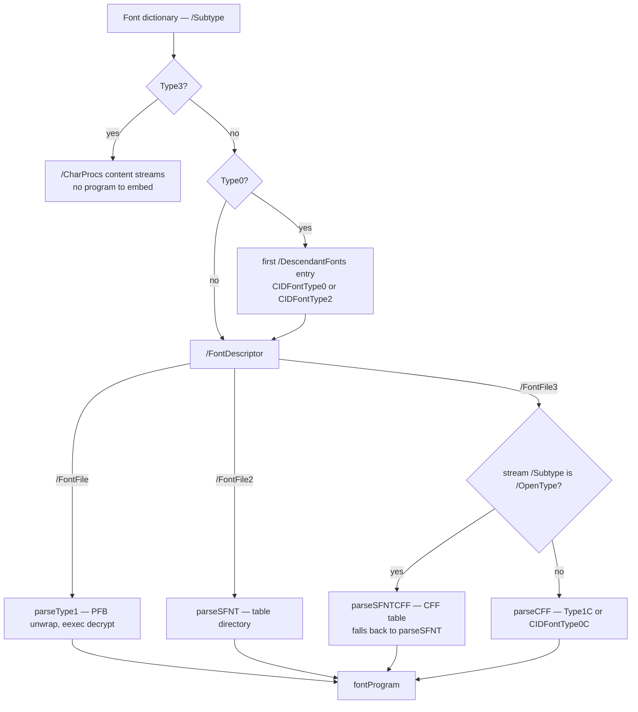
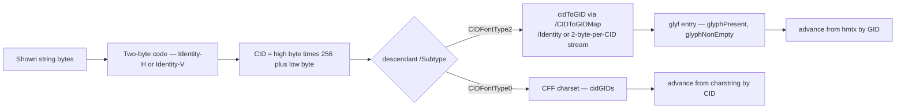

# Fonts

The font subsystem is about 3,900 lines across four files — `fonts.go`,
`fontprog.go`, and the generated tables `font_encodings.go` and
`cff_strings.go`. It answers three questions the PDF/A and PDF/UA font rules
keep asking: *which glyphs does this file actually show*, *does the embedded
font program define them*, and *do the declared widths match the program's*.
None of that is decidable from the PDF object model, so pdf0 parses sfnt, CFF
and Type 1 font programs in-tree. Open this doc when a font rule fires and you
need to know why, when adding a rule that touches glyphs, or when chasing a
false positive — font rules are the densest rule family here and the most common
source of both. For the family view see [validators.md](validators.md).

## Font types and what each requires

pdf0 dispatches on the font dictionary's `/Subtype`, and for `Type0` again on
the descendant CIDFont's — everything downstream follows from that pair.

| Font | Program stream | Declared widths | Code → glyph in pdf0 | Subset set |
|------|----------------|-----------------|----------------------|------------|
| `Type1` / `MMType1` | `/FontFile` (Type 1) or `/FontFile3` `/Type1C` (CFF) | `/Widths` + `/FirstChar`, else descriptor `/MissingWidth` | code → glyph *name* via the encoding, name → charstring (`glyphNames`, `widthByName`) | `/CharSet` |
| `TrueType` | `/FontFile2` (sfnt) or `/FontFile3` `/OpenType` | same as Type 1 | code → GID through the program's `cmap` subtables (`trueTypeGID`) | — |
| `Type0` → `CIDFontType0` | descendant's `/FontFile3` (CID-keyed CFF) or `/OpenType` | `/W` array + `/DW` (default 1000) | 2-byte code → CID → CFF charset entry (`cidGIDs`, `widthByCID`) | `/CIDSet` |
| `Type0` → `CIDFontType2` | descendant's `/FontFile2` | `/W` + `/DW` | 2-byte code → CID → GID via `/CIDToGIDMap` → `glyf` entry | `/CIDSet` |
| `Type3` | none — `/CharProcs` content streams | `/Widths` in glyph space, scaled by `/FontMatrix` | code → glyph name → CharProc, width from the `d0`/`d1` operand | — |

**Type 3 is exempt from embedding** (`checkOneFontEmbedded` returns early) but
not from width consistency: `checkType3Widths` reads the `w` operand of the
leading `d0`/`d1` in each CharProc, multiplies by `FontMatrix[0] * 1000`, and
compares against `/Widths`.

**The standard 14 fonts get no special case** — no built-in metrics table, no
exemption list. PDF/A requires every font embedded, so a bare `/BaseFont
/Helvetica` fails `checkFontsEmbedded` like any other unembedded font, and
nothing in `fontprog.go` can supply its widths.

Rule identifiers differ per ISO 19005 part, so every finding routes through
`fontClause(concept, level)` rather than one parent clause — the `embed` concept
is 6.3.4 at PDF/A-1b, 6.2.11.4.1 at 2b/3b, 6.2.10.4.1 at A-4 — and the clause
values follow the veraPDF profiles, not a reading of the standard. Level-gated
rules: `/CharSet` and `/CIDSet` *presence* on subset fonts and the
CMap-must-be-embedded rule are PDF/A-1b only; the forbidden ToUnicode targets
U+0000/U+FEFF/U+FFFE are PDF/A-4 only; the CID ≤ 65535 implementation limit
applies everywhere except PDF/A-4, which has no implementation-limits clause.

## `collectFontTextUsage` — rules about text actually shown

Font rules are evaluated over the executed-content model
([ADR 0004](adr/0004-executed-content-model.md)): a font declared in
`/Resources` but never used to show text is not checked. `collectFontTextUsage`
walks each page's content, recurses into the form XObjects invoked with `Do` and
the tiling patterns selected with `scn`, and returns
`map[*Dictionary]*fontTextUsage` — per font dictionary, the raw shown string
bytes plus the set of text rendering modes in force when they were shown.

Tokenization is separated from attribution. `buildFontEvents` turns a decoded
stream into a container-independent skeleton of `evTf` / `evTr` / `evShow`
events, deliberately keeping the `Tf` *operand name* rather than resolving it,
because resolution depends on the container's `/Resources`. Replaying that
skeleton against a container reproduces exactly what a direct walk would
attribute, and it is cached per `*Stream`; an `sfKey{stream, fontRes}` set then
skips re-attributing a (content stream, `/Font` dictionary) pair already
processed, so one content stream shared by thousands of pages does not
accumulate the same text thousands of times. Show operators are `Tj`, `TJ`, `'`
and `"`; any other operator clears the pending string operands.

**Rendering modes 3 and 7 are exempt.** `rendersVisibly(u)` returns false only
when every recorded mode is 3 (invisible) or 7 (add to clip, paint nothing) —
glyph shape is never painted in either. That gates the embedding rule
(`checkFontsEmbedded` builds an `exemptInvisible` set), glyph coverage, the
width rules, the damaged-program rule, `checkCIDSetProgramComplete` and the
Type 3 width check. A font with no recorded modes is treated as visible.

Two deliberate exceptions. **`.notdef` references are flagged even in invisible
text** — a text-showing operator must not reference it regardless of mode. And
**the `/CIDToGIDMap` requirement uses mode 3 only**: `checkOneFontDict` computes
its own `onlyInvisible` flag testing `m != 3`, ignoring mode 7, because the
corpus passes a mode-3 font at 1b. That is the one place in the subsystem where
the invisibility test is not `rendersVisibly`.

Two font checks bypass the model and scan `doc.Objects` directly —
`checkCMapEmbedded` and `checkCMapCIDLimit` — because both are about the CMap
object, not about shown glyphs. The usage map is shared well beyond PDF/A: nine
PDF/UA checks iterate it, `content_operators.go` uses it to find Type 3 glyph
procedures, and `text.go` reuses `parseToUnicodeMap` for text extraction. PDF/X
is the outlier — `pdfxCheckFontsEmbedded` scans resources itself.

## Font program parsing (`fontprog.go`)

`loadFontProgram` picks the parser from the descriptor key, and everything
converges on one `fontProgram` struct.

**sfnt (`parseSFNT`).** Accepts tag `0x00010000`, `true` or `OTTO`. Reads `head`
for `unitsPerEm` and the loca format flag, `maxp` for `numGlyphs`, `hhea` +
`hmtx` for advance widths, `loca` + `glyf` for outline extents, and `cmap` for
code→GID: the best Unicode subtable into `cmap`, `(3,0)` into `symbolCmap`
(queried with the `0xF000` prefix first), `(1,0)` into `macCmap`.
`cmapSubtableCount` is kept because ISO 19005-1 6.3.7 requires a symbolic
TrueType font to declare exactly one subtable.

**Which Unicode subtable wins** (`unicodeCmapRank`). A font may carry several, so
the choice is ranked rather than "last one seen": `(3,10)` Windows full
repertoire, then `(3,1)` Windows BMP, then `(0,4)`/`(0,6)` Unicode full
repertoire, then any other `(0,x)`. `(3,10)` outranks `(3,1)` because it is a
superset that reaches past the BMP; the Windows platform outranks the Unicode
platform at equal coverage because ISO 32000-1 9.6.6.4 describes code→GID in
terms of the Windows subtables, and because that keeps the choice unchanged for
every font whose subtables are the `(3,1)`/`(3,0)`/`(1,0)` trio. Equal ranks
resolve to the later subtable, as the un-ranked code always did. An unreadable
higher-ranked subtable never displaces a readable lower-ranked one — nor does a
higher-ranked one that is perfectly well formed but maps nothing, which amounts
to the same thing and is why "maps nothing" is folded into "unreadable" below.

**Subtable formats.** 0 (byte table), 4 (segment mapping), 6 (trimmed table) and
12 (segmented coverage) are parsed; formats 2, 8, 10, 13 and 14 are not. Format
12 is the only one whose keys can exceed `0xFFFF`, and in practice it is where a
`(3,10)`/`(0,4)` subtable's supra-BMP coverage lives. An unparseable subtable —
unknown format, truncated body, a declared `length`/`nGroups` the buffer cannot
back — yields `nil`, never an empty map: `trueTypeGID` treats a non-nil `cmap` as
authoritative, so an empty one would read as "every code is `.notdef`" instead of
"unknown". So does a subtable that parses cleanly and maps nothing at all, which
is not a theoretical shape: sixteen bytes of format-12 header declaring
`nGroups` 0, a lone `0xFFFF` format-4 sentinel, or a table whose every group
lies outside Unicode all reach the end of the parse holding no mapping.
`FuzzCmapSubtable` found the last of those, and pins the invariant.

**Empty glyph is not missing glyph.** This distinction is the trap, and it is
why two parallel arrays exist. `glyphPresent[gid]` means the loca entry is
well-formed and lies inside `glyf` (`start <= end && end <= glyfLen`) — an empty
entry, `start == end`, is still *present*. `glyphNonEmpty[gid]` means the entry
has non-zero length, i.e. carries an actual outline. A subset must embed an
outline for every glyph it renders, so an empty `glyf` entry for a rendered CID
is a violation — *except* for whitespace, where a blank glyph is correct.
`checkCIDFontConsistency` therefore consults the font's ToUnicode map and
reports an existing-but-empty glyph only when `toUni[cid]` maps to a
non-whitespace rune (`isGlyphWhitespace` accepts `unicode.IsSpace`, U+200B and
U+FEFF). Collapsing the two predicates false-positives on every space in every
subset font. A third array, `componentGID[gid]`, is filled by `markComposite`:
a glyph referenced as a component of a composite (an accent reused across
letters) carries an outline solely as a building block and is not a directly
mapped CID, so `checkCIDFontCIDSet` skips those or a conformant `/CIDSet` looks
incomplete.

**CFF (`parseCFF`).** Parses the INDEX structures (names, top DICTs, strings,
charstrings), the top DICT operators, and the charset. `_, isCID := top[1230]`
(the `ROS` operator) splits the two worlds: a CID-keyed font fills `cidGIDs` and
`widthByCID` keyed by the charset's CIDs, a name-keyed font fills `glyphNames`
and `widthByName` via `cffSIDName`. Widths come from the optional leading
operand of a Type 2 charstring (`type2CharstringWidth`, detected by an operand
count exceeding what the first stack-clearing operator takes), offset by the
Private DICT's `nominalWidthX`, defaulting to `defaultWidthX`.

**Type 1 (`parseType1`).** Unwraps PFB segment framing, reads the cleartext
`/FontMatrix`, finds `eexec`, decodes the hex form when the payload starts with
four hex digits, decrypts with r=55665, then walks `/CharStrings` decrypting
each charstring with r=4330 (skipping `lenIV` bytes) and taking the width from
`hsbw` or `sbw`.

**Widths are always normalised to 1/1000 text-space units**, because that is
what `/Widths` and `/W` are in: sfnt scales by `1000 / unitsPerEm`, CFF and
Type 1 by `FontMatrix[0] * 1000` (the default 0.001 matrix giving a factor of
1). The tolerance is `glyphWidthTolerance = 1.0`, one thousandth of an em. If a
descriptor carries a `FontFile*` stream no parser accepts and the font renders
visibly, `damagedFontProgramError` reports it under the `embed` clause rather
than silently exempting the font — across the corpus every valid embedded
program parses, so this raises no false positive.

## Encodings and character mapping

Two generated tables back the encoding machinery, and their headers name their
provenance. **`font_encodings.go`** — "generated from ISO 32000-1 Annex D.2
(spec/pdf1.7)" — holds `standardEncodingNames`, `macRomanEncodingNames` and
`winAnsiEncodingNames`, consumed only by `simpleFontCodeToName`, which layers a
base encoding (named, or `StandardEncoding` implicitly for a non-symbolic font)
with `/Differences` to produce `map[byte]string`. **`cff_strings.go`** — "the
391 predefined CFF strings (Adobe Technical Note #5176, Appendix A), indexed by
SID" — is consumed only by `cffSIDName`: SIDs below 391 index this table, higher
SIDs index the font's own string INDEX. Neither has a generator committed in
`cmd/`. A third table, `aglNames` in `fonts.go`, is a hand-maintained Adobe
Glyph List subset validating `/Differences` names on non-symbolic TrueType
fonts; `aglGlyphName` also accepts the algorithmic `uniXXXX`/`uXXXX` forms.

For a Type 0 font the path from bytes to glyph is longer:

**Only Identity decoding is handled precisely.** `checkCIDFontConsistency` skips
the per-glyph loop for any non-Identity CMap, because decoding a shown string
under an arbitrary predefined CMap needs that CMap's own code-space ranges.

**Identity-H/V codes are exactly two bytes**, so a shown string of odd length
ends in an incomplete code that cannot reference a defined glyph (ISO 32000-1
9.7.5, 9.10); pdf0 reports it under the `glyphs` clause. This matters more than
it sounds — a stray one-byte literal inside an otherwise well-formed Identity
run is what a veraPDF fail case tests, and it is easy to misdiagnose as an
empty-outline problem.

**ToUnicode and CMap scanning.** `parseToUnicodeMap` builds code → first rune
from `beginbfchar`/`beginbfrange`, using `angleTokens` to pick out `<hhhh>`
groups (often written with no separating whitespace, e.g. `<0003><0003><0020>`).
`hasForbiddenUnicodeTargets` scans the same sections for U+0000/U+FEFF/U+FFFE —
bfchar destinations are every second hex token, bfrange every third. `maxCMapCID`
scans `begincidrange`/`begincidchar` for the implementation-limit rule, and
`cmapContentWMode` / `cmapUseCMap` pull `/WMode` and the `usecmap` operand out
of an embedded CMap body to cross-check against the stream dictionary.

All of this runs over untrusted bytes. Each section scanner computes
`lo, hi := b+len(begin), b+e` and **continues past the section when `lo > hi`**:
a malformed stream whose end marker overlaps the begin marker would otherwise
slice with low > high and panic. Range expansion is bounded separately — a
`bfrange` only materialises when `hi >= lo && hi-lo < 65536`, the 16-bit CID
ceiling — without which one crafted `beginbfrange` line expands to billions of
map inserts.

## CIDSet and CharSet

Both are subset-completeness declarations in the `FontDescriptor`, and "present
glyph" means something different per font type. `/CharSet` (Type 1 / MMType1) is
a string of `/name` tokens, parsed by `parseCharSet`. `/CIDSet` is a bitmap
stream: bit *i*, MSB-first within each byte, means CID *i* is present. It is
`type cidSet []byte` and membership is tested directly against the bytes —
deliberately, because materialising a set of every present CID turned a 64 MB
CIDSet (512 M bits) into roughly 70 seconds of validation. `cidSet.has`/`empty`
are pinned by `cidset_test.go`, including a 16 MiB all-ones timing guard.

| Check | Level | What it asserts |
|-------|-------|-----------------|
| `checkFontSubsets` (`pdfa.go`) | 1b only | A subset font (`ABCDEF+` BaseFont prefix) must *have* `/CharSet` or `/CIDSet`. Parts 2+ only constrain the sets when present. |
| `checkFontSubsetCompleteness` | all | When present, the set must list every glyph name / CID **used for rendering**. |
| `checkCIDSetProgramComplete` | 1b only | The `/CIDSet` must be non-empty and enumerate every glyph **present in the program**: CID-keyed CFF charset CIDs, or every `glyphNonEmpty` index for `CIDFontType2` with an Identity `/CIDToGIDMap`. |

The PDF/UA counterpart `checkType1CharSet` is stricter — it checks both
directions, program→CharSet and CharSet→program. Its sibling
`checkCIDFontCIDSet` records why the equivalent CIDFont rule is *not* enforced
beyond emptiness in the PDF/A path: a conformant `/CIDSet` legitimately omits
CIDs whose glyphs exist only as padding or composite components.

## File map

| File | Owns | Governing spec |
|------|------|----------------|
| `fonts.go` | Content walking (`forEachContentItem`, `buildFontEvents`, `collectFontTextUsage`), all font rule functions, the predefined-CMap table, encoding/AGL validation, CID width parsing, CIDSet/CharSet, ToUnicode parsing | ISO 32000-2 clause 9 (9.6 simple fonts, 9.7 composite, 9.10 Unicode mapping) ISO 19005-1 6.3, -2/-3 6.2.11, -4 6.2.10 |
| `fontprog.go` | `fontProgram` plus `parseSFNT`, `parseCFF`, `parseType1`, and `parseSFNTCFF` for OpenType/CFF | OpenType/sfnt spec (`head`, `maxp`, `hhea`, `hmtx`, `loca`, `glyf`, `cmap`) Adobe TN #5176 (CFF), TN #5177 (Type 2 charstrings), TN #5015 (Type 1) |
| `font_encodings.go` | Generated: `standardEncodingNames`, `macRomanEncodingNames`, `winAnsiEncodingNames` | ISO 32000-1 Annex D.2 |
| `cff_strings.go` | Generated: `cffStandardStrings`, 391 entries indexed by SID | Adobe TN #5176 Appendix A |

Font findings are also produced outside these files: `checkFontsEmbedded` and
`checkFontSubsets` live in `pdfa.go`, the clause-7.21 PDF/UA font family in
`pdfua.go`, and `pdfxCheckFontsEmbedded` in `pdfx.go`.

## DoS guards

Each exists because a crafted file reached it. Checks run behind `recover()`,
but a hang or an OOM is not something `recover` catches.

Two of these are configurable per document; see
[architecture.md](architecture.md#resource-limits).

- **`/W` range span** (`WithMaxCIDRangeSpan`, default 65536) — `parseCIDWidths` skips inverted
  and over-wide ranges. `[0 2000000000 500]` would drive ~2e9 map inserts, and
  it runs *before* the visible-render gate, so merely selecting a Type 0 font
  with `Tf` triggered it (audit C1, `fonts_wrange_test.go`).
- **cmap format 4 total work** (`WithMaxCmapWork`, default `1 << 18`) — a valid
  subtable partitions the BMP in ~65536 iterations, a hostile one with many
  full-range segments is O(segments × 65535) (audit C10). On trip the partial
  map is returned and marked partial (`fontProgram.cmapPartial`), the glyph rules
  decline, and the trip is reported — see [limits.md](limits.md).
- **cmap format 12 total work** (the same `WithMaxCmapWork` budget, charged
  per subtable) — `nGroups` is
  a `uint32` and one group may span the whole of Unicode (0x110000 codes), so the
  expansion is entirely font-controlled. The budget charges one unit per group
  *and* one per code, which bounds the group loop as well as the map; on trip the
  partial map is returned, as in format 4. `1 << 18` is four times the 65535
  glyphs an sfnt can hold, so no honest font comes near it. `nGroups` is also
  checked against the bytes actually present, and a group is skipped when
  inverted or when it starts past U+10FFFF.

### Why formats 4 and 12 share one budget

They were separate constants (`maxCmapFormat4Work`, `maxCmapFormat12Work`), both
`1 << 18`, and were collapsed into the single `WithMaxCmapWork`. The obvious
objection is that format 12 can address sixteen times as many code points as
format 4 — the whole of Unicode rather than the BMP — so it might warrant more
room.

Measured against the veraPDF corpus, it does not. Across **358 embedded cmaps the
largest holds 4,985 entries — 1.9% of the budget**, leaving roughly 52x headroom,
and the ceiling is set by the font rather than the format: an sfnt holds at most
65,535 glyphs, so a font mapping more than `1 << 18` code points is mapping four
codes to every glyph it has.

Splitting the knob would also expose the wrong thing. A caller can reason about
"how much work may one font cost me"; they cannot reason about "how much work may
the format-12 subtable cost me", because which format a font uses is an internal
detail of the font, not a property of the document they are validating. The unit
the budget counts — one per group and one per code — is format-agnostic, and the
budget bounds a single subtable rather than the whole table, so a font carrying
several does not have them compete.

If a real font is ever found that needs different room per format, the split is
a second field and a second option; nothing here forecloses it.
- **`bfrange` span** (`hi - lo < 65536`), **section-marker overlap** (the
  `lo > hi` continue), and **CIDSet membership without materialisation**
  (`cidSet` tests bits in place) — all described above.
- **Content tokenizer progress** — `forEachContentItem` consumes a stray
  unbalanced `)` (leaked inline-image sample data would otherwise spin forever),
  skips `BI … EI` inline images, always advances on an unhandled delimiter, and
  caps non-numeric keyword tokens at 256 bytes while letting numeric tokens run
  to full Annex C precision.
- **Per-run memoization** — the validation cache holds the font-usage map, the
  per-stream event skeletons and the per-stream used-name sets.

## Confirmed limitations

- **Non-Identity CMaps are not decoded.** Glyph coverage, `.notdef` and width
  consistency are evaluated only for `Identity-H`/`Identity-V`; a Type 0 font
  with a predefined CJK CMap is checked at the dictionary level only.
- **cmap formats 2, 8, 10, 13 and 14 are not parsed** — a font whose only
  Unicode subtable is one of those has no `cmap` at all (`nil`, so the lookup
  falls through to the Mac and symbol tables rather than reporting `.notdef`).
  Format 14 in particular means variation sequences are invisible. Format 12's
  groups are read as written: they are required to be sorted and non-overlapping,
  and neither is enforced — an overlap resolves to the last group.
- **CFF local/global subrs are parsed but unused** (`_ = localSubrs`), so a
  width expressed only through a subroutine call is not recovered; Expert
  charsets (ids 1 and 2) fall back to identity SIDs. **No standard-14 metrics**,
  so only the embedding rule fires on an unembedded standard font.
- **`glyphNameToRune` covers the common cases only** — `uniXXXX`/`uXXXX` plus
  ASCII and Latin-1-high identity, so codes 0x80–0x9F under WinAnsi resolve only
  via a `uni`/`u` glyph name.
- **`simpleGlyphExists` treats GID 0 as non-existent** for TrueType, merging
  "code maps to `.notdef`" with "code maps to nothing"; only `isNotdefGlyph`
  separates them. **PFB segment lengths are read as `int`**, so a length above
  2^31 is negative on a 32-bit build (audit C46).
