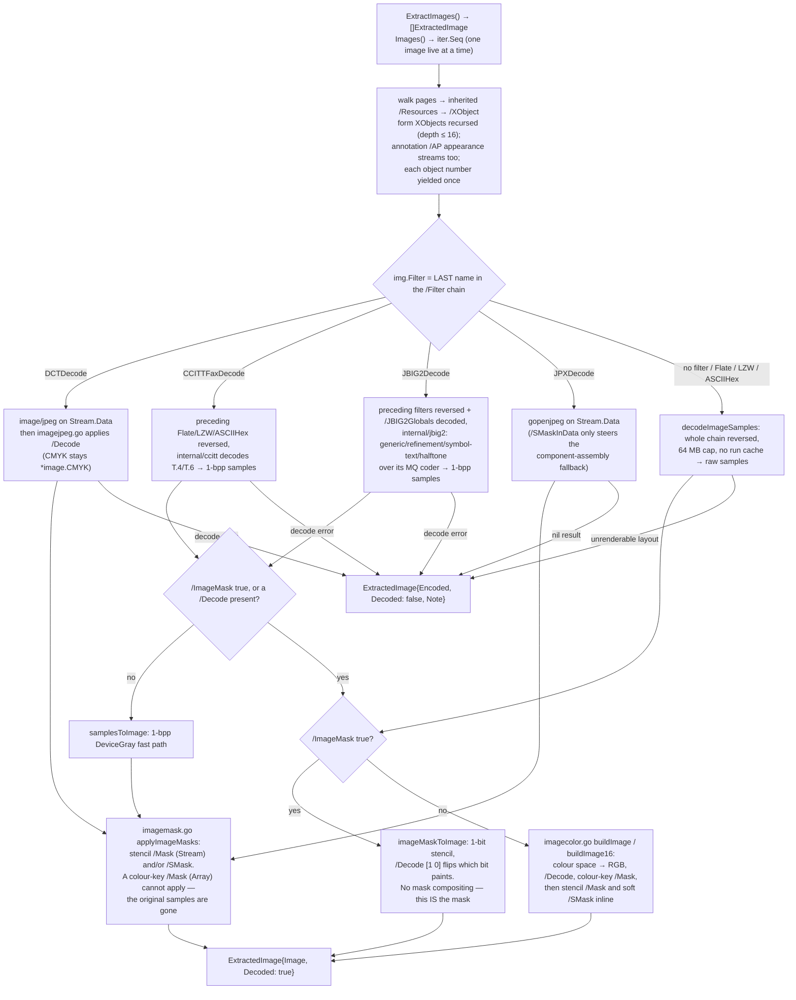

# Images

pdf0 can pull the raster images back out of a PDF and hand you `image.Image`
values. This subsystem — about 4,500 lines across fifteen files — is the image
XObject traversal plus in-tree decoders for the codecs Go's standard library
does not cover: CCITT Group 3/4 fax, JBIG2, and the PDF colour-space machinery
(Indexed palettes, Lab, Separation/DeviceN tint transforms) that turns samples
into RGB. Reach for it to extract page artwork or scanned pages, to inspect what
a file actually stores, or as the entry point when fixing a codec bug. For the
rest of the library see the [README](../README.md) and
[architecture.md](architecture.md).

## Using it

Two entry points, both on `*Document`:

```go
imgs := doc.ExtractImages()      // []ExtractedImage — every image at once
for img := range doc.Images() {  // iter.Seq[ExtractedImage] — one at a time
```

They yield the same images in the same order. The difference is the memory
contract, and it is the whole reason both exist. `ExtractImages` holds every
decoded image in the returned slice simultaneously; on a large scan document
that is hundreds of full-page bitmaps live at once — unbounded memory. `Images`
decodes each image only as it is yielded, so unless you retain them at most one
decoded image is live, and breaking out of the loop skips the remaining decode
work entirely (`TestImagesIteratorLazy` pins that). Prefer `Images` for any file
you did not produce yourself.

Under a deadline, `ExtractImagesContext(ctx)` returns the images gathered before
the cancellation **and** an error wrapping `ctx.Err()` — both, because a short
slice returned bare is indistinguishable from a document with fewer images, and
extraction has no finding channel to say otherwise. The error is nil exactly when
every image was reached; the check is between images, so a single very large
image is not interruptible. There is deliberately no context variant of `Images`:
an iterator is already cancellable by `break`, and since each image is decoded
only as it is yielded, breaking after image N skips exactly what a context check
between images would have. See
[architecture.md](architecture.md#cancellation).

Each yielded value is an `ExtractedImage`:

| Field | Meaning |
|---|---|
| `ObjNum` | Object number of the image XObject |
| `Width`, `Height` | Pixel dimensions from `/Width`, `/Height` |
| `BitsPerComponent` | From `/BitsPerComponent`; forced to 1 for an `/ImageMask` |
| `ColorSpace` | Best-effort name: a direct `/ColorSpace` name, the leading name of an array space (`ICCBased`, `Indexed`, `Separation`…), or `"ImageMask"` |
| `Filter` | The image codec — **the last filter in the `/Filter` chain** (`""` if there is none) |
| `Image` | Decoded pixels, or `nil` |
| `Decoded` | Whether `Image` holds pixels |
| `Encoded` | The bytes that could not be turned into pixels |
| `Note` | Why decoding did not happen |

When a codec is not handled — or handled but the input fails — `Decoded` is
false, `Image` is nil, and `Note` explains. `Encoded` is *not* uniformly the raw
stream: on the codec branches (DCT/CCITT/JBIG2/JPX) it is `Stream.Data`, so you
can pass it to an external decoder; on the general-purpose branch it holds the
*decoded* samples that had an unrenderable layout, and is nil when the filter
chain itself could not be reversed.

```go
for img := range doc.Images() {
	if !img.Decoded {
		log.Printf("obj %d: %s (%s)", img.ObjNum, img.Note, img.Filter)
		continue
	}
	f, _ := os.Create(fmt.Sprintf("img-%d.png", img.ObjNum))
	png.Encode(f, img.Image)
	f.Close()
}
```

A runnable version that builds its own document is in
[`examples/extract_images`](../examples/extract_images/main.go).

## The decode pipeline



Two details worth internalising. First, the codec branches are **not**
symmetric about preceding filters: `CCITTFaxDecode` and `JBIG2Decode` reverse
any general-purpose filters ahead of them in the chain, while `DCTDecode` and
`JPXDecode` read `Stream.Data` directly. Second, masks are applied in two
different places — `buildImage` composites them inline on the sample path (and
is the only path that can honour a colour-key `/Mask`), while `applyImageMasks`
composites them after the fact on the codec paths, drawing the codec image into
a fresh `*image.NRGBA` first.

`walkImages` installs a per-run cache on a shallow `*Document` copy, exactly as
the validators do, memoising page collection, decoded content streams and parsed
type-4 function programs. The whole traversal runs over untrusted input: it
reports failures as `Note` strings rather than panicking, and one bad image does
not abort the walk.

## File map

| File | Owns | Spec |
|---|---|---|
| `images/imageextract.go` | Page/form/annotation traversal, `ExtractedImage`, codec dispatch, `/JBIG2Globals` and CCITT `/DecodeParms` plumbing, JPEG 2000 component assembly | ISO 32000-2 §8.9 (image XObjects), Table 87 (`/SMaskInData`) |
| `images/imagejpeg.go` | Applies a PDF `/Decode` array to `image/jpeg` output — mainly inverted CMYK (`[1 0 1 0 1 0 1 0]`) | ITU-T T.81 / ISO 10918-1 |
| `images/imagemask.go` | Post-codec `/SMask` and stencil `/Mask` compositing | ISO 32000-2 §8.9.6 |
| `images/imagecolor.go` | Colour-space resolution and sample → pixel rendering: device spaces, CalGray/CalRGB, Lab, ICCBased, Indexed, Separation/DeviceN, `/Decode`, 8- and 16-bit output, colour-key/stencil/soft masks | ISO 32000-2 §8.6 |
| `internal/ccitt/ccitt.go` | Group 3 1-D, Group 3 2-D and Group 4 fax decoding; run-code and mode tries; the bit reader shared with JBIG2's MMR path | ITU-T T.4 (Group 3), ITU-T T.6 (Group 4) |
| `internal/jbig2/mq.go` | MQ adaptive binary arithmetic decoder and the Qe estimation table | ITU-T T.88 Annex E (same coder as JPEG 2000) |
| `internal/jbig2/jbig2.go` | Embedded segment parsing, page info, generic regions (arithmetic + MMR, unknown-length), compositing, the pixel budgets | ISO/IEC 14492 / ITU-T T.88 §6.2, §7, Annex D.3 |
| `internal/jbig2/jbig2_symbol.go` | Symbol dictionaries and text regions (arithmetic), integer decoding `IADH`/`IADW`/`IAEX`/…, `IAID`, aggregation, symbol placement | T.88 §6.4, §6.5, Annex A |
| `internal/jbig2/jbig2_refine.go` | Generic refinement regions, shared by standalone regions, `SBREFINE` and `SDREFAGG` | T.88 §6.3 |
| `internal/jbig2/jbig2_halftone.go` | Pattern dictionaries and halftone regions; Gray-coded bitplane greyscale decoding (arithmetic and MMR) | T.88 §6.6, §6.7, Annex C.5 |
| `internal/jbig2/jbig2_huffman.go` | Huffman bit reader, table representation, canonical code assignment, the fifteen standard tables | T.88 Annex B |
| `internal/jbig2/jbig2_huffcode.go` | The `SDHUFF`/`SBHUFF` symbol and text paths, custom table segments (type 53), uncompressed collective bitmaps | T.88 Annex B.2, §6.4, §6.5 |
| `internal/core/function.go` | PDF function evaluation: type 0 sampled, type 2 exponential, type 3 stitching | ISO 32000-1 §7.10 |
| `internal/core/function_ps.go` | Type 4 PostScript calculator functions: tokenizer, parser, interpreter | ISO 32000-1 §7.10.5 |
| `github.com/mgilbir/gopenjpeg` | JPEG 2000 decoding (external module, pure-Go OpenJPEG port) | ISO/IEC 15444-1 |

Unit tests are self-contained; the CCITT and JBIG2 decoders are additionally
cross-checked against real encoder output fetched by `make ccitt` / `make
jbig2`. The JBIG2 suite decodes one bitmap through every coding mode and asserts
byte-identical pixels — the decoder's strongest correctness evidence.

## Colour and functions

`resolveColorSpace` turns a `/ColorSpace` object into an `imgColorSpace`: a
component count plus a `toRGB` closure (and a full-precision `toRGB16` where the
space has one). `buildImage` reads `bpc`-bit samples MSB-first with byte-aligned
rows, maps each through the effective `/Decode` array, and calls `toRGB`.

- `DeviceGray`/`DeviceRGB`/`DeviceCMYK` (and the `G`/`RGB`/`CMYK` abbreviations)
  convert arithmetically; `CalGray`/`CalRGB` are treated as their device
  equivalents; `ICCBased` renders by its `/N` component count (1 grey, 3 RGB,
  4 CMYK), falling back to `/Alternate` — the profile itself is not applied.
- `Lab` converts through XYZ to gamma-encoded sRGB, honouring `/WhitePoint` and
  `/Range`. `Indexed` treats the sample as a palette index (default `/Decode`
  `[0, 2^bpc-1]`) and converts the entry through the base space.
- `Separation` and `DeviceN` carry one or *n* tint components that must be run
  through a **tint transform function** into an alternate space. That is where
  `internal/core/function.go` comes in: `View.EvalFunction` dispatches on `/FunctionType` — 0
  sampled (multilinear interpolation over the sample grid), 2 exponential, 3
  stitching (selects a subfunction by `/Bounds` and recurses), 4 a PostScript
  calculator program (`internal/core/function_ps.go`). Inputs are clamped to `/Domain`,
  outputs to `/Range`. A tint space is accepted only if a probe evaluation
  succeeds with the alternate space's arity; otherwise `buildImage` declines the
  image rather than render garbage.

Images at 16 bits per component render to `*image.NRGBA64` so the precision
survives; everything else on the sample path renders to `*image.NRGBA`.

## Resource budgets

These decoders parse attacker-controlled input, and several of them can be told
to do far more work than the input's size suggests. The guards are deliberate,
each tied to an observed failure.

None of them reports a `limit` finding, and that is a consequence of the API
rather than an omission: extraction returns no findings, so a trip surfaces per
image in `ExtractedImage.Note` and `Decoded=false`. It is also why no validator
is affected — no PDF/A, PDF/UA, PDF/X, PDF/VT or PDF/R rule reads a decoded
pixel. [limits.md](limits.md) classifies these guards on that axis.

- **The image pixel budget** (`WithMaxImagePixels`, default 2^26 — the same
  bound `images.MaxPixels` puts on an image a caller embeds). One budget, held
  by `core.Limits.CheckImage` before every allocation sized from an image's
  geometry, whatever the codec and wherever the geometry came from: the image
  dictionary on the raw/Flate/LZW path (checked before the samples are even
  decoded, and again with the component count once the colour space is known),
  the JPEG frame header (`jpeg.DecodeConfig`, before `image/jpeg` allocates the
  frame), the JPEG 2000 SIZ header (`gopenjpeg.ReadInfo`, before the codec
  allocates a component plane), a soft mask's own dictionary, and the fax and
  JBIG2 decoders, which take the budget as a parameter. An image with more than
  four components is also held to four samples per pixel. Every product is
  formed by `internal/checked.Mul`, so a `/Width` of 2^60 is refused rather than
  wrapped (audit 2026-09-22 C11). An image the budget refuses has
  `Decoded=false`, its encoded bytes, and a `Note` that names the
  `image-pixels` guard and says whether the bound was the default or the
  caller's; a soft mask it refuses leaves the image decoded and unmasked, and
  the `Note` says so.
- **CCITT output** (`internal/ccitt`). A Group 4 V0 code is one bit and repeats
  the reference row, so one byte of data can be eight full rows. The decoder is
  given the pixel budget and holds `/Columns` × rows to it: before decoding when
  `/Rows` is known, and at the first row past it when it is not — an error, not
  a truncated image (audit 2026-09-22 C12). Widths over 2^20 are refused
  outright.
- **JBIG2 pixel budgets** (`internal/jbig2/jbig2.go`). Segment headers declare bitmap
  dimensions independently of how much coded data follows, and the MQ decoder
  keeps yielding bits past end-of-input, so a truncated stream does not stop a
  decode loop early. The caller's pixel budget bounds any single bitmap (never
  above `maxJBIG2Pixels`, 2^26); `newJBBitmap` is the single allocation choke
  point and returns `ErrBudget`. The stream's total pixel *work* is bounded at
  four times the budget (never above `maxJBIG2TotalPixels`, 2^28), charged
  through `reserve` and `charge`: every bitmap decoded, every halftone grid —
  its bit-planes are MQ-decoded whatever the region's size (audit 2026-09-22
  C55) — every refined symbol instance, and every symbol or pattern stamped onto
  a region, counted by the pixels the stamp actually touches. Many
  individually-legal segments therefore cannot add up to an exhaustion of
  either memory or time. `maxJBIG2GrayCells` (2^20) separately bounds a halftone
  grid, amplified by the bitplane count plus an int per cell. Segment-level caps
  back these up: regions ≤ 2^20 per side, symbols ≤ 2^16, ≤ 2^24 text instances,
  ≤ 2^20 referred segments.
- **Type-4 function work budget** (`internal/core/function_ps.go`). A tint transform is
  evaluated once per pixel, so an unbounded program is a CPU denial of service.
  `WithMaxPostScriptSteps` (2^20 operators per evaluation) bounds it; depth and stack caps
  alone do not, because an `if`/`ifelse` program can fan out to exponentially
  many operators while staying shallow. `maxFunctionDepth` (32) bounds type-3
  stitching recursion.
- **Per-run memoisation** (`walkImages`, `psProgram`). Not a cap but the same
  concern: without the run cache each per-pixel tint evaluation re-decoded and
  re-parsed the function stream, turning a sub-megabyte image into minutes.
- **Sample size cap.** `decodeImageSamples` refuses a stream that inflates past
  64 MB, and deliberately bypasses the shared content cache: image samples are
  used once, and caching them would starve the cache of the small shared
  streams (palettes, tint functions) it exists for.
- **Traversal bounds.** CCITT code matching stops at 24 bits. Form-XObject
  recursion is capped at depth 16, and a `seen` set of object numbers stops
  shared or self-referential XObjects from being revisited. An annotation's
  appearance subdictionary is followed one level, as ISO 32000-2 12.5.5 defines
  it; following any dictionary value recursed forever on a state dictionary that
  named itself.
- **Colour-space nesting** (`csResolver` in `images/imagecolor.go`). An Indexed
  base, a Separation or DeviceN alternate and an ICCBased `/Alternate` are
  colour spaces in their own right, reached through references the file
  controls. The resolver carries the object numbers on its current path and the
  depth: a space that reaches itself again is refused as a cycle, and a chain
  deeper than 16 as too deep, each with its reason in the image's `Note` (audit
  2026-09-22 C13 — a Separation naming itself as its alternate was a fatal stack
  overflow). The path is unwound as each level returns, so a space reached twice
  by different routes is not a cycle.
- **Type-4 program parse bounds** (`internal/core/function_ps.go`). The parser is
  iterative, with procedure nesting capped at 128, the program at 1 MiB and
  2^18 tokens (audit 2026-09-22 C14: three million `{`, 6.6 KB of Flate, overflowed
  the stack of the recursive parser). The largest program in the corpora is 267
  bytes. A program past a bound does not parse, so its colour space is declined
  like any other unusable one.

## Confirmed limitations

- **Inline images** (`BI … ID … EI` in a content stream) are not extracted;
  only image XObjects are.
- Only `FlateDecode`, `LZWDecode` and `ASCIIHexDecode` can be reversed. An
  image whose samples are wrapped in `RunLengthDecode` or `ASCII85Decode` is
  reported undecoded with an empty `Encoded`.
- `DCTDecode` and `JPXDecode` do not reverse preceding general-purpose filters;
  such a chain fails to decode.
- JPEG decoding is the standard library's, so arithmetic-coded, 12-bit and
  lossless JPEG are out of scope.
- For JPEG 2000, `/Decode` is not applied, and images gopenjpeg declines come
  back undecoded. `/SMaskInData` is honoured only in the component-assembly
  fallback used for sub-sampled or extra-channel codestreams.
- CCITT `/BlackIs1` does not change the emitted samples (see the reasoning in
  `internal/ccitt`); `/EndOfLine` and `/DamagedRowsBeforeError` are not read.
- A colour-key `/Mask` (an array) cannot be applied to a codec-decoded image —
  it tests original per-component sample values, which a lossy codec has
  discarded — so such an image is left opaque.
- ICC profiles are not applied, and Separation/DeviceN has no 16-bit conversion
  path, so a 16-bpc tint image renders from the promoted 8-bit result.
- A JBIG2 stream using a segment type or feature the decoder does not handle
  fails cleanly, returning the encoded bytes for an external codec rather than
  partial pixels.
