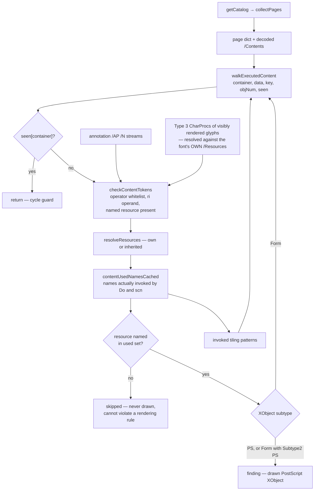

# Inside the PDF/A validator

[validators.md](validators.md) covers the validator *family* — which entry point
for which standard, what a result promises, how `ValidatePDFABytes` dispatches.
This doc goes one level down, into the engine. Open it when you are adding a PDF/A
rule and need to know where it belongs, chasing a false positive and need to know
which check produced it, or looking at a rule that seems oddly shaped and want the
reason. `pdfa.go` alone is ~6,600 lines; this is its map. The ratchet workflow that
gates any rule change lives in
[CONTRIBUTING](../CONTRIBUTING.md#the-corpus-ratchet--read-this-before-changing-a-validation-rule).

## The anatomy of a rule

A PDF/A rule is a plain `func(*Document, pdfa.Level) []pdfa.Violation`: it takes
the document and the level being validated, returns the violations it found and
`nil` when there are none, and must not mutate the document. A complete one,
verbatim from `pdfa.go`:

```go
// Rule 6.1.3-2: Encrypt key must not be present in trailer dictionary.
func checkNoEncrypt(doc *Document, level pdfa.Level) []pdfa.Violation {
	if doc.Trailer.Get("Encrypt") != nil {
		return []pdfa.Violation{{
			Rule:    "6.1.3",
			Level:   level,
			Message: "trailer must not contain /Encrypt",
		}}
	}
	return nil
}
```

`pdfa.Violation` has four fields. `Rule` is the ISO 19005 clause string — what
`RuleID()` returns and what the rule-coverage test matches against each veraPDF
rule's clause, so it is not free-form. `Level` is echoed from the argument, `Message` is human prose, and
`Object` is the anchoring object number (`0` if none). `Error()` renders as
`[PDF/A-2b 6.1.3] object 12: trailer must not contain /Encrypt`, dropping the
`object N:` segment when `Object` is 0.

Two conventions matter more than they look. **Resolve before type-asserting** —
`doc.ResolveName(dict.Get("Subtype"))`, not `dict.Get("Subtype").(Name)`, and
`doc.ResolveNumber(arr[i])` for an array element; a value hidden behind an
indirect reference (`/Subtype 12 0 R`) must neither evade a prohibition nor fail a
requirement. It has shipped at dozens of sites (audits C12, C18, C36), so
`internal/lint`'s `TestValidatorsResolveBeforeAssert` now fails on a type
assertion, type switch or `==`/`!=` comparison against a `Dictionary.Get` or
`Lookup` result, an array element, a dictionary's `All`/`Values` value or an
`object.Object` parameter, in every validator package, with no allowlist. A
structural walk that deliberately visits each indirect object on its own says so
with a `case object.IndirectRef:`. `doc.Resolve` follows ref→ref chains with a
bounded hop count that doubles as a cycle guard. **Guard every recursion** — the validator eats untrusted files, so
recursive helpers thread a visited set (`map[*Dictionary]bool` or `map[int]bool`)
or a depth counter, and `arr[0]` is always length-checked.

**The panic boundary.** Every check runs through `runCheck`, which `recover()`s
and converts a panic into a finding with `Rule: "internal"` rather than crashing
the caller. Stack overflows from unbounded recursion are not recoverable and are
prevented at the source instead.

**The byte-level variant** has a different signature — it needs the raw file
bytes, which `func(*Document, pdfa.Level)` has no room for. Those are called
through closures wrapped in `runByteCheck(level, func() []pdfa.Violation)`, its
own recover boundary, and only when `rawData != nil`: `checkNoDataAfterEOF`,
`checkFileStructureBytes`, `checkLinearizedTrailerID`, `checkStreamLengthBytes`,
`checkSignatureByteRange`.

All findings are concatenated then sorted by `(Rule, Object, Message)` — checks
iterate map-ordered `doc.Objects`, so without the sort the report order would be
nondeterministic and undiffable.

## What is inside `pdfa.go`

The `checks` slice in `ValidatePDFABytes` dispatches **59** functions. Forty of
them are defined in `pdfa.go` itself; the other nineteen live in sibling files
(see "Where the other rule files fit"). `pdfa.go` is organised in `// --- … ---`
sections, roughly in the order below. Rule IDs vary by part, so the clause column
shows the 1b / 2b-3b / 4 spread where a helper table (`colourClause`,
`annotActionClause`, `metadataClause`, `imageClause`, `xobjectClause`,
`filterClause`) resolves it.

| Family | Checks | Clause | Approx. line |
|---|---|---|---|
| File structure | `checkNoEncrypt`, `checkFileID`, `checkHeader`, `checkTrailerInfo` (+ the byte check `checkNoDataAfterEOF`) | 6.1.2–6.1.3 | 330 |
| Catalog | `checkMetadataStream`, `checkOutputIntents`, `checkOutputIntentProfile`, `checkNoCatalogAA`, `checkNoOCProperties`, `checkPermsDict` | 6.1.12, 6.2.2/6.2.3 | 481 |
| Streams & filters | `checkNoLZW`, `checkNoExternalStreams`, `checkSignatureByteRange` | 6.1.6 (`filterClause`) | 1045 |
| Fonts (embedding) | `checkFontsEmbedded` | 6.2.10 / 6.2.11 | 1253 |
| Annotations | `checkAnnotationSubtypes`, `checkAnnotationFlags`, `checkAnnotationAppearance` | 6.5.x / 6.3.x | 1455 |
| Interactive forms | `checkWidgetNoAction`, `checkNoXFA`, `checkNeedAppearances` | 6.6.2 / 6.4.1 | 1803 |
| Actions & trigger events | `checkNoForbiddenActions`, `checkNamedActions`, `checkAnnotationAA` | 6.6.1 / 6.5.x | 1885 |
| Metadata / XMP | `checkIdentification`, `checkInfoXMPConsistency` | 6.7.11 / 6.6.4 / 6.7.3 | 2115, 2872 |
| Transparency (1b prohibition) | `checkNoTransparency` | 6.2.4 (1b only) | 2296 |
| Images | `checkNoAlternateImages`, `checkInterpolate`, `checkNoOPI`, `checkJPXImages` | 6.2.7, 6.2.8.3 | 2462, 6460 |
| Version identification | `checkCatalogVersion` (A-4 only, `/Version` must be `2.N`) | 6.1.12 | 2594 |
| Font subsets | `checkFontSubsets` (CharSet/CIDSet presence, 1b only) | 6.3.5 | 2633 |
| ExtGState & halftones | `checkExtGState` (+ `checkHalftoneErrors`) | 6.2.5 | 2728 |
| Transparency groups | `checkTransparencyBlending` | 6.2.4 | 3183 |
| Embedded files | `checkEmbeddedFiles` (+ `checkEmbeddedFileSpecs`, `/AF`) | 6.1.11 / 6.1.12 | 3673 |
| Optional content | `checkOptionalContent` | 6.9 / 6.10 | 3857 |
| Implementation limits | `checkImplementationLimits` (Annex C, q/Q nesting, page size) | 6.1.12 / 6.1.13 | 3989 |
| Device colour | `checkDeviceColorSpaces` (+ output-intent coverage, `Default*`, group `/CS`) | 6.2.3.3 / 6.2.4.3 | 4284 |
| ICCBased | `checkICCBasedProfiles`, `checkICCBasedUsageRules` | 6.2.3.2 / 6.2.4.2 | 5530, 6256 |
| Separation / DeviceN | `checkSeparationDeviceN` (tint-transform consistency) | 6.2.4.4 | 5625 |

Section labels `MR-n` / `FP-n` / `C-n` are legacy audit IDs, not ISO numbering.
Two stretches are not rules at all: ~4915–5530 is the shared content-stream
tokenizer (`forEachContentOperator`, `forEachContentToken`, `contentUsedNames`,
`skipInlineImage`), and ~6120–6243 the XMP encoding helpers (UTF-32 must be
probed before UTF-16 — both carry null bytes).

## The per-run cache

Many checks want the same expensive things, and recomputing them per check was
quadratic: content streams inflated up to three times per page, the page tree was
collected in about eight checks, and `dictObjNum` rescanned the whole object table
on every font lookup (audit C34 — a real regression on documents with hundreds of
thousands of objects). `ValidatePDFABytes` therefore installs a `validationCache`
(`pdfa.go`, ~line 301) before the loop, memoising:

- `pages` — page-tree object number → `[]pageInfo` (`collectPages`); `directAnnots`
  — annotations written as *direct* dictionaries inside page `/Annots`, which a
  scan of `doc.Objects` can never see (audit A9); `dictNum` — the `*Dictionary` →
  object number reverse index behind `dictObjNum` / `objNumForDict`
- `content` — `*Stream` → decoded bytes, under an aggregate 512 MB budget
  (`WithMaxDecodedContentBytes`) that negatively caches once exhausted, bounding what
  a flate bomb can force
- `fontUsage`, `fontEvents`, `usedNames`, `streamFacts` — per-stream results of
  the executed-content walk; `psProgs` — parsed type-4 PostScript programs (a tint
  transform is evaluated per pixel); `structTree` — the flattened struct tree,
  shared with the PDF/UA validators

**It is installed on a shallow copy** — `runDoc := *doc; runDoc.valCache = …; doc
= &runDoc`. The copy shares the (read-only during validation)
`Objects`/`Trailer` and the immutable source record, so it is cheap, and the caller's `*Document` is
never touched. That is what makes validation non-mutating and lets one document be
validated concurrently, at several levels at once.

**Lifetime rule.** The cache lives for exactly one run and assumes the document
does not change underneath it. Never mutate a dictionary, stream or the object
table from inside a check, and never stash a `validationCache` or a value from it
beyond the call. Key new memo fields by pointer identity (`*Stream`,
`*Dictionary`) like the existing ones, with an explicit `…Valid bool` when `nil`
is a legitimate cached answer.

## Level differences

A `pdfa.Level` names one **target profile** (`pdfa/level.go`): the part of ISO
19005, the conformance level (a, b or u at parts 1-3) and, at part 4, the variant
(e or f). The levels are `PDFA1a`, `PDFA1b`, `PDFA2a`, `PDFA2b`, `PDFA2u`,
`PDFA3a`, `PDFA3b`, `PDFA3u`, `PDFA4`, `PDFA4E` and `PDFA4F` (`pdfa.Levels()`).
The zero value is `LevelDeclared`, which is not a profile: it asks for the level
the document declares, resolved by `ResolveTarget` through `LevelFor` before
anything runs. A document whose declaration cannot be read or names no level, and
a `Level` that names no profile, get one finding under the `limit` rule and are
not validated.

There is one pipeline for every level, and every check receives the target
**unflattened**. A check asks the profile what it means — `level.Part()`,
`level.Conformance()`, `level.IsA()`, `level.variant()`,
`level.requiresUnicode()` — and never compares a `Level` with a constant:
`level == PDFA4` is false at 4e and 4f, and that is how the variants' own rules
once became unreachable (audit C64). `internal/lint`'s
`TestPDFAChecksAskTheProfile` enforces it outside `level.go`. One rule body
serves every level, via four idioms.

**Early return** where the rule does not apply at all: `checkNoTransparency` opens
with `if level.Part() != 1 { return nil }` — only Part 1 bans transparency outright
— and `checkNoOCProperties`, `checkFontSubsets` and `checkInfoXMPConsistency` are
Part-1-only the same way, each with a comment recording the corpus evidence that
Part 2 relaxed them. The Level A families return early unless `level.IsA()`, and
the Unicode-mapping rule unless `level.requiresUnicode()` (A or U).

**A clause-helper table** for the rule ID, since the same requirement is numbered
differently per part: helpers hold a `[1b, 2b/3b, 4]` triple and switch on the
level, so `colourClause("outputIntent", level)` yields `6.2.2` at 1b and `6.2.3`
later, and `annotActionClause("catalogAA", level)` yields `6.6.1` / `6.5.2` /
`6.6.3`. The numbering follows the veraPDF profiles and `TestRuleCoverage` pins
it: it validates each corpus fail file at its level and ratchets how many veraPDF
rules are reported under their own clause (see
[testing.md](testing.md#rule-coverage)).

**The declaration is judged in one place.** `checkIdentification` compares the
document's pdfaid identification (read through the XMP model,
`readPDFAIdentification`) with the target: the part must be the target's, part 4
must carry `pdfaid:rev 2020`, and the conformance letter must be one the target
accepts — `Level.acceptsConformance`, the one statement of the conformance
hierarchy. Following the veraPDF identification tests: a 2b/3b target accepts
`B`, `U` or `A`; 2u/3u accept `U` or `A`; 2a/3a only `A`; 1b accepts `B` or `A`
(ISO 19005-1 has no Level U) and 1a only `A`. Part 4 has no hierarchy: plain
PDF/A-4 accepts no conformance entry, 4e exactly `E`, 4f exactly `F`. The
comparison is case-sensitive (`e` is not `E`, the corpus's 6-7-3-t01-fail-c),
while `LevelFor` maps a letter case-insensitively, so a file writing `e` is held
to 4e and told about the case. No other rule reads the declaration: the PDF/A-4
variant relaxations and requirements are gated on the target's variant, so a
file declaring `F` validated as plain PDF/A-4 gets neither, plus the
identification finding. To check a file against whatever it claims, ask for
`LevelDeclared`.

**An inline `if level == PDFA4` branch** where the requirement itself differs. The
genuine PDF/A-4 divergences:

- **Page-level output intents.** `checkOutputIntents` runs a separate A-4-only
  pass over `collectPages`, requiring each page `/OutputIntents` entry to carry
  `/S /GTS_PDFA1`. It runs even when the catalog has none.
- **No mandatory transparency group.** `transparencyGroupNotRequired` returns
  true at A-4 whenever *any* output intent — catalog or page — provides colour
  coverage, because at A-4 the output intent supplies the blending space
  implicitly. At 2b/3b the relaxation is narrower: catalog output intents, or
  `Default*` entries that cover every device space the page actually uses.
- **No implementation limits.** `checkImplementationLimits` returns `nil` at A-4:
  PDF 2.0 abolished the Annex C limits and ISO 19005-4 has no such clause.
- **XMP property validation deliberately off.** `checkXMPProperties`
  (`xmp_schemas.go`) returns `nil` at A-4. This is a decision, not a TODO —
  enabling the 1b/2b/3b property checks at A-4 false-positives on conformant
  corpus files. The evidence, and the warning not to "implement" it, are in
  [xmp.md](xmp.md#pdfa-4-deliberately-skips-property-value-validation), which owns this
  decision.

A-4 also has its variants, gated on `level.variant()`: at `PDFA4F` and `PDFA4E`
the document-level `/AF` requirement on embedded files is relaxed and embedded
files need not be PDF/A; `PDFA4E` additionally permits `3D` and `RichMedia`
annotations and the 3D/multimedia actions plain A-4 forbids. In exchange 4f must
carry `/EmbeddedFiles` and 4e's 3D streams must be `/U3D` or `/PRC`
(`pdfa4_ef.go`).

## Where the other rule files fit

**`final_rules.go`** — the low-frequency rules that arrived late and had no natural
home: prohibited catalog/page entries (6.11/6.12), image `/Interpolate` and
rendering intent on XObjects and inline images, file trailer `/ID` validity, A-4
trigger events (6.6.3), ActualText Private Use Area values (6.2.10.8), Type 5
halftone components (6.2.5), embedded PDF/A files (6.9) and the
inherited-page-XObject rule (6.2.2). Each embedded PDF is re-read and validated
at the level it declares (`Document.Conformance`, i.e. `LevelFor`), which applies
6.9 to its own embedded files in turn, down to `pdfa.MaxEmbeddedDepth` levels;
the file-type requirement holds at every depth. All nested validations of one
run share a budget (`maxEmbeddedPDFADocs` documents, and the run's per-stream
decode limit in bytes), so fan-out at each level cannot multiply the work. A
document deeper than the cap, or past the budget, is not validated and the run
says so under `limit`.

**`content_operators.go`** — everything decided by reading content: the operator
whitelist (`contentOperators`, ISO 32000-1 Annex A Table A.1; anything outside it
is forbidden even inside a `BX`/`EX` compatibility section), the four
`standardRenderingIntents` for the `ri` operand, named-resource resolution for
`Do`/`sh`/`gs`/`cs`/`CS`/`Tf`, the drawn-PostScript-XObject prohibition and the
A-4 ICC profile-identity rule. `walkExecutedContent` lives here — see the diagram.

**`filestructure.go`** — the byte-level clause-6.1 rules, reading the raw file
rather than the object model: header layout, indirect-object syntax (`obj`/`endobj`
placement, located via the source record's offsets, `Document.Source`), xref table formatting, hex-string form
(scanned in object bodies *and* in decoded content streams, with an
inline-image-aware tokenizer), `stream`/`endstream` layout, inline image filters
and intent, name UTF-8 validity. It also hosts `checkStreamLength` and
`checkObjectStreamDecodable`, object-model checks reporting defects the parser
recovered from during `Read`.

**`pdfa_levela.go`, `pdfa_levela_content.go`, `pdfa_levela_fonts.go`** — the
Level A families (Tagged PDF, artifacts, structure types, language, ActualText
for Private Use Area code points), each returning early unless `level.IsA()`,
and the Unicode character-map rule shared by Level A and Level U
(`checkUnicodeMapping`, gated on `level.requiresUnicode()`): a rendered font
needs a ToUnicode CMap or one of the three exemptions, and at parts 2/3 a
ToUnicode may not map to U+0000, U+FEFF or U+FFFE. The glyph-name exemption reads
the names of the glyphs actually shown, through the font's encoding or, for a
symbolic Type 1 font with no `/Encoding`, the program's built-in encoding.

**`create.go`** — the write side. `NewPDFADocument` /
`NewPDFADocumentWithInfo` / `NewPDFADocumentWith` build a five-object skeleton
(catalog, page tree, XMP metadata, output intent, ICC profile) that passes
pdf0's own validator at every level. All three return an error; the build →
`ValidatePDFA` round trip keeps builder and validator honest.

The sRGB destination profile is a real one from
`github.com/mgilbir/golittlecms`, versioned by level (v2.1 for PDF/A-1, which
targets PDF 1.4 and admits only ICC v2; v4 later). It is **embedded** rather
than built per document — `internal/cmd/genicc` writes the two files and
`TestTheEmbeddedProfilesAreWhatTheEngineBuilds` rebuilds them through
golittlecms and compares, so they cannot drift. Two reasons: building it per
document introduced a failure that could not happen and a panic standing in for
handling it, and an ICC profile carries its creation timestamp, so every
document used to embed a profile stamped with the moment it was generated.

**Reproducible output.** Two things in a generated document used to vary
between runs. The sRGB profile carried its own creation timestamp, which
embedding fixed. The file identifier is the other, and it is *meant* to vary —
it exists to tell this file from every other — so it is offered rather than
removed: set `PDFAOptions.FileID` and the bytes become a function of the
content alone. A digest of that content is the usual choice.

```go
doc, err := pdf0.NewPDFADocumentWith(pdf0.PDFAOptions{
    Level:        pdfa.PDFA4,
    FileID:       contentDigest[:16],
    OutputIntent: pdf0.PDFAOutputIntent{ICCProfile: myProfile, OutputConditionIdentifier: "FOGRA51"},
})
```

With both set, two builds of the same document are byte-identical — asserted in
`pdfa_reproducible_test.go`, along with the other direction: without a pinned
`FileID` the output *must* vary, or the first assertion is proving nothing.

The identifier is 16 random bytes from `core.RandomFileID`, shared by both
document builders. The PDF/A builder used to hash `time.Now()` with MD5, which
was a second answer to a question that already had one — and a worse one, since
two documents built inside a single clock tick would have shared an identifier.
MD5 remains in exactly one place, `internal/crypt`, where ISO 32000-1
Algorithm 2 specifies it for the standard security handler; that is the file
format, not a choice.

**Bringing your own profile.** `NewPDFADocumentWith` takes a
`PDFAOutputIntent` — the profile bytes and the output-condition identifier that
names what they characterise — and embeds it with `/N` read from the profile's
own header. Nothing of pdf0's colour management reaches the document. A profile
that is not one, that disagrees with its own declared length, that is in a
colour space a PDF/A output intent may not use (only GRAY, RGB and CMYK), or
that is ICC v4 at a level based on PDF 1.4, is refused rather than embedded —
which is what the error on these constructors is for.

**`preflight.go`** — `(*Document).Repair(level)`, the deliberately narrow repair
path: it removes encryption and the additional-action trigger events `level`
forbids — every `/AA` on the catalog, pages, annotations (through each page's
`/Annots`) and AcroForm fields before PDF/A-4, only the events 6.6.3 forbids at
PDF/A-4, per `pdfa.TriggerEventForbidden`, the validator's own classification —
and synthesizes a missing `/ID`. It refuses a Locked document and an unknown
level. Every fix is information-free — it deletes something
forbidden or supplies a value the producer may choose — so it can never turn a
conforming document non-conforming. Anything needing information the file does not
carry is left to the caller. Do not add a fix that has to guess.

## The executed-content walk



The gate at `X` is the whole model: a form XObject present in `/Resources` but
never named by a `Do` is not executed content, so an undefined operator inside it
is not reported — and the corpus contains conforming files that rely on exactly
that. The `seen` set is shared across all pages, so a shared stream is walked once.

## Known limitations and edge cases

- **An empty result is not a conformance certificate** — it means no *implemented*
  check fired. `ValidatePDFA(doc, level)` is `ValidatePDFABytes(doc, level, nil)`
  and additionally skips all five byte-level groups. A `Rule: "internal"` finding,
  conversely, is a pdf0 bug rather than a file defect: it is what `runCheck` emits
  after recovering a panic.
- **Every conformance suite is measured at its own level.** `TestCorpus` runs
  the `PDF_A-1b/2b/3b/4` suites, `TestCorpusLevelA` runs `PDF_A-1a`, `PDF_A-2a`
  and `PDF_A-2u` at `PDFA1a`/`PDFA2a`/`PDFA2u`, and `TestCorpusConformanceSuites`
  runs `PDF_A-4f`/`PDF_A-4e` at `PDFA4F`/`PDFA4E`, all at FP=0 and missed=0.
  The PDF/UA suites are walked at `PDFA2b`/`PDFA4` as a fail-file regression net
  only. `TestRuleCoverage` reads only the 1b/2b/3b/4 profiles.
- **The corpus has no Level U suite for part 3** and no 3a suite; `PDFA3u` and
  `PDFA3a` are the part-2 rules at part 3's clause numbers.
- **Content decoding is budgeted.** A stream over `WithMaxContentStreamBytes` (64 MB)
  decoded, or any stream once the run has spent `WithMaxDecodedContentBytes` (512 MB),
  yields `nil` — indistinguishable from "undecodable". A rule reading `nil` content
  as "clean" silently under-reports on a hostile file; treat it as "unknown".
  Both trips *are* reported, under the reserved rule `limit`
  (`content-stream-size`, `decoded-content-total`) — see
  [limits.md](limits.md). `limit` and `internal` are the two rule identifiers a
  new check must never reuse: they name the checker, not the document, and
  `IsCheckerFinding` is the caller's way to tell the two apart. A cancelled
  `ValidatePDFAContext` run reports itself the same way.
- **Rule IDs are load-bearing.** `TestRuleCoverage` checks that each corpus
  fail file is reported under its veraPDF rule's clause, so emitting a working
  check under a different clause number breaks the coverage ratchet even when
  the file is still rejected. (Related sentinel asymmetry:
  `objNumForDict` returns 0 on a miss to match `pdfa.Violation.Object`, while
  the underlying `dictObjNum` returns -1.)
