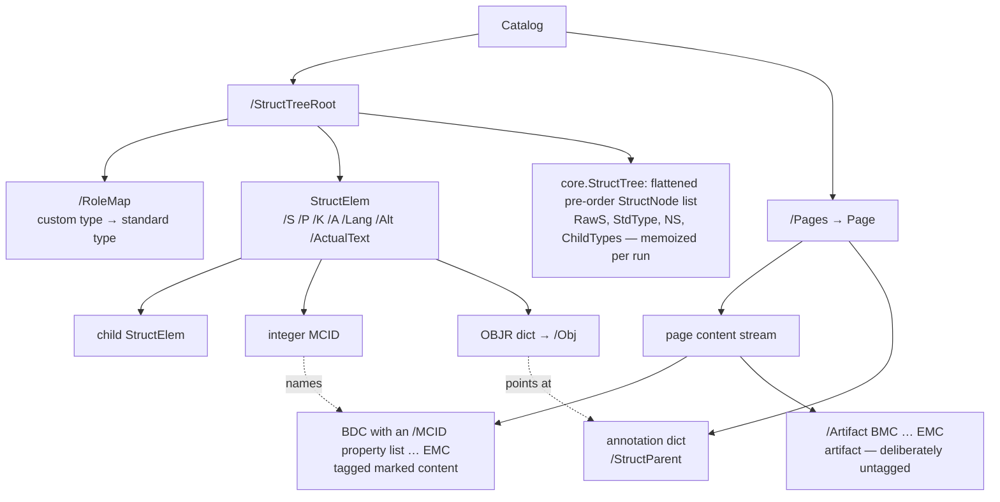
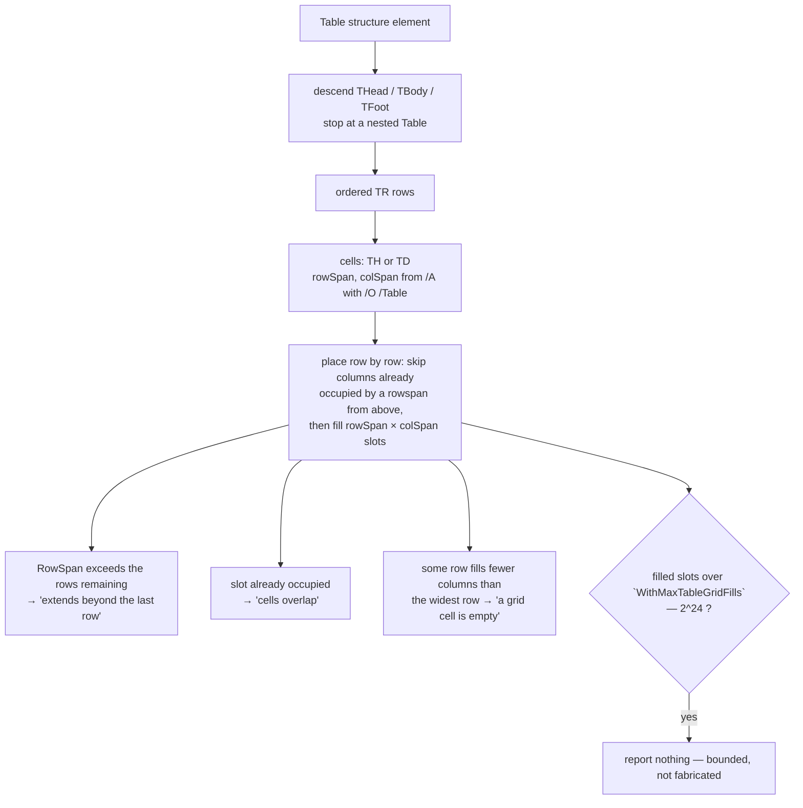

# PDF/UA accessibility validation

`ValidatePDFUA` (ISO 14289-1) and `ValidatePDFUA2` (ISO 14289-2) check whether a
document is *accessible*: whether an assistive technology can recover the
author's intended reading order, headings, table geometry, alternate text and
Unicode text from the file. Open this doc when you are adding a UA rule, chasing
a UA finding, or deciding how much a clean result is worth. The framing that
matters: **PDF/A mostly validates the page-content model — colour, fonts,
transparency, file structure — while PDF/UA mostly validates the tagged
structure tree hanging off the catalog.** Almost every UA check in pdf0 either
walks that tree, or walks page content in order to correlate it back to the
tree. [validators.md](validators.md) owns the family view and the entry-point
table; this doc is the inside of the two UA cells.

## The structure tree comes first

Everything below depends on one traversal. `Catalog /StructTreeRoot` roots a
tree of *structure elements*: dictionaries whose `/S` names a structure type
(`Document`, `Sect`, `P`, `H1`, `Table`, `TR`, `TD`, `Figure`, …), whose `/K`
holds children, and whose `/P` points back at the parent. A child in `/K` is one
of three things: another structure element, an integer **MCID** naming a
marked-content sequence in a page's content stream, or an **OBJR** dictionary
pointing at an object (in practice an annotation).

Every element is in a structure **namespace** (ISO 32000-2 14.7.4, 14.8.6). One
with no `/NS` is in the default namespace — the PDF 1.7 standard one, in a PDF
2.0 file as in any other — and a non-standard type there is mapped by
`/RoleMap` on the structure tree root. One whose `/NS` names a namespace
dictionary is mapped by that dictionary's `/RoleMapNS`, into the default
namespace by name or into another by `[name nsdict]`. A type is resolved when
it is standard in the namespace it is in: the PDF 1.7 set
(`core.StandardStructTypes`, Table 333/337), the PDF 2.0 set (Annex M: without
Art, BlockQuote, TOC, TOCI, Index, Private, Quote, Note, Reference, BibEntry and
Code; with DocumentFragment, Aside, Title, FENote, Sub, Em, Strong, Artifact and
Hn for every n), or MathML, which needs no mapping. `core.ResolveStructType`
(`internal/core/structtree.go`) is the one resolver.

`internal/core/structtree.go` builds the tree once per run, because PDF/A Level
A asks it the same questions. `buildStructTree` walks `/K` depth-first,
descending transparently through arrays, and flattens the tree into a pre-order
`[]core.StructNode`. Each node records the element dictionary, its object number
(`-1` when reached directly), `RawS` (the type **as written**), `StdType`,
`NS`, `Mapped` and `Complete` (the resolution), `ChildTypes` (the resolved types
of its `/S` children, in order) and `Parent`. The `RawS`/`StdType` split is
load-bearing: the role-map checks report on `RawS` — it is the written type that
is unmapped — while every other check compares `StdType`, so a custom type
mapped to `H2` counts as a heading and an `/Img` mapped to `Figure` needs
alternate text. `internal/lint`'s `TestStructureChecksReadTheResolvedType` holds
that line: it fails on a read of `RawS` outside the role-map checks, and on a
validator function that walks `/K` itself and reads `/S`. `core.StructTree`
memoizes the list on the run, and `walkStructElems` filters it down to the `/S`
nodes; the nesting and annotation-placement checks read the list too, rather
than descending the tree again.

Guards on untrusted input, all verified in source. **Cycles:** every walk
(`buildStructTree`, `collectTableRows`, `checkUAFieldDescription`) dedupes on
`IndirectRef.Number`,
so a `/K` pointing back at an ancestor terminates —
`TestStructTreeFlatten` builds exactly that and asserts the visit list.
**`/RoleMap` chains:** a role map may reach a standard type through intermediate
custom types (`MyPara → Para → P`), so both users of the map follow chains rather
than a single hop. `checkUARoleMapIntegrity` walks each key's chain to detect a
cycle; `core.ResolveStructType` walks it to resolve a type, across namespaces.
Both are bounded by a seen-set, so a cyclic map terminates, and both answer
each type once: a role map is a function, so every type a walk crosses shares
the walk's answer, and the answers are memoised — per run for the resolution
(for a chain in the default namespace; a namespaced type's answer is memoised
for the type itself), per check for the cycle test. The whole map costs
O(keys), charged to the run's work meter (audit 2026-09-22 C41: a per-chain
step budget let 2,000 elements each walk a 100,000-long chain, for ninety
seconds, without ever tripping). A run whose budget runs out while a chain is
followed is stopped, and the check unwound, so `checkUARoleMap` never reports
*"neither standard nor mapped"* from a truncated walk
(`TestRoleMapChainResolves`, `TestRoleMapChainTerminates`,
`TestRoleMapChainBudgetDeclines`). **Mutation:** `validatePDFUA` installs the cache on a
**shallow copy** of the `Document`, so the caller's document is never touched
(`TestUAValidationCacheIsolation`).

## The rule families

Every family below is dispatched from the single `validatePDFUA(doc, part)`
function in `pdfua/pdfua.go`. The clause column is the string the finding carries in
`pdfua.Violation.Clause`; a few cite the Matterhorn Protocol checkpoint that pins the
rule, noted in the source comments.

| Family | Clause(s) | Checks | What actually fires |
|---|---|---|---|
| Tagging and document setup | 7.1, 7.2 | inline in `validatePDFUA`, `checkUASuspects` | `/MarkInfo << /Marked true >>` absent, no `/StructTreeRoot`, `/ViewerPreferences /DisplayDocTitle` not true, catalog `/Lang` empty, `/MarkInfo /Suspects` true |
| PDF/UA declaration | 5 | `checkUAIdentifier`, `checkUAIdentifierPrefix` | no XMP, no `pdfuaid:part`, a `part` that disagrees with the requested part, or a `part`/`amd`/`corr` element written with a prefix other than `pdfuaid` while bound to the PDF/UA-id namespace URI |
| Document title | 7.1 | `checkUATitle` | XMP has no `dc:title` (Matterhorn 06) — the companion to `DisplayDocTitle` |
| Header version | 6.1 | `checkUAHeaderVersion` | header is not `1.x`. **UA-1 only** — selected by the `part` parameter, not filtered afterwards |
| Structure typing | 7.1 | `checkUARoleMap`, `checkUARoleMapIntegrity`, `checkUAStructParent` | a `/S` neither standard nor mapped to a standard type (reported once per distinct type), a `/RoleMap` that remaps a standard type or is circular, an element with no `/P` |
| Element nesting | 7.2 | `checkUAStructNesting` | violates the `uaAllowedParents` / `uaAllowedChildren` tables: `TD`/`TH` outside `TR`, `TR` outside `Table`/`THead`/`TBody`/`TFoot`, `LI` outside `L`, `LBody` outside `LI`, `TOCI` outside `TOC`, and the mirror child constraints |
| Container well-formedness | 7.2 | `checkUATableListStructure` | more than one `Caption`/`THead`/`TFoot` on a `Table`, a `THead`/`TFoot` with no `TBody`, a `Table` `Caption` that is neither first nor last child, an `L`/`TOC` `Caption` that is not first |
| Table grid | 7.2 | `checkUATableGrid` | see [Table grids](#table-grids) |
| Table headers | 7.5 | `checkUATableTHScope` | a `TH` with neither a `Scope` in a `/O /Table` attribute dictionary **nor** an `/ID` |
| Headings | 7.4, 7.4.2, 7.4.4 | `checkUAHeadings`, `checkUAOneHPerNode`, `checkUAStrongWeak` | a skipped level (`H1` then `H3`), a first numbered heading that is not `H1`, more than one child `<H>` under one node, a document mixing `<H>` with `<H1>`–`<H6>` |
| Figures | 7.3 | `checkFigureAlt` | a `Figure` with neither `/Alt` nor `/ActualText` non-empty |
| Notes | 7.9 | `checkUANotes` | a `Note` with no `/ID`, or two `Note`s sharing one |
| Language | 7.2 | `checkUALang` | a *present* `/Lang` (catalog or structure element) that is not syntactically valid BCP 47 (`validBCP47`). An absent `/Lang` on an element is fine — it defers to an ancestor |
| Annotations | 7.18.1, 7.18.2, 7.18.5, 7.18.8 | `checkUAAnnotations` | `TrapNet` present, a `Link` with no `/Contents`, any other visible non-`Widget` annotation with neither `/Contents` nor `/Alt`, a visible annotation with no `/StructParent`, a `PrinterMark` that *has* a `/StructParent`. Hidden (`/F` bit 2) and `Popup` annotations are exempt throughout |
| Annotation placement | 7.18.1 | `checkUAAnnotStructType` | an OBJR-reached annotation under the wrong structure type: `Widget` wants `<Form>`, `Link` wants `<Link>`, everything else `<Annot>` |
| Tab order | 7.18.3 | `checkUATabOrder` | a page carrying `/Annots` without `/Tabs /S` |
| Form fields | 7.18.1, 7.15 | `checkUAFieldDescription`, `checkUAXFA` (and the `Widget` arm of `checkUAAnnotations`) | a field with no `/TU` whose description sits on a pure-widget child, a `Widget` with neither an effective `/TU` (inherited up `/Parent`, bounded to 32 hops) nor an `/Alt`, and a dynamic XFA form (`dynamicRender` required, detected in the *decoded* packet) |
| Media clips | 7.18.6.2 | `checkUAMediaClips` | a `/Type /MediaClip` dictionary anywhere in the document (`core.View.ReachableDicts`, direct dictionaries included) missing `/CT`, missing `/Alt`, or with an `/Alt` carrying no non-empty string |
| Fonts | 7.21.3.1–7.21.8, 7.21.4.1/.2, 7.21.6 | `checkUAFonts`, `checkUAFontDicts`, `checkUACMaps`, `checkUACMapWMode`, `checkUACIDSystemInfo`, `checkUAToUnicodeValues`, `checkUAFontSubsetGlyphs`, `checkUANotdefCID` | not embedded, `CIDFontType2` without `/CIDToGIDMap` or with a non-`Identity` name, symbolic TrueType with an `/Encoding`, non-symbolic TrueType not on MacRoman/WinAnsi, a CMap neither predefined nor embedded, an embedded CMap whose `/WMode` disagrees with the stream's own, a `CIDSystemInfo` Registry/Ordering/Supplement mismatch with the CMap, a `ToUnicode` mapping to U+0000/U+FEFF/U+FFFE, a subset `/CharSet` or `/CIDSet` disagreeing with the embedded program, and a shown CID 0 (`.notdef`) |
| Character mapping | 7.2 | `checkUACharMapping` | text shown with a Type 0 Identity-encoded font that has no `ToUnicode` (Matterhorn 10-001) — the deliberately narrow, false-positive-free case |
| Real content vs artifacts | 7.1 | `checkUARealContent` | see [Content-level checking](#content-level-checking) |
| XObjects | 7.20 | `checkUAReferenceXObjects`, `checkUAFormXObjectMCID` | a Form XObject carrying `/Ref` (a reference XObject), or a form containing `/MCID` painted by more than one `Do` |
| Security | 7.16 | `checkUASecurity` | an encrypted document with no `/P`, or `/P` with permission bit 10 (extract for accessibility) clear |
| Optional content | 7.10 | `checkUAOptionalContent` | an OC configuration (`/D` or an entry of `/Configs`) with an empty `/Name`, or carrying `/AS` |
| Embedded files | 7.11 | `checkUAEmbeddedFiles` | a file specification with `/EF` whose `/F` or `/UF` is empty |

Every font family above iterates `collectFontTextUsage(d)` — the same
**executed-content model** PDF/A uses ([ADR 0004](adr/0004-executed-content-model.md)):
a font dictionary that is never used to *show text* is not checked. The map is
memoized in the shared validation cache, which is why `validatePDFUA` installs
one before doing anything else; nine font checks consume it.

## Content-level checking

`pdfua/pdfua_content.go` is the only place UA validation reads page content streams.
It tokenizes each stream once (`tokenizeContent`) and derives a
`streamContentFacts` — memoized per `*Stream` in `valCache.streamFacts` — holding
the distinct real-content violation messages and the sequence of XObject names in
effect at each `Do`. The real-content model (Matterhorn checkpoint 01) classifies
each marked-content sequence as `BDC`/`BMC` opens it: **artifact** (first operand
`/Artifact`), **tagged** (the property list carries an `/MCID`), or
**transparent** — anything else, notably `/OC` optional content and
property-less `BMC`, which participates in nesting balance but in no rule.

Three conditions then fire: a text-showing operator (`Tj`, `TJ`, `'`, `"`) with
an empty marked-content stack is untagged real content (01-005), an artifact
opened inside a tagged ancestor is 01-003, and tagged content opened inside an
artifact ancestor is 01-004. `TestUARealContent` pins all three plus the
`/OC`-wrapping case that must stay clean.

`tokenizeContent` yields tokens one at a time (an `iter.Seq`) rather than
returning a slice of them, and the analysis keeps no operand buffer — only the
three facts a `BDC`/`BMC` actually consults. The two are the same point: a real
document's page can hold millions of operands, none of which any rule reads back,
and materializing them cost more than the whole scan. On a 117 MB file the token
slice alone was 45 GB of allocation, about 94% of the run's total;
`BenchmarkContentHeavyUAValidation` watches `allocs/op` for the regression.

The tie back to the structure tree is `checkUAFormXObjectMCID` (7.20): a form
XObject whose decoded bytes contain the `/MCID` token is tagged content, and
tagged content must map one-to-one onto structure, so painting it twice is a
violation. Counting the paints resolves the `doNames` sequence against each
container's `/XObject` resources — pages *and* other forms, since a form may
invoke a form. `TestRealContentSharedStreamMemo` builds 20 000 pages sharing one
stream and requires one cache entry but 20 000 findings, one per page object:
the memo must collapse the *analysis*, never the *reports*.

Note what this does **not** do: it never resolves an `/MCID` integer back through
`/ParentTree` to the structure element that owns it. Marked-content sequences are
classified by shape, not matched to the tree.

## Table grids

`pdfua/pdfua_tablegrid.go` reconstructs a table's logical grid, because the defects
PDF/UA cares about are invisible to a tree walk. A walk can tell you a `TD` sits
under a `TR` under a `Table`; it cannot tell you row 2 has a hole, because
whether row 2 is complete depends on `/RowSpan` values declared in row 1 and on
`/ColSpan` values declared by *earlier cells in the same row*. Occupancy is a
two-dimensional fact and needs a two-dimensional model.

`collectTableRows` gathers the rows in document order, descending through
`THead`/`TBody`/`TFoot` row groups but stopping at a nested `Table` (which is
laid out separately, on its own pass through the flattened tree).
`collectRowCells` reduces each `TR` to `TH`/`TD` cells with their spans, read by
`cellSpan` from an attribute dictionary whose owner `/O` is `Table`; a missing or
non-positive value becomes 1. `gridDefects` then places the cells:

Two design points are deliberate and tested. **Only unambiguous defects are
reported**, so a well-formed table never raises a false positive. **The layout is
budgeted:** `WithMaxTableGridFills` counts *actually filled* slots, not the nominal
rows × columns area, so a genuinely large sparse table is unaffected while a cell
claiming a two-billion-column span trips the budget and the table is skipped
rather than laid out — and the trip is reported, as `table-grid-fills` under the
reserved clause `limit`, so "no grid defects" cannot be read as "clean" when the
grid was never built ([limits.md](limits.md)). Tables that share one `/K`
array are laid out once, and the slots every layout fills are charged to the
run's work meter, so many tables each near the per-table bound still cost the
run what they cost. The work meter (`work`) and a cancelled
`ValidatePDFUAContext` run report through the same clause. `TestGridDefectsSpanBomb` throws four shapes at it (huge
ColSpan, huge RowSpan, near-int-max spans that must not overflow the budget
arithmetic, and many moderate cells that cumulatively blow it) and requires a
return within 25 s. `TestGridDefectsSparseHuge` builds 60 000 × 30 000 and
requires O(rows) — which is why the hole test compares `len(occupied[r])` against
the max width instead of scanning the grid.

`checkUATableTHScope` (7.5) is separate and much simpler: each `TH` must be
individually identifiable, satisfied by *either* a `Scope` attribute *or* an
`/ID`. The source records why: diffing veraPDF fail files against their pass
siblings showed some conformant files give every `TH` a `Scope` and others give
every `TH` an `/ID`, so an earlier `Scope`-only rule was raising false positives.
Only the *presence* of `Scope` is checked, not its value.

## PDF/UA-2

`ValidatePDFUA2` runs the same checks with `part` "2" (`pdfua/pdfua2.go` holds
only the package comment that says so). Parameterizing by `part` (rather than
post-filtering findings by message text, as an earlier version did — audit C39)
is what makes the identification rule demand `pdfuaid:part 2`, makes the UA-1
`1.x`-header rule not run at all, and adds the rules only part 2 has: the
declared version (the header, or a later catalog `/Version`) must be 2.0 — one
that cannot be read is not; a type in an explicit namespace must not be
role-mapped back into that namespace (ISO 14289-2 8.2.4); and MathML's `math`
must sit in a `Formula` (8.2.5.29). Every finding carries `Part`, and `Error()`
prints it: `[PDF/UA-2 …]`. The shared rules keep their ISO 14289-1 clause
numbers; read the clause against the standard you invoked.

Structure types are resolved in the element's namespace (above), so a `/Title`
in the PDF 2.0 namespace is a standard type. What is not done: PDF/UA-2's own
rules for the 2.0-only types (FENote, Title, Artifact elements) beyond those
two, and no PDF/UA-2 corpus beyond the veraPDF suite is bundled, so this does
not assert full ISO 14289-2 conformance.

`ValidatePDFUA2` is also unreachable from the CLI: `pdf0 ua` only ever calls
`ValidatePDFUA` ([cli.md](cli.md)).

## The false-positive oracle

The measured claim for these rules is not the test count — it is that
**conformant documents stay clean**. `TestUAReferenceFilesNoFalsePositives`
(`pdfua_reference_test.go`) globs `spec/pdfua/reference-files/*.pdf` — the PDF
Association's PDFUA-Reference-Files suite — reads each file and fails on *any*
violation, with the message "false positive on a conformant file". The files are
not committed (`spec/` is gitignored in full) and there is no `make` target;
place them by hand. The test self-skips when the directory is empty, so a fresh
clone silently does not run it.

**The rule for contributors: a new UA check must leave those documents clean.**
That constraint shaped the `TH` Scope-or-`/ID` boundary, the narrow
Identity-plus-no-`ToUnicode` character-mapping rule, and the "only unambiguous
defects" stance in the grid analysis. When the spec as written would flag a
reference file, the reference file wins — the same corpus-as-oracle discipline as
PDF/A ([ADR 0001](adr/0001-corpus-as-oracle.md)).

A second external set backstops the *parser* rather than the validator:
`TestWTPDFExamples` (`wtpdf_test.go`) runs the LaTeX Project's Well Tagged PDF /
PDF/UA-2 examples — real PDF 2.0 files with structure trees, associated files,
MathML and custom role maps — asserting each parses, reports version `2.0`, has
pages, and survives Read → Write → Read. Fetch with `make wtpdf`
(`testdata/wtpdf/`, also gitignored). Both datasets and their provenance are
tabulated in [testing.md](testing.md).

## File map

| File | Owns | Governing clauses |
|---|---|---|
| `pdfua/pdfua.go` | `pdfua.Violation`, `ValidatePDFUA`, the `validatePDFUA(doc, part)` dispatch, and most rules: identification, title, fonts and CMaps, annotations, form fields, media clips, optional content, embedded files, language, headings, figures | 5, 6.1, 7.1–7.4, 7.10, 7.11, 7.15, 7.16, 7.18.x, 7.20, 7.21.x |
| `pdfua/pdfua_struct.go` | Its names for `core.StructTree` and `walkStructElems`, element nesting tables, container well-formedness, heading strength, `Note` IDs, `/Suspects`, UA-1 header version, the two PDF/UA-2 namespace rules | 7.1, 7.2, 7.4.4, 7.9, 6.1, UA-2 8.2.4 and 8.2.5.29 (and ISO 32000-1 14.8.4.3) |
| `pdfua/pdfua_content.go` | `streamContentFacts`, real-content vs artifact analysis, the form-XObject paint count, OBJR annotation placement | 7.1, 7.18.1, 7.20 |
| `pdfua/pdfua_tablegrid.go` | `TH` identifiability and the table grid reconstruction | 7.2, 7.5 |
| `pdfua/pdfua2.go` | The PDF/UA-2 package comment: what part 2 adds over the shared checks (the rules themselves are in the files above, selected by `part`) | ISO 14289-2 clauses 4, 8.2.4, 8.2.5.29 and the shared clauses |

Shared machinery lives outside these files: `collectFontTextUsage` and the
`validationCache` in `pdfa.go`, `tokenizeContent` in the content-operator layer,
`decodeXMPToUTF8` in `xmp.go`, `loadFontProgram` in forme's `font/fontprog.go`.

## Confirmed limitations

- **No `/ParentTree` validation.** The number tree mapping `/StructParents` and
  `/StructParent` keys back to structure elements is never read. Annotations are
  checked for the *presence* of `/StructParent` and correlated to the tree
  through OBJR only; content-stream MCIDs are never resolved to their elements.
- **`/Headers` is not checked at all** — the `TH`/`TD` association array has no
  rule. `Scope` is checked for presence only, never for a valid value, and an
  `/ID` exempts a `TH` from needing either.
- **A panic is contained, but a stack overflow is not.** Every UA check now runs
  behind a `recover()` boundary and a panic is reported as an `internal` finding
  (this closed C27). Unbounded recursion that overflows the stack remains fatal
  and is guarded at the source instead — see [validators.md](validators.md).
- **Two font rules are narrowed on purpose:** the `/CIDSet` arm of 7.21.4.2 is
  skipped unless `CIDToGIDMap` is `Identity`, and the simple-font `.notdef` case
  of 7.21.8 is unimplemented — both documented in-source as false-positive
  avoidance, not oversights.
- **A clean result is not conformance.** Matterhorn checkpoints covering reading
  order, colour-as-sole-meaning and most semantic judgements are outside what a
  static checker can assert.
