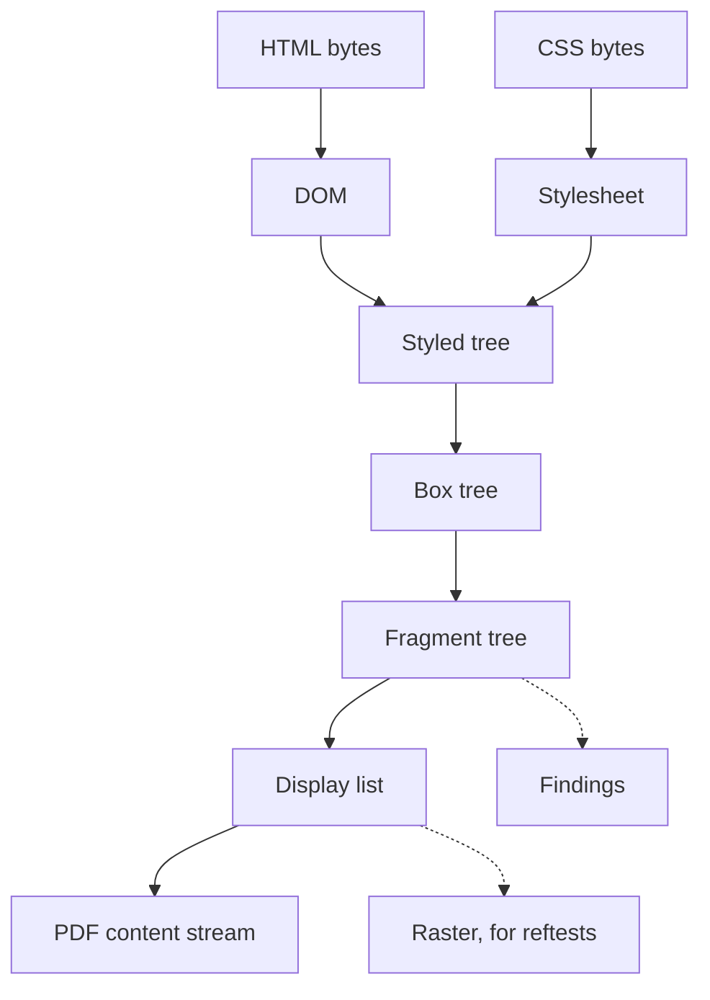

# Rendering HTML + CSS to a PDF page — design sketch

**Status:** phases 0 and 1 of §9 are complete (2026-08-05, pdf0#267). Phase 2,
the HTML and CSS parsers, is next and is where a fresh session starts.

This document is the design record for a new capability: take an HTML document
with CSS, lay it out inside a declared page box, and emit a PDF page. It was
written as a sketch before any of it existed, and the sections describing what
was then absent have been rewritten rather than left to read as though they were
still true — §0, §3.2, §8, §9 and §10. What is still ahead is unchanged and is
still a sketch: §1 argues that the honest size of this work is larger than it
first appears, and the sequencing past phase 2 should survive contact with the
layout engine before being fixed.

### What changed against the sketch, and why

Three things went differently, all of them decided with reasons recorded in the
commits:

- **The canvas grew a shaper, and then lost it.** §3.2 asked for embedding and
  subsetting. Setting a line of Devanagari needs more than metrics — it needs
  OpenType layout — so a shaping engine was built here and checked against
  HarfBuzz. None of it mentions PDF, so it was extracted to
  [github.com/mgilbir/forme](https://github.com/mgilbir/forme), which pdf0 now
  depends on. §3.2's "share the sfnt table-directory reader and nothing else"
  was answered by putting the reader and the subsetter in the same module,
  outside this one.
- **The public API changed.** §9 phase 0 said it would not. Two commits changed
  it deliberately (`4bce899`, `03a651b`): the root re-exports were dropped so a
  finding is named by the package that declares it, and `pdfa.ValidationError`
  became `pdfa.Violation` to match the other six validators. The object model
  keeps its root aliases, because fourteen packages import it and root imports
  twelve of them.
- **The bundled family is Noto Sans, not Liberation.** See §10.

## 0. What exists today, and what does not

**This section described the library before phase 1. It is kept because the
argument it makes — that this proposal spans two separable bodies of work — is
what the phasing still rests on. What it says is absent is now present.**

pdf0 *was* a read-side library: it parsed, validated against ten conformance
standards, extracted, repaired and re-serialised, and every one of those
capabilities consumed an existing document. There was no content generation at
all — the only content streams in the repository were hand-typed string
literals in `examples/simple_pdf/main.go` and its two siblings, and
`NewPDFADocument` built a five-object skeleton with an empty page tree. You
could validate a PDF/A to the letter and could not put a word on a page.

That is no longer so. `content.Builder` writes content streams, `fonts` embeds
and subsets a face, `Document.AddPage` builds the page, and `Document.Save`
refuses to write a file that does not meet the conformance it claims. No example
hand-types a content stream any more. The half of this proposal that is a
content-generation layer is done.

So this proposal spans two genuinely separate bodies of work, and conflating them
is the first mistake available:

1. **A content-generation layer for pdf0** — a canvas, font embedding, font
   subsetting. PDF-domain work, useful on its own, and a hole in the library
   independent of any HTML.
2. **An HTML + CSS layout engine** that targets that canvas.

What *is* reusable is better than nothing. `fontprog.go` already parses sfnt,
CFF and Type 1 well enough to answer the two questions text measurement asks —
which glyph does this rune map to (`cmap`, `macCmap`, `symbolCmap`) and what is
its advance width in 1/1000 units (`widthByGID`, `widthByCID`, `widthByName`).
That is the metric half of text layout, already written and already hardened
against hostile input. It does not do kerning, shaping, or table-level rewriting,
which is what subsetting needs (§3.2).

## 1. Honest scope

The requested first version covers block and inline layout, backgrounds, borders,
images, tables and flexbox. That is a substantial fraction of a browser layout
engine, and the parts that look small are not:

- **Inline layout** is the deceptive one. Line boxes, line breaking, baseline
  alignment, `vertical-align`, whitespace collapsing, bidirectional reordering
  and atomic inlines are individually modest and collectively the largest single
  piece of the engine — larger than flexbox.
- **Line breaking** done properly is UAX #14, a table-driven Unicode algorithm.
  With a zero-dependency policy (§2.3) those tables get generated, which this
  repository already has precedent for in `cff_strings.go` and
  `font_encodings.go`.
- **Text shaping** without GSUB/GPOS means no kerning and no ligatures. For Latin
  with a `kern` table that is acceptable. For Arabic or Devanagari it is not —
  unshaped Arabic renders as disconnected, wrong letterforms that still look like
  text. §6 makes that an error rather than a silent lie.
- **Tables** need the automatic layout algorithm, which is two intrinsic-width
  passes over the whole table before any position is known.

None of this is an argument against building it. It is an argument for the
staging in §9, for the guardrails in §6 landing *with* the layout engine rather
than after it, and for the external oracle in §7 existing before the third
feature does.

## 2. Decisions taken

Recorded here because they shape everything downstream. Each was a live fork.

### 2.1 Structure — a subpackage, after a wider refactor

The engine lives inside the pdf0 module as a subpackage, not as a separate module
on the formalis pattern ([ADR 0002](../adr/0002-formalis-extraction.md)). Spinning
it out later stays open, and the formalis precedent means the seam is understood.

This lands *after* the flat root package is split into subpackages, which is its
own change on its own branch. §8 covers what that refactor has to contend with —
it is not a file move.

### 2.2 One page, scaled to fit, with thresholds

There is exactly one PDF page. Content lays out inside the page box minus
margins; if it does not fit, the whole result is scaled down until it does; and
if that scaling would push any element below a declared minimum size, the render
**errors** rather than producing an illegible document.

No flow across pages, no fragmentation. A future `<page>` element mapping each
child to one PDF page is noted as a direction and deliberately not designed here.

§5 argues that *how* the scaling is done is the load-bearing decision, and that
one of the two obvious readings makes the threshold guarantee exact while the
other makes it unattainable.

### 2.3 Own parsers, restricted subset, zero dependencies

Both the HTML and the CSS parser are written here. No `golang.org/x/net/html`.
The engine accepts a declared subset and **rejects** what falls outside it rather
than implementing HTML5 error recovery.

This is consistent with how ICC and JPEG 2000 were handled — `golittlecms` and
`gopenjpeg` are ports written rather than dependencies taken — and it keeps the
fuzz surface (§4.3) entirely in-tree.

The cost is real and should be stated: browsers accept malformed markup that this
engine will refuse. That is a defensible contract for a document-generation tool,
where the input is usually a template the caller controls, and an indefensible
one for rendering arbitrary web pages. The engine is the former.

## 3. Architecture

Six stages, each a package, each with a data structure at its boundary. The
boundaries are not ceremony: §7's oracle attaches at the fragment tree and the
display list, and it cannot attach if those are not real values.



### 3.1 The stages

- **`html`** — bytes to DOM. Tokenizer plus a tree builder over the accepted
  subset. Entity expansion capped (§4.2). No scripting, ever.
- **`css`** — bytes to stylesheet. CSS Syntax Level 3 tokenizing, selector
  parsing, at-rule handling. Every declaration it parses but the engine does not
  implement is recorded, not dropped (§6.3 — this is the highest-value guardrail
  in the document and among the cheapest).
- **`style`** — DOM plus stylesheet to styled tree. Selector matching,
  specificity, cascade, inheritance, computed values.
- **`box`** — styled tree to box tree. `display` resolution, anonymous box
  generation, out-of-flow extraction.
- **`layout`** — box tree plus available space to **fragment tree**: every box
  with a resolved position and size, in absolute page coordinates.
- **`paint`** — fragment tree to **display list**: an ordered sequence of
  primitives (fill path, stroke path, draw glyph run, draw image, push/pop clip)
  in painting order, with no PDF in it at all.
- **`pdfout`** — display list to content stream and resource dictionary, via the
  pdf0 canvas (§3.2).

Keeping `paint` and `pdfout` apart is what makes the whole testing story in §7
possible. The display list is where a rasterizer attaches, and it separates "did
we lay this out correctly" from "did we emit correct PDF" — two failure modes
that are miserable to debug together.

### 3.2 The pdf0 canvas — **done** (phase 1)

Needed regardless of HTML, and independently valuable. All three items below are
built; the notes say where each ended up.

The one thing this section did not anticipate: text that is more than Latin
needs *shaping*, not just metrics — ligatures, kerning, mark attachment, Indic
and Khmer reordering, the bidirectional algorithm. That was built, checked
against HarfBuzz over a corpus, and then extracted to
[forme](https://github.com/mgilbir/forme), because none of it is about PDF. The
subsetter went with it. What stayed here is writing shaped glyphs into a content
stream and writing the font into the document.

- **Content stream builder.** Graphics state (`q`/`Q`, `cm`, `gs`), paths, fill
  and stroke, clipping, colour spaces, text (`BT`/`ET`, `Tf`, `Td`, `TJ`, `Tz`,
  `Ts`, `Tr`), images via `Do`, shadings, and `ExtGState` for opacity.
- **Font embedding.** Simple and CID (Type0 / Identity-H), `FontDescriptor`,
  `Widths`/`W`, a `ToUnicode` CMap, and `CIDSet`/`CharSet` where PDF/A demands
  them. The validators in `fonts.go` already encode exactly what those
  requirements are, which is a rare luxury: the specification of the writer is
  already in the repository, executable.
- **Subsetting.** Not optional — embedding a full CJK face is tens of megabytes.
  sfnt/`glyf` subsetting (rebuild `loca`, `glyf`, `hmtx`, `cmap`, keep the
  required tables) first; CFF subsetting is harder and can start as embed-whole.

Note the relationship to `fontprog.go` precisely, because it is easy to
overestimate: that file *reads* font tables to answer validation questions. A
subsetter *rewrites* them. They should share the sfnt table-directory reader and
nothing else.

## 4. Security

The engine renders untrusted HTML, CSS, fonts and images. This section is not
advisory.

### 4.1 Hermetic by default

**No network. No filesystem. Ever, unless the caller explicitly opts in.**

``, `url()`, `@import`, `<link>` and `@font-face src` are resolved only
through a caller-supplied resolver interface, or from `data:` URIs with a size
cap. Absent a resolver, an external reference is not fetched and is **reported**
(§6.4) so that it is never silently absent.

Without this default, `ValidateHTML`-shaped code is an SSRF primitive and a local
file-read primitive: `` and
`` are the whole attack, and both are one-line.

No JavaScript, at any point, under any option. `<script>`, `<iframe>`, `<object>`
and `<embed>` are dropped and reported.

### 4.2 Resource limits

Using pdf0's existing functional-option idiom (`limits.go`,
[the design record](configurable-limits.md)) and reporting trips through the
existing recorder (`limits_report.go`), so a bound that fires becomes a finding
rather than a silent truncation. That house rule matters more here than anywhere:
a layout engine that silently stops laying out produces a document that looks
finished.

Caps needed, each with a sane default: input HTML and CSS bytes; DOM node count
and tree depth; entity-expansion budget; `@import` depth and cycle detection;
style rule and selector count; selector-matching work; generated box and fragment
count; a layout work counter incremented in the inner loops; computed length
magnitude; table cell count after `colspan`/`rowspan` expansion; text run length;
image bytes and decoded pixel count.

The specific blowups these exist for: billion-laughs entity expansion; `@import`
cycles; descendant-combinator matching over a deep tree; `width: 1e9px`;
`colspan="1000000"`; deeply nested flex containers, where naive intrinsic sizing
is exponential.

Cancellation gets `Context` variants, for exactly the reasons `cancel.go` records
— a caller with a deadline needs to stop the work, not stop waiting for it.

### 4.3 Fuzzing

`FuzzRenderHTML` from the first milestone, not retrofitted, seeded from the test
corpus. The repository already runs fuzzers (`fuzz_test.go`). HTML and CSS are
the most obviously fuzzable input this project has ever accepted.

## 5. Scale-to-fit, and why the mechanism decides everything

"Scale down until it fits" has two readings, and they are not close.

**(a) Geometric scale.** Lay out once at natural size. Compute a single factor
`s`. Emit the whole page under one `s 0 0 s tx ty cm`. Everything shrinks
uniformly; line breaks do not move; the design is preserved exactly.

**(b) Re-layout smaller.** Reduce font sizes or the viewport and lay out again.
Text reflows, line breaks move, heights change non-monotonically — a smaller font
can produce a *taller* block by changing where lines break. Convergence is not
guaranteed, so it needs iteration with a bail-out, and every threshold has to be
re-checked after each pass against geometry that just changed.

**Take (a).** Beyond aesthetics, it is what makes the requested guarantee exact
and cheap:

- One layout pass. `s = min(1, availW/naturalW, availH/naturalH)`.
- The effective size of every element is exactly `natural × s`. So a threshold
  check is a single multiplication per element, computed before anything is
  emitted, with no iteration and no possibility of a later pass invalidating it.
- Deterministic and reproducible, which §7's comparison testing requires.
- The output stays vector. One `cm` is not a rasterisation: text remains
  selectable, searchable and taggable, and image resolution is untouched.

Scaling *up* to fill an underfull page is off by default. It is surprising, and
it degrades images.

Two consequences worth naming, because both become thresholds in §6.1: scaling
shrinks ink as well as boxes, so a 1pt hairline at `s = 0.6` becomes 0.6pt, below
what some presses reproduce; and it raises the effective DPI of placed images,
which is the one thing scaling makes strictly better.

### 5.1 An aside on "pixel space"

The framing of the page as available pixel space needs one correction, because
getting it wrong bakes in artifacts that are painful to remove later.

PDF user space is 1/72 inch, continuous, in floating point. It is not a pixel
grid. CSS `px` is *defined* as 1/96 inch, so `px` to `pt` is exactly ×0.75 — but
an A4 page is 595.276 × 841.89 pt, which is 793.70 × 1122.52 CSS px. Not
integral. There is no pixel grid that represents the page exactly, and rounding
layout to one produces resolution-dependent output for no benefit.

So: authors keep writing `px`, and the engine converts once. Internally, use
**fixed-point layout units** — 1/64 px in a signed 32-bit integer, the choice
browsers converged on — rather than `float64`. Fixed point makes comparisons
exact, kills accumulated floating-point drift across long inline runs, and makes
layout bit-reproducible, which the determinism the repository already tests for
(`validator_determinism_test.go`) and §7's reftest comparison both want. Convert
to float points once, at paint time.

## 6. Guardrails

The central ask, and the part worth getting right first. Layout degrades
*silently* — that is its characteristic failure. A clipped paragraph, a 3pt
caption and a tofu-filled heading all produce a valid PDF that a caller has no
programmatic way to distrust.

The answer follows the house pattern exactly: every guardrail is a **finding with
a rule identifier**, in a concrete type satisfying pdf0's `Violation` interface
(`violations.go`), carrying a per-rule **policy** of Ignore, Warn or Error.
Findings from a render then combine with findings from `ValidatePDFA` and
`ValidatePDFUA` in one slice, which is the whole point of that interface.

The concrete type carries what a layout finding needs and an object number cannot
express: the source location in the HTML, the CSS selector or declaration
responsible, the DOM path, and the offending geometry. `ObjectNum()` returns 0,
which the interface already documents as "not tied to a specific object" — the
same shape each existing validator uses to carry its own fields.

Return shape follows the Factur-X precedent — a struct, because there is more to
report than findings:

```go
type Result struct {
    Document *pdf0.Document  // nil when a rule at Error severity fired
    Scale    float64         // the s of §5; 1.0 when nothing was scaled
    Findings []pdf0.Violation
}
```

### 6.1 Size thresholds, checked against post-scale geometry

Exact, per §5, because effective size is `natural × s`.

| Rule | Fires when | Default |
|---|---|---|
| `min-font-size` | effective font size below the floor | 6pt, Error |
| `min-scale` | `s` itself below the floor | 0.5, Error |
| `min-box-width` / `min-box-height` | a box with content collapses below the floor | Error |
| `min-image-size` | a placed image falls below the floor | Warn |
| `min-image-dpi` | effective placement DPI below the floor | 150, Warn |
| `min-stroke-width` | an effective border or rule below the floor | 0.25pt, Warn |

`min-scale` is the blunt one and probably the most useful: if the input had to be
shrunk past half to fit, the document is wrong, and no per-element threshold is
needed to say so.

### 6.2 Layout integrity, independent of scale

- `unbreakable-overflow` — atomic content wider than its container: a long URL, a
  `nowrap` run, an oversized image. Error. This is the classic silent clip.
- `overflow-clipped` — a fragment's ink falls outside its clip.
- `overflow-page` — content outside the page box after scaling. Should be
  unreachable given §5; if it fires, the scale computation is wrong, so it is a
  self-check as much as a guardrail.
- `text-truncated` — glyphs removed by ellipsis or clipping.
- `box-collapsed` — a computed size at or below zero with content present.
- `table-column-underflow` — a column squeezed past its minimum content width.

### 6.3 Fidelity — the unknown-unknowns catcher

- `unsupported-property` — a declaration parsed and then not applied. **Reported
  by default.**
- `unsupported-element`, `unsupported-selector`, `unsupported-at-rule`.
- `glyph-missing` — a character with no glyph in any available font. Error. Tofu
  is the purest form of silent garbage.
- `unsupported-script` — text requiring bidi or complex shaping the engine does
  not do (§1). Error, because the failure mode looks like success.
- `font-fallback` — a requested family was unavailable and substituted. Warn.

`unsupported-property` deserves the emphasis. An engine implementing a CSS subset
*will* silently ignore declarations, and a page where `flex-wrap` was dropped is
not obviously broken — it is plausible and wrong, which is worse. Recording every
parsed-but-unapplied declaration converts the engine's unknown unknowns into a
list the caller can read. It costs one map insertion at the point where the
cascade already knows the property is unhandled.

It also does a second job. §7.1 notes that a reftest passes vacuously when the
engine ignores a property in both the test and the reference file. The
`unsupported-property` count is exactly the signal that detects that.

### 6.4 Resources

- `resource-blocked` — an external reference not fetched under §4.1. Warn, so the
  hermetic default is never silent.
- `resource-too-large`, `resource-decode-failed`.

### 6.5 Every guard is proven to fire

Per the standing rule that a check never seen to fail proves nothing: each rule
above needs a test that plants a layout violating it, asserts the finding, then
asserts that the compliant version produces none. A threshold that has only ever
been observed passing is decoration.

## 7. Testing — the oracle problem

This repository has twice learned that a self-referential guard guards nothing:
[ADR 0003](../adr/0003-arlington-as-parser-oracle.md) records the two scrapped
attempts, one of which tested pdf0's own trivial output and one whose consistency
check was tautological. That lesson applies directly here, and sharply.

**Validating our generated PDF with our own validators is not an oracle.** It is
worth doing — it catches emission bugs, and passing PDF/A and PDF/UA is a genuine
requirement of the output — but it cannot tell us whether the *layout* is right,
because both halves share our understanding.

### 7.1 The external oracle: W3C Web Platform Tests reftests

A CSS reftest is a pair of files with the assertion *these two documents render
identically*. The pair, and the claim, come from the CSS Working Group.

Our engine renders both and compares. No browser required, and the ground truth
is external: reftests are constructed so the test and the reference reach the
same rendering by *different* CSS mechanisms, so an engine bug typically moves
one and not the other.

Two honest caveats, both of which need answering rather than noting:

- A reftest fails only on a *difference*. An engine that ignores a property in
  both files passes vacuously. §6.3's `unsupported-property` count is the
  companion signal that catches exactly this, and the pairing is why that rule is
  on by default.
- The comparison needs a rasterizer to be a true pixel comparison. **Start by
  comparing fragment trees structurally** — cheaper, no rasterizer, and it
  catches geometry bugs, which are most of them. Add display-list rasterisation
  later for paint bugs.

Fetched at a pinned commit into gitignored `testdata/`, on the pattern
`make corpus` and `make arlington` already establish, with a ratcheting baseline
that is never raised to make a red test green, and a teeth test on the model of
`TestArlingtonOracleHasTeeth` asserting that a deliberately mismatched pair does
fail.

### 7.2 Secondary checks

- **Arlington** ([ADR 0003](../adr/0003-arlington-as-parser-oracle.md)) is
  already wired up and *is* external. The canvas's emitted objects can go
  straight through the existing structural-oracle machinery — a real grammar
  check on new writer output, for free.
- **pdf0's own validators** over the output: structurally valid PDF, and PDF/A
  and PDF/UA conformance. A self-check, labelled as one.
- **Browser print-to-PDF visual diff** for calibration. Behind a make target,
  never in CI, never a gate.

## 8. The refactor that comes first — **done** (phase 0)

Splitting the flat root package preceded this work. The root package went from
230 Go files to 174; `object`, `syntax`, `content`, `fonts`, `images`, `sign`
and `facturx` came out of it, along with one package per validator, and
implementation that is not for callers went to `internal/`. Every ratchet was
re-verified: corpus FP/missed/parseErrors all 0, Isartor missed 1, Arlington
conformant-with-finding 5 — each identical to before — and the two Level A
ratchets tightened from 9 to 0 as those rules landed.

The analysis below is what the cut was designed against, and it held. It is not
a file move, and one constraint dominated the design.

**Methods must be declared in the package that declares their type.** `Document`
is the hub, and its method set is spread across the tree — `ExtractText`,
`Write`, `WriteIncremental`, `AppendPages`, `PageList`, `ExtractPages`. If text
extraction moves to its own package, `ExtractText` cannot remain a method there.
A root type alias (`type Document = core.Document`) forbids defining methods on
it in root; an embedding wrapper changes field-access and literal semantics for
every existing caller.

### What the measurements say

This section originally guessed at the shape. The numbers below replace the
guesses, and two of them overturned what it recommended.

- The headline "230 files" is misleading: **162 are tests**. There are 68
  implementation files, ~1068 package-level symbols, 222 exported declarations.
- `Document` carries **169 methods spread over 28 of those 68 files** — 28
  exported (public API, immovable) and 141 unexported.
- **"The validators are already free functions" is true only of PDF/A.** PDF/UA
  is written method-style: `pdfua.go` alone declares 42 unexported `Document`
  methods, with 25 more across its struct, tablegrid and content files. PDF/R
  and preflight are the same. Those must become free functions before they can
  move anywhere.
- Only 11 of the remaining files mention `Document` nowhere.

### `Document` belongs at the top, not the bottom

The consequence of the constraint plus those numbers: a package that declares
`Document` cannot call into a package that imports it, so `Document` cannot sit
at the base of the graph with its method bodies elsewhere. It has to be the
**facade at the top** — declared in root, its exported methods delegating
downward — while the object model, codecs and subsystems sit below it taking
*narrow parameters* rather than `*Document`.

The real cost of the refactor is therefore de-`Document`-ifying code: replacing
a `*Document` parameter with the thing actually needed — a resolver interface, a
byte slice, a params struct. Moving files is the easy part.

### `internal/` only for implementation

The original recommendation here — split into `internal/` and re-export from
root — is wrong for anything whose types are public API, and measurably so.
Aliasing to an internal package renders in godoc as a bare

```
type Dictionary = core.Dictionary
```

with the struct fields and **every method gone**, and nothing the reader can
follow, because an internal package cannot be imported from outside. For types
whose methods *are* the documented API — `Dictionary.Get`, `Set`, `Clone` — that
erases the documentation.

So: a **regular subpackage** for anything carrying public API, where the alias
target stays browsable one hop away; `internal/` only for implementation whose
API is not designed for outside use, where the freedom to refactor it later is
worth more than its godoc.

### The verification that has to accompany each slice

Compiling is not evidence. Each slice needs: the conformance ratchets re-run and
shown at baseline (corpus, Isartor, Arlington); an **unmodified external
consumer** of the public API compiled and run against both revisions with
identical output, which is what actually proves source compatibility when
aliases are involved; and, for every guard that moves, the original defect
planted again to confirm the guard still fails. A refactor this wide is exactly
where a rule quietly stops being registered.

## 9. Phasing

Provisional, per the preamble.

0. ~~Refactor the flat package into subpackages. Public API unchanged, all
   ratchets re-verified identical.~~ **Done** (§8). The API did change, on
   purpose — see the status note at the top.
1. ~~**pdf0 canvas** — content stream builder, font embedding, subsetting.
   Stands alone; `examples/` stops hand-typing content streams.~~ **Done**
   (§3.2). All three built, plus a shaping engine that was not foreseen and now
   lives in forme. No example hand-types a content stream.
2. **Parsers** ← **next** — HTML subset, CSS Syntax L3, cascade, computed values. Reports
   unsupported everything from the first commit (§6.3).
3. **Block and inline layout** — box tree, fragment tree, display list, text
   measurement on `fontprog.go` metrics, UAX #14 line breaking. **The guardrail
   framework and scale-to-fit land here**, not after: a reporting layer retrofitted
   onto a finished engine is how it becomes decorative.
4. **The WPT oracle**, before the feature count grows past what can be verified
   by reading.
5. Backgrounds, borders, images.
6. Tables.
7. Flexbox.
8. **Tagged PDF/UA output.** HTML carries the semantics a tagged PDF needs —
   headings, lists, table structure, alt text — and pdf0 already validates PDF/UA-1
   and -2. Most HTML-to-PDF tools emit inaccessible documents. This is the
   strategic prize, and it is reachable only because stages 0–7 kept the structure.

## 10. Fonts

The engine takes a caller-supplied font set through an interface. A default
family is bundled, under SIL OFL 1.1, in a **companion module** rather than in
pdf0 itself.

The packaging is not fussiness. `go mod download` fetches a whole module zip, so
a font committed to this repository is paid for by every pdf0 user — including
the ones who only parse. Three families at four weights is several megabytes
levied on a library whose current appeal includes being lean. A companion module
also puts the OFL notice obligations in the module that actually redistributes
the files, which is where they belong.

On the licence, because two get conflated: CC0 is a public-domain dedication with
no conditions; SIL OFL 1.1 is permissive *with* conditions — retain the copyright
notice and licence on redistribution of the font files, no Reserved Font Name on
a modified version, no selling the font on its own. OFL explicitly permits
**embedding** a font in a document, and the OFL FAQ addresses subsetting
specifically: an embedded, subset face does not make the produced PDF a
derivative work bound by OFL. So OFL is usable here, and the obligations attach
to shipping the font files, not to the PDFs this engine emits.

**Liberation** (OFL 1.1) was the recommended default: sans, serif and mono;
`glyf`-flavoured TrueType, so §3.2's first-phase subsetter works without needing
CFF; and metric-compatible with Arial, Times and Courier. That last property
carries more weight than it appears to — real-world HTML names those three
families constantly, and metric compatibility makes the resulting layout correct
rather than merely close.

**What shipped is Noto Sans**, in [forme](https://github.com/mgilbir/forme),
which is the companion module this section asked for. The reason is coverage:
the shaping work needed Devanagari and Arabic to test against, and Liberation is
Latin, Greek and Cyrillic. The Google Fonts build of Noto Sans merges several
per-script Notos — its GSUB and GPOS name `DFLT cyrl deva dev2 grek latn`, and
it carries all 128 Devanagari code points, where the narrower
`notofonts/latin-greek-cyrillic` upstream carries 0 of them. It is a variable
font, which sounds wrong for embedding and is not: subsetting drops `fvar`,
`gvar`, `avar`, `HVAR`, `MVAR` and `STAT`, and in a variable font the `glyf`
outlines *are* the default instance, so what reaches a document is an ordinary
static font at the default weight.

Liberation's metric compatibility is still the right argument for HTML, and is
still unaddressed: a document naming Arial gets Noto Sans's metrics, not
Arial's. Adding Liberation beside Noto in forme is the obvious answer and is
open work, not a closed decision.

## 11. Declaring the page box

Two mechanisms, and they compose rather than compete.

```css
@page { size: A4 portrait; margin: 20mm; }
```
```go
render.HTML(src, render.PageSize(render.A4), render.Margin(20*render.MM))
```

The CSS Paged Media `@page` rule is the standard, browser-compatible answer and
makes one HTML+CSS file fully determine the PDF. Its cost is that page geometry
then arrives from untrusted input and needs bounding like any other length
(§4.2), and a Go caller cannot retarget a template from A4 to US Letter without
rewriting its stylesheet.

**Go options are authoritative; `@page` overrides only when the caller opts in.**
The caller owns the output surface — which is the original framing of this
capability — while a self-contained document can still describe itself when
that is wanted. It also gives the deferred `<page>` element (§2.2) a natural
home: if pages become elements, `@page` is how each one describes itself.

## 11a. Where phase 2 starts

Written for whoever picks this up cold.

**Read first:** §1 (honest scope), §3 (the six stages and what passes between
them), §6.3 (the `unsupported-property` finding — it is the signal that keeps
reftests from passing vacuously, and §7.1 says why), and §7.1 (the WPT oracle).
Those four are unchanged by phases 0 and 1 and are the load-bearing design.

**The state of the tree.** Everything phases 0 and 1 built is on
`feat/write-surface` (pdf0#267), which is **not yet merged**. Phase 2 builds on
it, so land that first. The branch `feat/html-css-render` holds nothing but an
older copy of this document and can be deleted.

**What phase 2 is.** The HTML subset parser and CSS Syntax Level 3, the cascade,
and computed values — §3's stages 1 and 2. Own parsers, no dependencies (§2.3,
a decision taken and not to be relitigated). Layout is phase 3 and lands
*together with* the guardrail framework and scale-to-fit, not after (§9); the
reason is in §6 and it is the difference between a reporting layer and a
decorative one.

**What phase 1 leaves you.** `content.Builder` for the canvas,
`fonts.Face.Draw`/`Shape` for text, `fonts.Face.Embed` for the font,
`Document.AddPage` and `Document.Save`. Shaping, metrics and subsetting come
from [forme](https://github.com/mgilbir/forme): `shape.Face` measures and
positions, `font` reads the programs. `examples/text/main.go` is the closest
thing to a worked example — it measures, breaks lines and draws them.

**What is still open from phase 1**, and would be found the hard way otherwise:

- Metric compatibility (§10). A document naming Arial gets Noto Sans's metrics.
- `Shape` cannot move the pen across the line, so a span-written mark lands on
  the baseline; `Draw` places each glyph and does not have that limit. The
  layout engine should use `Draw`. This is stated on `Shape` itself.
- No font *fallback* in the layout sense. `shape.Stack` sets text no one face
  covers by taking each character from the first face that has it, and nothing
  in pdf0 chooses faces from a CSS `font-family` list yet.

## 12. Open questions

- Package name. `pdf0/html` shadows a stdlib name at the identifier level;
  `pdf0/render` does not, and reads better at the call site.
- Whether the display list should be a public API. It is the natural extension
  point for a non-PDF backend, and publishing it constrains its evolution.
- Whether the bundled family is Liberation alone or gains a broader-coverage face
  (Noto) later, which is really a question about how far outside Latin the
  `unsupported-script` guard (§6.3) is expected to stop being the answer.
