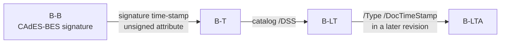

# Digital signatures

pdf0 signs PDF documents with detached CMS/PKCS#7 signatures and verifies them
again, with no cgo and no network: signing (`WriteSigned` and friends), PAdES
baseline assessment (`ValidatePAdES`), RFC 3161 time-stamps, and CRL/OCSP
revocation from the document's own Document Security Store. Reach for it to
produce a signed PDF from a certificate and a `crypto.Signer`, or to decide
whether a PDF you received is the document that was signed, by the party you
expect. The verifier lives in the `sign` package (`verify.go`, `cmsverify.go`,
`byterange.go`, `trust.go`, `revocation.go`, `changes.go`, `pades.go`,
`timestamp.go`); the writers are `sign.go`, `doctimestamp.go` and
`incremental.go` in the root package, and `signedfile.go` gives the verifier
the file's revisions — see [architecture.md](architecture.md) for how they sit
in the package.

## Which verdict do I read?

**`sign.Result.Intact()` for integrity, `TrustedChain` for identity, and
`Revocation` for status — each is a separate claim.** `r.Valid` on its own is
not a safe check, and trust comes *only* from the roots you pass: with
`sign.VerifyOptions{}` (nil roots) no chain is ever built, so `TrustedChain` is
always `false` and a signature from an entirely unknown signer looks exactly
like one from your CA.

```go
data, _ := os.ReadFile("signed.pdf")
doc, err := pdf0.Read(bytes.NewReader(data), int64(len(data)))
// ...
roots := x509.NewCertPool() // the roots of the signers YOU accept
roots.AddCert(caCert)       // never x509.SystemCertPool(): see below

results, err := doc.VerifySignatures(sign.VerifyOptions{Roots: roots})
if err != nil {
	return err // verification could not run; not "no signatures"
}
for _, r := range results {
	if !r.Intact() { // Valid AND every later change permitted
		return fmt.Errorf("signature does not hold for the document as delivered: %v %v", r.Err, r.DisallowedChanges)
	}
	if !r.TrustedChain {
		return fmt.Errorf("signer is not trusted: %w", r.ChainErr)
	}
	if r.Revocation.Status == sign.RevocationRevoked {
		return fmt.Errorf("signer certificate was revoked at %s", r.Revocation.RevokedAt)
	}
}
```

**Do not use `x509.SystemCertPool()` or any web PKI pool as signing roots.**
Those roots vouch for domain names: any of their CAs will issue a TLS
certificate to anyone who controls a domain. The purpose check below stops a
TLS-only certificate from counting as a signer, but the roots should still be
the ones that issue the signing certificates you accept.

Every field of `sign.Result`, and the exact limit of what it promises:

| Field | Promises | Does **not** promise |
| --- | --- | --- |
| `Valid bool` | the `/ByteRange` has the one layout a signature may have, the bytes inside it are intact, and the signature (or, for a document time-stamp, the RFC 3161 token) over them verifies under the embedded certificate | anything about bytes *outside* the range, or about who the signer is |
| `CoversWholeDocument bool` | the `/ByteRange` covers every byte of the file except the signature's own `/Contents` hex string | that the signature verifies |
| `DocumentUnmodified() bool` | `Valid && CoversWholeDocument` — nothing at all was changed after signing | trust, revocation or a reliable time |
| `ChangesAllowed bool` | every change made to the file after the signed revision is permitted (see [Allowed changes](#allowed-changes)); true when there are none | that anything is trusted; false when the changes could not be established |
| `DisallowedChanges []string` | a description of each change that is not permitted, or why the changes are unknown | |
| `Intact() bool` | `Valid && ChangesAllowed` — the verdict for a document that has been through long-term-validation updates | trust or revocation |
| `Revision int` | the index into `Source().Revisions()` of the revision the signature covers; -1 when its range does not end at one | |
| `TrustedChain bool` | the certificate chains to one of `VerifyOptions.Roots` (`TSARoots` for a document time-stamp), valid at `ValidationTime`, with a document-signing purpose (see [Trust](#trust)) | anything unless you passed roots |
| `ChainErr error` | why the chain did not build, or why its purpose was refused | |
| `ValidationTime time.Time` | the time chain and revocation were judged at: the earliest time a verified, *trusted* time-stamp proves the signature existed, or now | |
| `SignerCommonName string` | the Subject CN of the embedded certificate — a display label, filled in even when verification fails | any identity assurance on its own |
| `SigningTime time.Time` | the `signing-time` signed attribute, if the CMS carries one | a trustworthy time: the signer asserts it and nothing verifies it. It is never used as the validation time |
| `TimestampTime time.Time` | the time a verified time-stamp asserts: a B-T signature's signature time-stamp, or a document time-stamp's own | a trustworthy time unless `TimestampTrusted` |
| `TimestampTrusted bool` | that time-stamp's authority chains to your time-stamp roots with the `id-kp-timeStamping` purpose | |
| `Revocation RevocationInfo` | status at `ValidationTime` from the CRLs/OCSP responses in the document's `/DSS`, authenticated by the certificate's real issuer; a revocation from any source wins; a revoked intermediate is reported here too | any network lookup |
| `DocTimestamp bool` | the result is a document time-stamp (`/Type /DocTimeStamp`), not an approval signature | |
| `Err error` | why verification failed, when it did | |
| `Field string` | the fully qualified name (ISO 32000-2 §12.7.4.2 — the `/T` chain joined with `.`) of the form field whose `/V` references this signature, e.g. `Signature1` | a name at all when no field references the signature dictionary; then it is empty |

A signature can be `Valid` and still describe a different document: an
incremental update appends a new value for an existing page after the signed
range, leaving the original bytes — and the signature over them — perfectly
intact. `Intact()` catches it and `DisallowedChanges` names the page;
`examples/sign_verify` demonstrates exactly this.

## Verifying

`VerifySignatures(opts)` and `ValidatePAdES(opts)` read the file the document
was read from — its source record, `Document.Source()` — never a byte slice
passed alongside it: a signature covers bytes, and bytes that are not the
document's own file would be verified against the wrong thing. A `Document`
built in memory has no file, and no signature in it verifies. The error they
return is non-nil only when verification could not run to completion (a
failure on a hostile file, recovered rather than crashing the caller); the
results are then nil and must not be read as "no signatures".

Every dictionary with `/ByteRange` and `/Contents` whose `/Type` is absent,
`/Sig` or `/DocTimeStamp` is verified, in this order:

1. **The byte range** (`byterange.go`). Exactly one layout is accepted: four
   non-negative integers `[0 len1 start2 len2]`, both spans inside the file —
   each length compared against what remains after its start, never a sum
   against the size, so no value can overflow — and the gap between them
   exactly the dictionary's own `/Contents` hex string. The range must end at
   the end of a revision (its `%%EOF`, or the end-of-line after it) whose
   bytes hold the gap, or at the end of the file. Two dictionaries claiming the
   same range end are both refused: at most one of them can be valid.
2. **The digest** is computed by streaming the covered bytes from the file,
   never by gathering them into a buffer. Signatures are hashed in file order
   and share the hash of the prefix they have in common, so verifying a file
   with thousands of revisions costs about one pass over it.
3. **The CMS** (`cmsverify.go`): one `SignerInfo`, signed attributes present, a
   `message-digest` equal to the digest, a `content-type` equal to the
   `eContentType` (`id-data`, and no encapsulated content, for a document
   signature), an ESS `signing-certificate`/`signing-certificate-v2` that — when
   present — binds the signer certificate under the hash algorithm it names,
   and a signature over the signed attributes under the algorithm and
   parameters the `SignerInfo` declares (RSASSA-PSS salt length and hash
   honoured). SHA-1 and MD5 are refused as digests.
   A document time-stamp is verified as what it is, an RFC 3161 token: its
   `eContentType` must be `id-ct-TSTInfo`, its authority certificate must carry
   `id-kp-timeStamping`, and its message imprint must be the digest of the
   covered bytes. A B-T signature's signature time-stamp is checked the same
   way over the signature value.
4. **Trust and revocation** at the validation time (see [Trust](#trust) and
   [Revocation](#revocation)).
5. **The changes after the signature** (see [Allowed changes](#allowed-changes)).

## Allowed changes

A signature that does not cover the whole file covers one of its revisions,
and every incremental update after it changes the document. The verifier
compares the signed revision with the file as it stands (`signedfile.go`,
`sign/changes.go`), the analysis ISO 32000-2 §12.8.2.2.2 describes, and
classifies every object that differs:

- **Archival additions are permitted** — ETSI EN 319 142-1, and ISO 32000-2
  Table 257, which says a DSS or document time-stamp update "shall not be
  considered as changes to the document" at any certification level: a
  Document Security Store with its `/Certs`, `/CRLs`, `/OCSPs` and `/VRI`, and
  a document time-stamp field with its signature dictionary and widget (a
  time-stamp widget may carry an appearance only if its `/Rect` has no area).
- **Signing is permitted unless a certification signature forbids it**: a new
  signature field with its widget and signature dictionary, or a signature
  value in a field the signed revision left empty, is permitted — the ordinary
  multi-signer workflow, which ISO 32000-2 §12.8.2.2 leaves unrestricted when
  no DocMDP certification applies and which ETSI EN 319 142-1 and the
  reference validators accept. It is refused when the signed revision's
  catalog `/Perms /DocMDP` names a certification signature with `P` 1, and
  signing an existing field is refused when an earlier signature's FieldMDP
  transform (`/TransformMethod /FieldMDP`, `/Action` `/All`, `/Include` or
  `/Exclude` over `/Fields`) locks that field.
- **Edits to existing objects are permitted only as far as attaching those
  requires**: the catalog may change `/DSS` and `/AcroForm`; the interactive
  form may gain the new fields at the end of `/Fields` and the signature bits
  in `/SigFlags`; a page may gain the new widgets at the end of `/Annots`; a
  DSS dictionary that was already one may change. An object whose before and
  after differ in any other key is not permitted.
- **Everything else is not permitted** and is described in
  `DisallowedChanges`: a changed page, an added object nothing archival
  refers to, a deleted object, a changed trailer `/Root`, `/Encrypt` or
  `/Info`, bytes after the last `%%EOF` that belong to no revision.

**A time-stamp never makes a change permitted.** It proves when bytes existed:
a public time-stamp authority stamps any hash it is sent. An earlier version
treated a document time-stamp covering the whole file as excusing every change
before it, which let a page changed after signing come back as a conformant
PAdES signature (audit 2026-09-22 C1).

The comparison reads both states from the file's bytes, not from
`Document.Objects`: the signed state is what a reader of the file truncated at
the signed revision sees, so an update appended without a `%%EOF` of its own,
or an object changed by redefining the object stream that holds it, is still a
change. Objects are compared as the file stores them — for an encrypted file,
enciphered — so a change there is judged on its structure. The work is budgeted
per verification; past the budget the changes are reported unknown, never
permitted.

**Known gaps, reported rather than guessed:** DocMDP `P` 2 and 3 also permit
form filling, page templates and (at 3) annotation changes; recognising those
faithfully means judging each field type's value and appearance, which is not
done, so such changes are reported as not permitted.

## Trust

Chains are built with `crypto/x509` to `VerifyOptions.Roots`, using the CMS's
certificates and the DSS `/Certs` as intermediates, at the validation time.
A chain to a trusted root is not enough — the certificate must be for signing
documents (audit 2026-09-22 C22):

- the signer's key usage must include `digitalSignature` or
  `contentCommitment`, and a certificate with no key-usage extension is
  refused;
- the signer's extended key usage, and every intermediate's, must be absent
  or permit document signing: `anyExtendedKeyUsage`, `emailProtection`,
  `id-kp-documentSigning` (1.3.6.1.5.5.7.3.36), Adobe Authentic Documents
  Trust (1.2.840.113583.1.1.5) or Microsoft Document Signing
  (1.3.6.1.4.1.311.10.3.12). A TLS certificate (`serverAuth`) is refused.

A time-stamp authority must carry `id-kp-timeStamping` and chain to
`VerifyOptions.TSARoots` (or `Roots` when that is nil). A self-signed
authority not among the roots is checked cryptographically but not trusted,
and its time is not used.

The **validation time** is the earliest time a verified, trusted time-stamp
proves the signature existed — its own signature time-stamp, or a document
time-stamp over a later revision — and otherwise the current time. The
signer's own `signing-time` attribute is never used: the signer asserts it, and
a holder of an expired or revoked certificate could backdate it.

A time-stamp authority's own chain is judged the same way: at the earliest
time a trusted document time-stamp covering the token proves it existed, or
now. Document time-stamps are settled from the outermost inwards, so an
authority whose certificate has since expired stays trusted for the tokens a
later, trusted archive time-stamp preserved — the nested B-LTA case — and the
chain of trust ends at the newest time-stamp, judged now.

## Signing

All writers refuse an encrypted document (`cannot sign an encrypted
document`) — sign in plaintext and encrypt afterwards — and none mutates the
in-memory `*Document`; they work on a clone.

| Call | Produces | Level |
| --- | --- | --- |
| `WriteSigned(w, cert, key, opts...)` | full serialization plus a signature field, `/SubFilter /ETSI.CAdES.detached`, SHA-256 detached CMS with `content-type`, `message-digest` and `signing-certificate-v2` attributes | PAdES B-B |
| … with `WithSignatureTimestamp(tsaCert, tsaKey)` | the same, plus an RFC 3161 signature time-stamp over the signature value as an unsigned attribute, issued in-process by the supplied TSA key | PAdES B-T |
| `WriteSignedIncremental(w, cert, key, opts...)` | the file the document was read from verbatim, then only the appended signature objects and a new xref section chaining back via `/Prev`; takes `WithSignatureTimestamp` too | PAdES B-B / B-T |
| `WriteArchivalTimestamp(w, ValidationData{Certs, CRLs, OCSPs}, tsaCert, tsaKey)` | an incremental update of the file the document was read from, adding the certificates, CRLs and OCSP responses to the catalog `/DSS` and a `/Type /DocTimeStamp` field whose RFC 3161 token covers the whole file | PAdES B-LT / B-LTA, on top of an existing B-T |

**`WriteSigned` refuses a document that already carries a signature**, with
`ErrAlreadySigned`. It rewrites the whole file — new offsets, new xref,
possibly different object-stream packing — which moves every byte an existing
signature committed to and invalidates it. Add a signature to a signed
document with `WriteSignedIncremental`; pass `InvalidatingExistingSignatures()`
only to replace the file and discard the old signatures on purpose.

Adding to a signed file is always an *append*: `WriteSignedIncremental` and
`WriteArchivalTimestamp` copy the bytes the document was read from (its source
record, `Document.Source`) out untouched and add a revision behind them; the
update can even be undone by truncation. The new objects are numbered above
every number that file uses, including its object streams and
cross-reference streams, so the update never redefines one of them.

**An existing DSS is extended, never replaced.** `WriteArchivalTimestamp` keeps
every certificate, CRL, OCSP response and `/VRI` entry the DSS already holds,
and does not add material it already holds byte for byte, so renewing a B-LTA
document's archival time-stamp keeps every earlier piece of revocation
evidence. The update touches only what the allowed-changes analysis accepts as
archival, so the signatures before it stay `Intact`.

The TSA is local: pdf0 issues time-stamp tokens from a certificate and key you
hold, and has no RFC 3161 HTTP client, so a commercial TSA means fetching the
token yourself; it fetches no CRLs or OCSP responses either — `ValidationData`
is yours to fill.

## PAdES

`ValidatePAdES(opts)` assesses each approval signature (document time-stamps
count as long-term material) and returns a `PAdESResult`: `SubFilter`,
`IsPAdES`, `Level`, `Conformant`, `Valid`, `CoversDocument`, `ChangesAllowed`,
`DisallowedChanges`, `SignerCommonName`, `TrustedChain`, `TimestampValid`,
`TimestampTrusted`, `TimestampTime` and `Issues`. `Conformant` means the
`Issues` list is empty: sub-filter `ETSI.CAdES.detached`, the CMS verifies, no
`/Cert` in the signature dictionary (the certificate belongs in the CMS), a
CAdES signing-certificate attribute is present, the signature time-stamp (if
any) verifies, a B-LTA document time-stamp after the signature verifies, and
**every change after the signature is permitted**. Trust is reported beside it
(`TrustedChain`, `TimestampTrusted`), not folded into it.



Each level requires the previous one: a `/DSS` without a signature time-stamp
still reports B-B. The DSS is where a long-term signature keeps what a verifier
will need years later — `/Certs`, `/CRLs`, `/OCSPs` — since the issuing CA's
responders will not answer forever; the document time-stamp archives it.

A B-LT or B-LTA signature never covers the whole file — the validation material
is added after it — so `CoversDocument` is false for it, and it is conformant
because `ChangesAllowed` is true, not because a time-stamp covers the rest.

## Revocation

`sign.CheckCertRevocation(cert, issuer, crls, ocsps, at)` returns a
`RevocationInfo` (`Status` — `sign.RevocationUnknown`/`Good`/`Revoked` — plus
`Source`, `"OCSP"` or `"CRL"`, and `RevokedAt`) for the time `at`. Inside
`VerifySignatures` the issuer is the next certificate of the verified chain
(without roots, a certificate whose key verifiably issued the signer's), never
a certificate found by name: a forged CA carrying the real one's name decides
nothing (audit 2026-09-22 C2). A source counts only if that issuer signed it —
or, for OCSP, a responder certificate the issuer issued with the OCSP-signing
EKU, valid at `at`.

Every source is read, and **a revocation from any authenticated source wins**
over a "good" from another; a revocation needs no freshness, since it is
permanent. A "good" counts only from a source current at the validation time:
`thisUpdate ≤ at ≤ nextUpdate`, with five minutes of clock skew. A CRL without
`nextUpdate` is non-conforming (RFC 5280 §5.1.2.5) and never current; an OCSP
response without one is current only at the moment it was produced (RFC 6960
§4.2.2.1 — "newer information is always available"). Compare `RevokedAt` with
`ValidationTime` when a signature made before a revocation matters.

`Document.DSSCerts()` and `Document.DSSRevocationMaterial()` read `/Certs` and
`/CRLs` + `/OCSPs` out of the catalog's `/DSS`, decoding the streams. **Nothing
is ever fetched from the network** — not OCSP, not CRL distribution points, not
AIA issuer certificates. No DSS material, or no authenticated issuer, yields
`RevocationUnknown`.

**Revocation covers the whole path** (RFC 5280 §6.1.3): every certificate
between the signer and the trust anchor is checked, each against the next
certificate of the verified chain, at the validation time. A revoked
intermediate makes the chain untrusted — `TrustedChain` false, `ChainErr`
naming it, and `Revocation` reporting that revocation. The same applies to a
time-stamp authority: a revoked authority certificate or intermediate makes
its time-stamps untrusted, whatever the time-stamp's own date — a
deliberately conservative reading, since the revocation reason (key
compromise or not) is not weighed. For live revocation, fetch the material
yourself and call `sign.CheckCertRevocation` directly.

## Limitations and edge cases

- **The signature placeholder is found by anchoring on `/ByteRange`, not on
  `/Contents`.** Worth knowing if you touch `patchSignature`: a page's
  `/Contents 4 0 R` precedes the signature dictionary in essentially every real
  document, and an earlier signature's `/Contents` is a filled hex blob, so the
  first `/Contents` in the file is never the right target. `findSigSlots` locates
  the unique, still-unfilled `/ByteRange` placeholder — which a filled signature
  no longer carries — and searches forward from there. Signing a document with
  page content, and adding a second signature to an already-signed file, are both
  covered by regression tests in `sign_contents_test.go`.
- **Result order is by object number.** Both `VerifySignatures` and
  `ValidatePAdES` sort the signature dictionaries by object number, which is
  stable across runs and meaningful: in a document signed by successive
  incremental updates the later signature is the later object. `Field` names each
  result, so results can also be matched by field name.
- **Level detection is presence-based.** The catalog's `/DSS` only has to resolve
  to a dictionary, and a `/DocTimeStamp` only has to lie in a revision after the
  signature. A reported `B-LTA` means "the material is there" —
  `TimestampValid` and `Conformant` say whether it verifies.
- **The signature must fit 8192 bytes** of DER. Bigger chains overflow the
  reserved `/Contents` placeholder and signing fails with `signature (… hex)
  exceeds reserved space`.
- **Algorithms.** Signing supports RSA and ECDSA keys, always with SHA-256.
  Verification accepts RSA PKCS#1 v1.5, RSASSA-PSS (with the salt length and
  hash its parameters declare; an MGF1 hash different from the message hash is
  refused) and ECDSA over SHA-256/384/512, and rejects SHA-1/MD5 digests,
  multiple `SignerInfo`s, and signatures without signed attributes.
- **The signature field is added to the existing form, and named for the first
  free `SignatureN`.** An `/AcroForm` already in the catalog is updated in place:
  the new field is appended to its `/Fields`, the signature bits are OR-ed into
  `/SigFlags` (Table 225: bit 1 `SignaturesExist`, bit 2 `AppendOnly`), and every
  other key — `/DA`, `/DR`, `/NeedAppearances`, `/Q` — is kept, so neither an
  earlier signature's field nor an ordinary form field is dropped. The name scan
  covers the whole field tree plus field-like dictionaries the tree does not
  reach, so the first signature of a fresh document is `Signature1`, the second
  `Signature2`, and no two fields share a fully qualified name. Only a document
  with no `/AcroForm` at all gets a new form object. `WriteArchivalTimestamp`
  treats the form identically for its `/Type /DocTimeStamp` field, and names it
  from the same scan with a `TimestampN` prefix: the first document time-stamp is
  `Timestamp1`, a second `Timestamp2`. The two counters are independent — a
  time-stamp added to a signed document is still `Timestamp1` — but neither ever
  reuses a name already in the file.
- **The widget goes on the first page**, with a zero `/Rect`: signatures produced
  here are invisible. "First" means first in reading order, the page `PageList`
  reports first, found by descending into intermediate `/Pages` nodes — a tree
  whose pages all sit below one is signable, and a `/Kids` array mixing
  intermediate nodes and leaves (legal under ISO 32000-2 §7.7.3.2) does not
  confuse it. The widget's `/P` is the indirect reference to that same page
  object (Table 166), taken from the object number the writer updates, so the
  annotation and its `/P` cannot name different objects.
- **A direct `/AcroForm` is promoted; a direct catalog or page is refused.**
  Storing the interactive form as a direct dictionary in the catalog is legal, so
  it is copied into a new indirect object that the (rewritten) catalog then
  points at — it cannot be updated in place, having no object number of its own.
  The catalog and the first page are different: signing rewrites both, and ISO
  32000-2 §7.5.5 (trailer `/Root`) and §7.7.3.2 (page-tree `/Kids`) require both
  to be indirect references, so a document where either is direct is malformed
  and every writer refuses it (`the document catalog is a direct object …`, `the
  first page is a direct object …`) rather than silently promoting a broken
  structure — an incremental update cannot supersede an object that does not
  exist.
- **Encrypted documents** cannot be signed or incrementally updated at all.

## See also

`examples/sign_verify` (a runnable sign-then-verify guard),
[architecture.md](architecture.md) (the read/write pipeline the signer sits on),
[validators.md](validators.md) (the other validators) and
[../README.md](../README.md) (the rest of the API).
