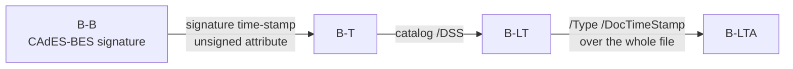

# Digital signatures

pdf0 signs PDF documents with detached CMS/PKCS#7 signatures and verifies them
again, with no cgo and no network: signing (`WriteSigned` and friends), PAdES
baseline assessment (`ValidatePAdES`), RFC 3161 time-stamps, and CRL/OCSP
revocation from the document's own Document Security Store. Reach for it to
produce a signed PDF from a certificate and a `crypto.Signer`, or to decide
whether a PDF you received is the document that was signed, by the party you
expect. The code lives in `sign.go`, `signatures.go`, `pades.go`, `timestamp.go`,
`doctimestamp.go`, `revocation.go` and `incremental.go` — see
[architecture.md](architecture.md) for how they sit in the package.

## Which verdict do I read?

**`SignatureResult.DocumentUnmodified()`, and — for trust —
`VerifySignaturesWithRoots`.** `r.Valid` on its own is not a safe check, and
`VerifySignatures` performs *no* trust-chain verification whatsoever: with
`roots == nil` no chain is ever built, so `TrustedChain` is always `false` and
a signature from an entirely unknown signer looks exactly like one from your CA.

```go
data, _ := os.ReadFile("signed.pdf")
doc, err := pdf0.Read(bytes.NewReader(data), int64(len(data)))
// ...
roots := x509.NewCertPool() // your trust anchors, or x509.SystemCertPool()
roots.AddCert(caCert)

for _, r := range doc.VerifySignaturesWithRoots(data, roots) {
	if !r.DocumentUnmodified() { // Valid AND CoversWholeDocument
		return fmt.Errorf("signature does not cover the document as delivered: %w", r.Err)
	}
	if !r.TrustedChain {
		return fmt.Errorf("signer is not trusted: %w", r.ChainErr)
	}
	if r.Revocation.Status == pdf0.RevocationRevoked {
		return fmt.Errorf("signer certificate was revoked at %s", r.Revocation.RevokedAt)
	}
}
```

Every field of `SignatureResult`, and the exact limit of what it promises:

| Field | Promises | Does **not** promise |
| --- | --- | --- |
| `Valid bool` | the bytes inside the signed `/ByteRange` are intact and were signed by the private key of the embedded certificate | anything about bytes *outside* that range, or about who the signer is |
| `CoversWholeDocument bool` | the `/ByteRange` is the canonical layout — exactly two segments, the first starting at offset 0, the second ending at EOF, and the single gap byte-identical to the `/Contents` hex window | that the signature verifies |
| `DocumentUnmodified() bool` | `Valid && CoversWholeDocument` — signed, and nothing was changed afterwards | trust, revocation or a reliable time |
| `TrustedChain bool` | the signer chains to one of the roots you supplied, validated at the **current wall clock**, using the CMS's other certificates as intermediates | anything unless you called `VerifySignaturesWithRoots` with a non-nil pool; it is never set by `VerifySignatures` |
| `ChainErr error` | why the chain failed to build, when roots were given | |
| `SignerCommonName string` | the Subject CN of the embedded signer certificate — a display label, populated even when verification fails | any identity assurance on its own |
| `SigningTime time.Time` | the `signing-time` *signed attribute*, if the CMS carries one | a trustworthy time: it is asserted by the signer. Zero when absent — pdf0's own signer never emits one. A real time comes from a verified time-stamp (`PAdESResult.TimestampTime`) |
| `Revocation RevocationInfo` | status derived **only** from CRLs/OCSP responses embedded in the document's `/DSS` | any network lookup, and any answer at all when no issuer certificate or no DSS material is available (then it stays `RevocationUnknown`) |
| `Err error` | why CMS verification failed, when it did | |
| `Field string` | — always empty; the current code never populates it | |

A signature can be `Valid` and still describe a different document: an
incremental update appends a new value for an existing page after the signed
range, leaving the original bytes — and the signature over them — perfectly
intact. `examples/sign_verify` demonstrates exactly this.

## Verifying

`VerifySignaturesWithRoots(raw, roots)` walks the object table and, for each
dictionary that has both `/ByteRange` and `/Contents` and whose `/Type` is
absent, `/Sig` or `/DocTimeStamp`, runs one verification. `raw` must be the
**exact bytes of the file** — digests are recomputed over them, not over the
parsed object model.

```mermaid
sequenceDiagram
    autonumber
    participant C as Caller
    participant S as signatures.go
    participant M as verifyCMS in signatures.go
    participant R as revocation.go
    participant X as x509 / roots

    C->>S: VerifySignaturesWithRoots(raw, roots)
    loop each dict with /ByteRange + /Contents whose /Type is absent, /Sig or /DocTimeStamp
        S->>S: byteRangeSegments + contentsGapIsSignature
        Note right of S: CoversWholeDocument requires exactly two segments,<br/>the first at offset 0, the second ending at EOF,<br/>and the single gap == the /Contents window (audit C12)
        S->>M: verifyCMS(/Contents, concatenated signed bytes)
        M-->>S: signer cert, embedded certs, signing time, error
        Note right of M: digest, content-type and ESS binding checked;<br/>SHA-1/MD5 rejected. On error the result stops<br/>here: no revocation, no chain
        opt an issuer is found in the CMS or DSS /Certs, and the DSS holds material
            S->>R: CheckCertRevocation(cert, issuer, crls, ocsps)
            R-->>S: RevocationInfo
        end
        opt roots != nil
            S->>X: chainTrusted(cert, certs, roots) at current wall-clock
            X-->>S: TrustedChain / ChainErr
        end
    end
    S-->>C: []SignatureResult (map-iteration order, not stable)
```

`verifyCMS` insists on a single `SignerInfo`, on signed attributes being present,
on the `content-type` attribute matching the `eContentType`, and — when an ESS
`signing-certificate`/`signing-certificate-v2` attribute is present — on its hash
actually binding the signer certificate; SHA-1 and MD5 are refused as signature
digests. Chain validation deliberately uses the current time rather than
`SigningTime`, so the holder of an expired or revoked certificate cannot backdate
that self-asserted attribute to forge a trusted chain.

## Signing

All four writers refuse an encrypted document (`cannot sign an encrypted
document`) — sign in plaintext and encrypt afterwards — and none mutates the
in-memory `*Document`; they work on a clone.

| Call | Produces | Level |
| --- | --- | --- |
| `WriteSigned(w, cert, key)` | full serialization plus a signature field, `/SubFilter /ETSI.CAdES.detached`, SHA-256 detached CMS with `content-type`, `message-digest` and `signing-certificate-v2` attributes | PAdES B-B |
| `WriteSignedTimestamped(w, cert, key, tsaCert, tsaKey)` | the same, plus an RFC 3161 signature time-stamp over the signature value as an unsigned attribute, issued in-process by the supplied TSA key | PAdES B-T |
| `WriteSignedIncremental(w, original, cert, key)` | `original` verbatim, then only the appended signature objects and a new xref section chaining back via `/Prev` | PAdES B-B |
| `WriteArchivalTimestamp(w, original, certs, tsaCert, tsaKey)` | an incremental update adding a catalog `/DSS` holding `certs` and a `/Type /DocTimeStamp` field whose RFC 3161 token covers the whole file | PAdES B-LTA, on top of an existing B-T |

Adding to a signed file is always an *append*: a PDF signature covers a byte
range of a particular file, so re-serializing the document — new offsets, new
xref, possibly different object-stream packing — would move every byte a previous
signature committed to and invalidate it. `WriteSignedIncremental` and
`WriteArchivalTimestamp` therefore copy the original bytes out untouched and add
a revision behind them; the update can even be undone by truncation.
(`WriteSigned` rewrites the whole file, which is fine for a document that carries
no signature yet.)

The TSA is local: pdf0 issues time-stamp tokens from a certificate and key you
hold, and has no RFC 3161 HTTP client, so a commercial TSA means fetching the
token yourself. On verification a time-stamp certificate must carry the
`id-kp-timeStamping` extended key usage, or the token is rejected.

## PAdES

`ValidatePAdES(raw)` assesses each approval signature (document time-stamps are
skipped — they count as long-term material) and returns a `PAdESResult`:
`SubFilter`, `IsPAdES`, `Level`, `Conformant`, `Valid`, `CoversDocument`,
`SignerCommonName`, `TimestampValid`, `TimestampTime` and `Issues`.
`Conformant` means the B-B baseline held with an empty `Issues` list: sub-filter
`ETSI.CAdES.detached`, the CMS verifies, no `/Cert` in the signature dictionary
(the certificate belongs in the CMS), a CAdES signing-certificate attribute is
present, and the byte range covers the file.



Each level requires the previous one: a `/DSS` without a signature time-stamp
still reports B-B. The DSS is where a long-term signature keeps what a verifier
will need years later — `/Certs`, `/CRLs`, `/OCSPs` — since the issuing CA's
responders will not answer forever; the document time-stamp seals the DSS itself.

That seal also relaxes coverage: when a document time-stamp's byte range covers
the whole file *and* its token verifies, an approval signature covering only its
own earlier revision stays conformant, since the trailing bytes are protected by
the time-stamp instead. `CoversDocument` still reports `false` — the relaxation
applies to `Issues`/`Conformant`, not to the coverage flag.

## Revocation

`CheckCertRevocation(cert, issuer, crls, ocsps)` returns a `RevocationInfo`
(`Status` — `RevocationUnknown`/`Good`/`Revoked` — plus `Source`, `"OCSP"` or
`"CRL"`, and `RevokedAt`). OCSP responses are consulted first and the first
definite answer wins. Every source must be signed by `issuer` — or, for OCSP, by
a responder certificate issued by `issuer` carrying the OCSP-signing EKU — and
must be inside its validity window: material not yet in force or past its
`nextUpdate` is discarded rather than believed, so a stale "good" cannot be
replayed to mask a later revocation. Five minutes of clock skew are tolerated.

`Document.DSSCerts()` and `Document.DSSRevocationMaterial()` read `/Certs` and
`/CRLs` + `/OCSPs` out of the catalog's `/DSS`, decoding the streams. **Nothing
is ever fetched from the network** — not OCSP, not CRL distribution points, not
AIA issuer certificates. No DSS material, or no issuer certificate among the CMS
certificates and `DSSCerts()`, yields `RevocationUnknown`. For live revocation,
fetch it yourself and call `CheckCertRevocation` directly.

## Limitations and edge cases

- **The signature placeholder is found by anchoring on `/ByteRange`, not on
  `/Contents`.** Worth knowing if you touch `patchSignature`: a page's
  `/Contents 4 0 R` precedes the signature dictionary in essentially every real
  document, and an earlier signature's `/Contents` is a filled hex blob, so the
  first `/Contents` in the file is never the right target. `findSigSlots` locates
  the unique, still-unfilled `/ByteRange` placeholder — which a filled signature
  no longer carries — and searches forward from there. Signing a document with
  page content, and adding a second signature to an already-signed file, are both
  covered by regression tests in `sign_contents_test.go`.
- **Document time-stamps come back invalid from `VerifySignatures`.** A
  `/DocTimeStamp` field is included in the results, but its CMS is an RFC 3161
  token whose message digest is over the TSTInfo, not over the file, so it always
  reports `Valid == false` with `document digest does not match the signature
  (content was modified)`. That is not tampering — assess time-stamps through
  `ValidatePAdES`.
- **Result order is not stable.** Both `VerifySignatures*` and `ValidatePAdES`
  iterate the object map, so multi-signature documents come back in Go's
  randomized map order. `SignatureResult.Field` and `PAdESResult.Field` are
  always empty, so results cannot be matched to field names.
- **Level detection is presence-based.** The catalog's `/DSS` only has to resolve
  to a dictionary, and a `/DocTimeStamp` only has to carry a `/ByteRange`;
  neither is validated. A reported `B-LTA` means "the material is there" —
  `TimestampValid` and `Conformant` say whether it verifies.
- **The signature must fit 8192 bytes** of DER. Bigger chains overflow the
  reserved `/Contents` placeholder and signing fails with `signature (… hex)
  exceeds reserved space`.
- **Algorithms.** Signing supports RSA and ECDSA keys, always with SHA-256.
  Verification accepts RSA PKCS#1 v1.5, RSASSA-PSS and ECDSA over
  SHA-256/384/512, and rejects SHA-1/MD5 digests, multiple `SignerInfo`s, and
  signatures without signed attributes.
- **`WriteSigned` replaces the catalog `/AcroForm`** with a fresh one listing
  only the new field (named `Signature1`), and attaches the widget to the first
  page. Existing form fields are dropped from `/Fields`.
- **`ValidatePAdES` never checks trust** — it verifies signatures with a nil root
  store. Combine it with `VerifySignaturesWithRoots` when you need both.
- **Encrypted documents** cannot be signed or incrementally updated at all.

## See also

`examples/sign_verify` (a runnable sign-then-verify guard),
[architecture.md](architecture.md) (the read/write pipeline the signer sits on),
[validators.md](validators.md) (the other validators) and
[../README.md](../README.md) (the rest of the API).
