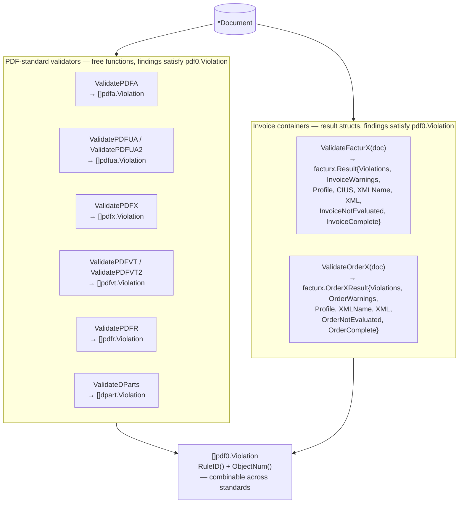
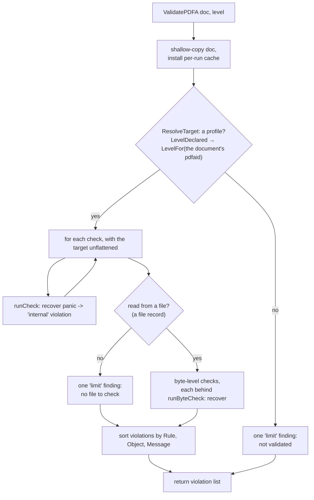

# Validators

pdf0 validates a `*Document` against ten conformance standards. Reach for this
doc to pick an entry point, to understand what a result type does and does not
promise, or before adding a rule.

Every validator is **read-only**: each installs its per-run cache on a shallow
copy, so the caller's document is never mutated and the same document can be
validated concurrently (`TestValidateConcurrentSameDoc`, `TestUAValidationCacheIsolation`).

Three further properties hold across the family:

- **Panic safety.** Every check runs behind a `recover()` boundary — `runCheck`
  for PDF/A, `finding.Guarded` and `pdfua.RunCheck` for the rest. A check that
  panics on hostile input is reported as a finding with the rule `internal`
  rather than crashing the caller, and findings collected before the panic
  survive. The honest limit, the same one `runCheck` has always carried: a stack
  overflow from unbounded recursion is *not* recoverable, so those are prevented
  at their source instead. (This closed C27 from the 2026-07-26 codebase audit;
  before that, only PDF/A had a boundary.)
- **Deterministic order.** Every validator sorts its findings by rule, then
  object, then message before returning — through the one shared
  `finding.Sort`, on every return path including the early ones — so results
  are stable across runs and safe to diff or snapshot.
- **A nil document is a checker finding.** Every validator answers a nil
  `*Document` with one finding under `limit` ("no document to validate"),
  before touching it (`validator_guard.go`, `TestEveryValidatorAnswersANilDocument`).
- **Rules judge the document, not the object table.** A rule about what the
  document contains walks `core.View.ReachableDicts` — every dictionary the
  trailer reaches, direct ones included, orphans not — and only a rule about
  the file's syntax ranges over every object, marked `// allobjects:`
  (`internal/lint`'s `TestValidatorsWalkTheReachableGraph`).
- **A checker that stops early says so.** A tripped resource guard, a recovered
  panic and a cancelled context are all reported as findings under a *reserved*
  rule identifier — `limit` or `internal` — which `IsCheckerFinding` separates
  from a real non-conformance. The findings gathered before the stop are kept,
  and the result is never empty, so a run that did not finish looking can never
  be read as a clean bill of health. Treat such a finding as **unknown**, not as
  a failure. See [limits.md](limits.md) for the classification and
  [architecture.md](architecture.md#cancellation) for the `…Context` variants.

```go
var real []pdf0.Violation
for _, e := range pdf0.ValidatePDFAContext(ctx, doc, pdfa.PDFA2b) {
	if !pdf0.IsCheckerFinding(e) {
		real = append(real, e)
	}
}
```

## Pick an entry point

| Standard | Entry point | Returns | Findings satisfy `Violation` | `…Context` variant |
|----------|-------------|---------|------------------------------|--------------------|
| PDF/A (ISO 19005) 1a/1b/2a/2b/2u/3a/3b/3u/4/4e/4f | `ValidatePDFA(doc, level)` | `[]pdfa.Violation` | yes | yes |
| PDF/UA-1 (ISO 14289-1) | `ValidatePDFUA(doc)` | `[]pdfua.Violation` | yes | yes |
| PDF/UA-2 (ISO 14289-2) | `ValidatePDFUA2(doc)` | `[]pdfua.Violation` | yes | yes |
| PDF/X-1a/3/4/4p/6 (ISO 15930) | `ValidatePDFX(doc, level)` | `[]pdfx.Violation` | yes | yes |
| PDF/VT-1 (ISO 16612-2) | `ValidatePDFVT(doc)` | `[]pdfvt.Violation` | yes | yes |
| PDF/VT-2 | `ValidatePDFVT2(doc)` | `[]pdfvt.Violation` | yes | yes |
| PDF/R | `ValidatePDFR(doc)` | `[]pdfr.Violation` | yes | yes |
| DPart hierarchy (ISO 32000-2 §14.12) | `ValidateDParts(doc)` | `[]dpart.Violation` | yes | yes |
| Factur-X / ZUGFeRD container | `ValidateFacturX(doc)` | `facturx.Result` | yes (`facturx.Violation`) | yes |
| Order-X container | `ValidateOrderX(doc)` | `facturx.OrderXResult` | yes (`facturx.OrderXViolation`) | yes |

The last two columns move together, and that is not a coincidence: cancellation
is reported *as a finding* under the reserved rule `limit`, so an entry point
that cannot carry a finding `IsCheckerFinding` can classify has no honest way to
report a cancelled run — see
[architecture.md](architecture.md#which-entry-points-have-one). The two invoice
containers were the standing exception on both counts until `formalis` v0.2.0:
their findings were `formalis.Violation`, an external type this package could not
extend, and the invoice half of the work was a rule engine that took no context.
Both have lapsed, so both columns say yes.

Signature and PAdES assessment are `*Document` methods with their own result
types; see [signing.md](signing.md).



### Combining findings

The six PDF-standard validators keep their own concrete finding types but all
satisfy `pdf0.Violation` (`error` + `RuleID()` + `ObjectNum()`), so a
multi-standard report is a plain append:

```go
var all []pdf0.Violation
for _, e := range pdf0.ValidatePDFA(doc, pdfa.PDFA2b) {
	all = append(all, e)
}
for _, e := range pdf0.ValidatePDFUA(doc) {
	all = append(all, e)
}
```

Factur-X and Order-X return a result *struct* rather than a slice, because a
container validation answers more than "what is wrong": it also yields the
extracted invoice XML, the conformance level the container declared, and what
the invoice rule engine did not evaluate. The findings inside it are ordinary
`pdf0.Violation` values and append like the rest:

```go
res := pdf0.ValidateFacturX(doc)
for _, v := range res.Violations {
	all = append(all, v)
}
```

They carry one field the PDF-standard findings do not: `Source`, the authority
that defines the rule. It is the zero `formalis.Source` on pdf0's own container
findings and names the rule's author on a finding adopted from the invoice rule
engine, because a rule identifier such as `BR-01` is unique within its authority
and not outside it.

Three fields on the result are worth reading together:

- `Violations` is the verdict: pdf0's container findings, the PDF/A-3 base's,
  and the invoice engine's **fatal** findings. The PDF/A-3 base is validated at
  PDF/A-3b, which a container declaring 3a or 3u also satisfies; whether such a
  container meets the rest of its own claim is a PDF/A question
  (`ValidatePDFA` at `pdfa.LevelDeclared`).
- `InvoiceWarnings` is the invoice engine's **advisory** findings — CEN flags
  1,168 of the two EN 16931 syntax bindings' assertions `warning`, and a
  conforming Factur-X EXTENDED invoice trips dozens by design, since carrying
  more than the EN 16931 core is what EXTENDED is *for*. `pdf0.Violation` has no
  severity, so folding these into `Violations` would make them indistinguishable
  from a PDF/A-3 failure in any combined report.
- `InvoiceNotEvaluated` / `InvoiceComplete` say what the rule set that ran does
  **not** implement. "No findings" and "no findings, and here is what nobody
  looked at" are different answers, and this is the second one. They are not
  turned into findings: every rule set has gaps, so a finding per gap would fire
  on every invoice ever validated.

The EN 16931 / CIUS *invoice-content* rules live in `formalis`; pdf0 validates
the PDF container (PDF/A-3 conformance, the embedded-file relationship, the XMP
declaration) and hands the extracted XML over. Which rule set that XML is run
through follows what the container declared: a Factur-X profile routes to the
EN 16931 core at that profile, a CIUS conformance level (`XRECHNUNG`) routes to
the rule set the invoice itself declares in BT-24, and a level that names neither
is a `metadata` finding rather than a guess. See
[ADR 0002](adr/0002-formalis-extraction.md).

## What an empty result means

Nothing fired that pdf0 checks. It is **not** a conformance guarantee: the PDF/A
validator implements a subset of ISO 19005, and the other validators are
narrower still (`ValidatePDFVT2` does not assert the PDF/X-5 external-reference
rules; `ValidatePDFUA2` does not assert full ISO 14289-2). Three rule sets rest
on the author's knowledge of standards this repository does not hold, and say
so in their source: the PDF/X per-level table (`pdfx/levels.go`, ISO 15930;
PDF/X-4 is also calibrated against the Cal Poly suite), PDF/R (`pdfr/pdfr.go`,
ISO 23504, including its identification schema), and the X-1a colour rule,
which covers device RGB but not CIE-based spaces. The measured claim is
the corpus ratchet, not the API — see [CONTRIBUTING](../CONTRIBUTING.md#the-corpus-ratchet--read-this-before-changing-a-validation-rule).

## How PDF/A validation runs

`ValidatePDFA` (`pdfa_api.go`, dispatching to `pdfa.ValidateView`) runs a fixed
list of 59 check functions, then the byte-level file-structure checks over the
file the document was read from. Each check runs
behind a `recover()` boundary so a bug or an adversarial structure in one check
cannot crash the caller. Validation runs against a shallow copy of the
`Document`, so it never mutates the caller's document and is safe to run
concurrently on the same document.



The byte-level rules read the file the document was read from
(`Document.Source`), as `Read` found it, and nothing else: they judge that file
even if the document has been edited since. To judge an edited document's bytes,
write it and read the result. A document built in memory has no file; for it the
byte-level rules do not run, and the result carries a `no-source-file` checker
finding saying so. (There used to be a `ValidatePDFABytes` that took the bytes as
a parameter; bytes that were not the document's own produced findings about
neither file.)

**The level is a target profile.** A `pdfa.Level` names the part, the
conformance level and (at part 4) the variant: `PDFA1a`, `PDFA1b`, `PDFA2a`,
`PDFA2b`, `PDFA2u`, `PDFA3a`, `PDFA3b`, `PDFA3u`, `PDFA4`, `PDFA4E`, `PDFA4F`
(`pdfa.Levels()`). Every rule gates on the target, never on what the document
declares, with one exception: the identification rule, which compares the
declaration with the target. A target accepts the declarations the conformance
hierarchy allows — a 2b or 3b target accepts `B`, `U` or `A`, a 2u/3u target `U`
or `A`, an a target only `A`, 1b `B` or `A`; plain PDF/A-4 accepts no
conformance entry, 4e only `E`, 4f only `F`. So a 2u or 2a file validates clean
at 2b, and a file declaring `F` validated at plain PDF/A-4 is reported for its
declaration and held to the plain part's rules (no 4f relaxations).

The zero value, **`pdfa.LevelDeclared`**, validates against the level the
document declares (`pdfa.LevelFor(part, conformance)`, the one mapping from a
declaration to a level, which `Document.Conformance`, `Save` and the
embedded-PDF/A rule share). A document whose declaration cannot be read or names
no level — and a `Level` that names no profile at all, such as `pdfa.Level(99)` —
gets exactly one finding under the `limit` rule (`IsCheckerFinding` reports it)
and is not validated. The builders (`NewPDFADocument`, `NewPDFADocumentWith`,
`GenerateXMPMetadata`) refuse both with an error.

**Level A** (1a/2a/3a) and **Level U** (2u/3u) are Level B plus more. Level U
adds the Unicode character-map requirement: every font used for rendering has a
ToUnicode CMap or meets one of the standard's three exemptions, and at parts 2/3
no ToUnicode maps to U+0000, U+FEFF or U+FFFE. Level A adds that and Tagged PDF
(`/MarkInfo` and a structure tree), content tagged or marked as an artifact,
role-mapped structure types without cycles, `/Lang` syntax wherever it is
written, and (parts 2/3) ActualText for Private Use Area code points. The
`PDF_A-1a`, `PDF_A-2a` and `PDF_A-2u` corpus suites are ratcheted at their own
levels (`TestCorpusLevelA`, FP=0, missed=0); part 3 has no a or u suite.

**Executed-content model.** Many PDF/A rules apply only to content that is
actually *used*, not merely present. (Two font rules are deliberate exceptions
and scan `Document.Objects` directly: `checkCMapEmbedded` and
`checkCMapCIDLimit`.) Colour spaces, fonts, and ExtGState
parameters are checked when a page (or a form XObject / pattern / Type3 glyph it
invokes) actually references them — see `walkExecutedContent` and
`collectFontTextUsage`. A form XObject that is never drawn does not trigger
font-embedding or colour rules. This mirrors what veraPDF does, and it is why the
corpus is the oracle for rule semantics
([ADR 0001](adr/0001-corpus-as-oracle.md), [ADR 0004](adr/0004-executed-content-model.md)).

## Where the rules live

All PDF/A checks are dispatched from the `checks` slice and `byteChecks` in `ValidateView`.
They are grouped across files by concern:

| File | Rules |
|------|-------|
| `pdfa.go` | Dispatch + most rules (font embedding, colour, metadata, annotations, output intents, transparency) |
| `level.go` | The target profile: levels, `LevelFor`, `ResolveTarget`, the conformance hierarchy |
| `pdfa_levela.go` / `pdfa_levela_fonts.go` | Level A: tagged structure, artifacts, structure types, language, ActualText; Level A and U: Unicode character maps |
| `final_rules.go` | Catalog prohibitions, trigger events, halftones, inherited XObjects |
| `content_operators.go` | Content-stream operator whitelist, named resources |
| `filestructure.go` | Byte-level structure rules over the raw file (the source record's offsets, `Document.Source`) |
| `fonts.go` / forme `font/fontprog.go`, `font/font_encodings.go`, `font/cff_strings.go` | Font-dictionary rules; sfnt/CFF/Type1 program parsing |
| `xmp.go` / `xmp_schemas.go` | XMP metadata parsing and schema validation |
| `internal/core` (PDF functions) | PDF function objects (types 0/2/3/4), used by tint transforms and shadings |

The other standards each own their file(s): `pdfua/pdfua.go`, `pdfua/pdfua_content.go`,
`pdfua/pdfua_struct.go`, `pdfua/pdfua_tablegrid.go`, `pdfua/pdfua2.go`, `pdfx/pdfx.go`, `pdfx/levels.go`,
`pdfvt/pdfvt.go`, `pdfr/pdfr.go`, `dpart/dpart.go`, `facturx.go`, `order_x.go`. `violations.go`
holds the shared `Violation` interface and is the canonical statement of the
contract above.

To add a rule, see
[CONTRIBUTING](../CONTRIBUTING.md#adding-a-validation-rule).
