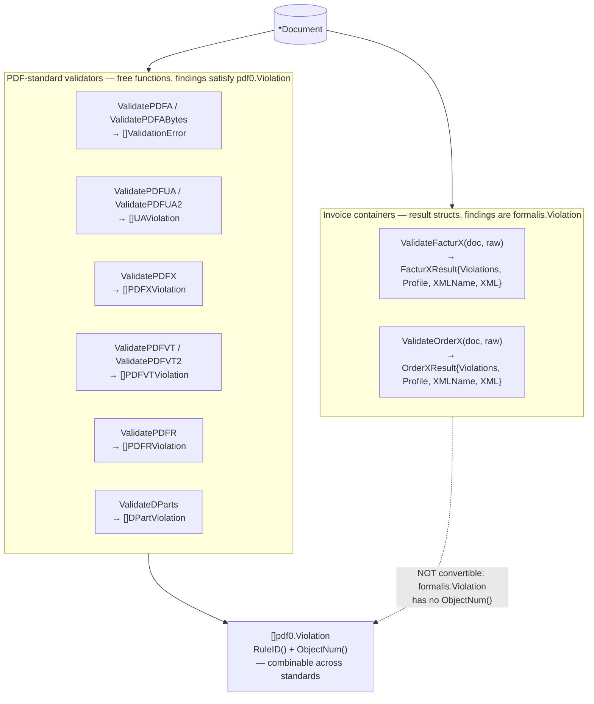
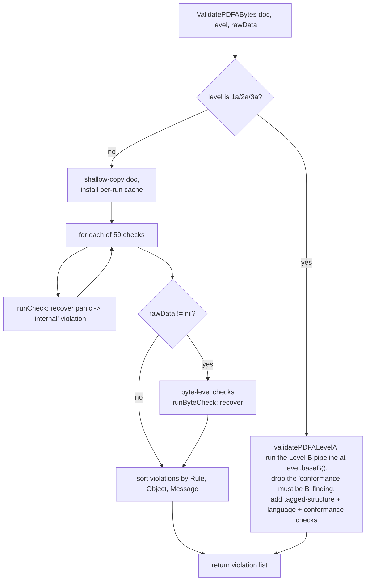

# Validators

pdf0 validates a `*Document` against ten conformance standards. Every validator
is read-only, panic-safe, and safe to run concurrently on the same document.
Reach for this doc to pick an entry point, to understand what a result type does
and does not promise, or before adding a rule.

## Pick an entry point

| Standard | Entry point | Returns | Findings satisfy `Violation` |
|----------|-------------|---------|------------------------------|
| PDF/A (ISO 19005) 1a/1b/2a/2b/3a/3b/4 | `ValidatePDFA(doc, level)`<br/>`ValidatePDFABytes(doc, level, raw)` | `[]ValidationError` | yes |
| PDF/UA-1 (ISO 14289-1) | `ValidatePDFUA(doc)` | `[]UAViolation` | yes |
| PDF/UA-2 (ISO 14289-2) | `ValidatePDFUA2(doc)` | `[]UAViolation` | yes |
| PDF/X-1a/3/4/4p/6 (ISO 15930) | `ValidatePDFX(doc, level)` | `[]PDFXViolation` | yes |
| PDF/VT-1 (ISO 16612-2) | `ValidatePDFVT(doc)` | `[]PDFVTViolation` | yes |
| PDF/VT-2 | `ValidatePDFVT2(doc)` | `[]PDFVTViolation` | yes |
| PDF/R | `ValidatePDFR(doc)` | `[]PDFRViolation` | yes |
| DPart hierarchy (ISO 32000-2 §14.12) | `ValidateDParts(doc)` | `[]DPartViolation` | yes |
| Factur-X / ZUGFeRD container | `ValidateFacturX(doc, raw)` | `FacturXResult` | **no** — see below |
| Order-X container | `ValidateOrderX(doc, raw)` | `OrderXResult` | **no** — see below |

Signature and PAdES assessment are `*Document` methods with their own result
types; see [signing.md](signing.md).



### Combining findings — and the one exception

The six PDF-standard validators keep their own concrete finding types but all
satisfy `pdf0.Violation` (`error` + `RuleID()` + `ObjectNum()`), so a
multi-standard report is a plain append:

```go
var all []pdf0.Violation
for _, e := range pdf0.ValidatePDFA(doc, pdf0.PDFA2b) {
	all = append(all, e)
}
for _, e := range pdf0.ValidatePDFUA(doc) {
	all = append(all, e)
}
```

**Factur-X and Order-X are the exception.** They return a result *struct*, not a
slice, and its `Violations` field holds `formalis.Violation` — a type owned by
`github.com/mgilbir/formalis`, which this package cannot extend with the
interface methods. The values carry `Rule`, `Message` and `Object` fields, so
adapt them explicitly if you need one combined list:

```go
res := pdf0.ValidateFacturX(doc, raw)
for _, v := range res.Violations {
	fmt.Printf("[Factur-X %s] object %d: %s\n", v.Rule, v.Object, v.Message)
}
```

The EN 16931 / CIUS *invoice-content* rules live in `formalis`; pdf0 validates
the PDF container (PDF/A-3 conformance, the embedded-file relationship, the XMP
declaration) and hands the extracted XML over. See
[ADR 0002](adr/0002-formalis-extraction.md).

## What an empty result means

Nothing fired that pdf0 checks. It is **not** a conformance guarantee: the PDF/A
validator implements a subset of ISO 19005, and the other validators are
narrower still (`ValidatePDFVT2` does not assert the PDF/X-5 external-reference
rules; `ValidatePDFUA2` does not assert full ISO 14289-2). The measured claim is
the corpus ratchet, not the API — see [CONTRIBUTING](../CONTRIBUTING.md#the-corpus-ratchet--read-this-before-changing-a-validation-rule).

## How PDF/A validation runs

`ValidatePDFABytes` (`pdfa.go`) runs a fixed list of 59 check functions, then —
if raw bytes are supplied — the byte-level file-structure checks. Each check runs
behind a `recover()` boundary so a bug or an adversarial structure in one check
cannot crash the caller. Validation runs against a shallow copy of the
`Document`, so it never mutates the caller's document and is safe to run
concurrently on the same document.



`ValidatePDFA(doc, level)` is `ValidatePDFABytes(doc, level, nil)`: it skips the
byte-level rules because they need the file bytes. Use `ValidatePDFABytes`
whenever you have them.

**Level A** (1a/2a/3a) is Level B plus the accessibility requirements — tagged
logical structure, a natural-language specification, Unicode character mapping,
and an `A` conformance declaration. It is validated by running the Level B
pipeline and adding those families (`pdfa_levela.go`), so every Level B rule
applies at Level A too.

**Executed-content model.** Many PDF/A rules apply only to content that is
actually *used*, not merely present. Colour spaces, fonts, and ExtGState
parameters are checked when a page (or a form XObject / pattern / Type3 glyph it
invokes) actually references them — see `walkExecutedContent` and
`collectFontTextUsage`. A form XObject that is never drawn does not trigger
font-embedding or colour rules. This mirrors what veraPDF does, and it is why the
corpus is the oracle for rule semantics
([ADR 0001](adr/0001-corpus-as-oracle.md), [ADR 0004](adr/0004-executed-content-model.md)).

## Where the rules live

All PDF/A checks are dispatched from the `checks` slice in `ValidatePDFABytes`.
They are grouped across files by concern:

| File | Rules |
|------|-------|
| `pdfa.go` | Dispatch + most rules (font embedding, colour, metadata, annotations, output intents, transparency) |
| `pdfa_levela.go` | Level A: conformance declaration, tagged structure, language |
| `final_rules.go` | Catalog prohibitions, trigger events, halftones, inherited XObjects |
| `content_operators.go` | Content-stream operator whitelist, named resources |
| `filestructure.go` | Byte-level structure rules over the raw file (`Document.Offsets`) |
| `fonts.go` / `fontprog.go` / `font_encodings.go` / `cff_strings.go` | Font-dictionary rules; sfnt/CFF/Type1 program parsing |
| `xmp.go` / `xmp_schemas.go` | XMP metadata parsing and schema validation |
| `function.go` / `function_ps.go` | PDF function objects (types 0/2/3/4), used by tint transforms and shadings |

The other standards each own their file(s): `pdfua.go`, `pdfua_content.go`,
`pdfua_struct.go`, `pdfua_tablegrid.go`, `pdfua2.go`, `pdfx.go`, `pdfx_color.go`,
`pdfvt.go`, `pdfr.go`, `dpart.go`, `facturx.go`, `order_x.go`. `violations.go`
holds the shared `Violation` interface and is the canonical statement of the
contract above.

To add a rule, see
[CONTRIBUTING](../CONTRIBUTING.md#adding-a-validation-rule).
