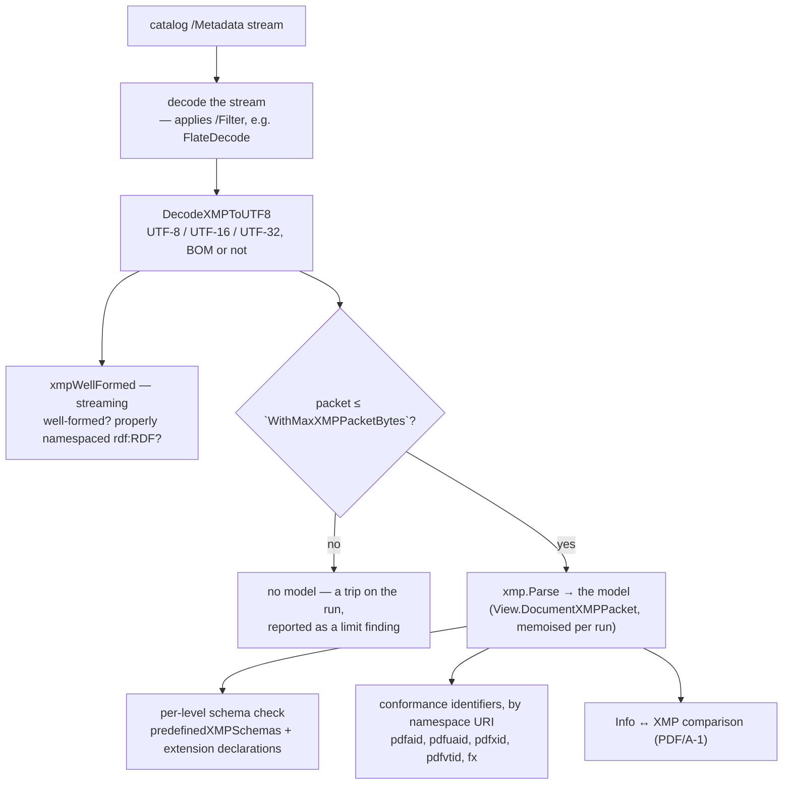

# XMP metadata

Every conformance standard pdf0 validates declares itself in XMP: PDF/A writes
`pdfaid:part`, PDF/UA `pdfuaid:part`, PDF/X `pdfxid:GTS_PDFXVersion`, PDF/VT
`pdfvtid:GTS_PDFVTVersion`, Factur-X the `fx:` block. The XMP subsystem is
therefore load-bearing for all of them, not a PDF/A detail — and it carries
rules of its own, since PDF/A constrains which properties may appear, in which
schema, with which value form. The model every reader and writer goes through
is `internal/xmp`; the PDF/A rules over it are in `pdfa/xmp.go` (the glue and
the streaming well-formedness check), `pdfa/xmp_schemas.go` (schema tables,
property and extension-schema checks) and `pdfa/identification.go` (the pdfaid
reader). Open this doc before touching a schema table, before adding a rule
that reads metadata, before writing metadata, or when a metadata finding looks
wrong; for how the PDF/A validator runs, see [validators.md](validators.md).

## The pipeline

There is one reader. It used to be two: a DOM for the schema checks and
substring scrapers (`ExtractXMPValue`, `xmpHasKey`, `ExtractXMPAttr`) for every
identification — and the scrapers read a value out of a comment, missed one
written with whitespace around `=` or on an element that carried an attribute,
assumed the canonical prefix, and compared the escaped text (`Smith &amp; Sons`)
with the unescaped Info entry (audit 2026-09-22 C35, C141). Every reader asks
the model for a property by **namespace URI and local name**, and gets a value
the XML parser has already unescaped.

`core.View.DocumentXMPPacket` returns the model and a status: parsed, absent,
malformed (the well-formedness rule's to report) or limit (a trip has been
noted, and the reader must neither guess a value nor report one missing).

## The model — `internal/xmp`

Parsing is stdlib `encoding/xml` only; the library has no XML dependency.
`xmp.Parse` tokenises with `RawToken` and resolves namespaces itself, so every
element keeps both the prefix it was written with and the URI that prefix
means; it checks tag matching, and judges well-formedness exactly as
`encoding/xml`'s `Token` does (a corpus test asserts the agreement on every
packet). The tree keeps everything: processing instructions, comments,
whitespace, namespace declarations, unknown elements, and — per node — the
source bytes it was parsed from. The `CharsetReader` returns its input
unchanged: packets are already UTF-8 by then, but many still carry an
`encoding=` declaration that would otherwise fail the decoder, and nothing is
fetched from outside.

`Packet.Properties` walks every `rdf:Description` child of every `rdf:RDF` (a
real Factur-X file carries its `fx` block in a second `rdf:RDF`) and yields one
`Property` per property in either serialisation: **attribute form** (any
attribute that is neither a namespace declaration nor in the RDF/`xml:`
namespace) and **element form** (any child element outside the RDF namespace).
`Get`, `Lookup` and `Text` look one up.

Values classify into a `Kind` — `Simple`, `Struct`, `Bag`, `Seq`, `Alt`. The
subtle cases, each pinned by `TestParseXMPPropertyForms`:

- `rdf:parseType="Resource"` normally means a structure — **unless** it
  contains an `rdf:value` child, which makes it a *qualified simple value* (the
  siblings are qualifiers, e.g. `xmpidq:Scheme` on `xmp:Identifier` items). The
  same applies to the nested-`rdf:Description` form.
- `rdf:resource="…"` is a simple value flagged `IsURI`; `xml:lang` sets
  `HasLang` and `Lang`, which is what the language-alternative rule tests and
  what `Value.AltText("x-default")` selects by. Non-RDF children with no
  `parseType` become structure fields, and non-namespace attributes on a
  structure are shorthand fields.
- Element text is whitespace-trimmed; an attribute value is not — veraPDF's
  6-1-5 pass files carry a trailing space in an attribute-form `pdf:Producer`
  that matches the Info entry's.

### Writing: edit, don't regenerate

Every metadata writer — `SetDocumentInfo`, `NewPDFADocument…` /
`GenerateXMPMetadata`, `EmbedFacturX` / `EmbedOrderX` / `facturx.XMPPacket` —
edits a packet through the model (`core.EditableXMP` parses the document's own).
`SetText`, `SetAltText` (one language item; the others are kept), `SetSeq`,
`SetBag`, `Remove` and `SetExtensionSchema` (replace the declaration for one
namespace, keep the rest) change one property and remove its duplicates, in
either form; a new namespace is declared with the preferred prefix when it is
free and another when that prefix already means something else in scope.
Writers used to build a fresh packet, which destroyed every property another
writer had put there — the Factur-X, PDF/UA, PDF/X and PDF/VT identification
among them (C32, C44).

`Packet.Bytes` writes every node an edit did not reach from its source bytes:
an unmodified packet comes back byte for byte, and an edited one differs only
where it was edited. Values are checked on the way in (`xmp.CheckText`: valid
UTF-8, XML 1.0 characters only — `ErrInvalidText`, surfaced as
`pdf0.ErrInvalidMetadataText`), escaping happens in one place, and `Bytes`
re-parses its own output before returning it, so a writer cannot produce a
packet that is not well-formed (C72). A packet that cannot be edited — not
well-formed, no `rdf:RDF`, over the packet limit — is an error, never replaced.

`TestCorpusXMPRoundTrip` proves this on every packet in the veraPDF and
Factur-X corpora: the model parses exactly when `encoding/xml` does, an
unmodified packet round-trips byte for byte, a packet rewritten entirely from
the model (`Packet.Rewrite`, ignoring source bytes) parses to an `Equivalent`
tree, and setting one property changes nothing else a reader can see.

## Encoding normalisation

`DecodeXMPToUTF8` (`internal/core`) accepts XMP in UTF-8, UTF-16 or UTF-32, with or
without a BOM, and returns UTF-8. Order of tests:

1. UTF-32 BOMs (`00 00 FE FF`, `FF FE 00 00`), then UTF-16 BOMs
   (`FE FF`, `FF FE`), then a UTF-8 BOM (`EF BB BF`, skipped).
2. BOM-less heuristic: UTF-32BE `00 00 00 xx`, UTF-32LE `xx 00 00 00`, then
   UTF-16BE `00 xx`, UTF-16LE `xx 00`.

**UTF-32 must be tested before UTF-16 in both stages, and the source comment
says so.** The byte patterns overlap: the UTF-32LE BOM `FF FE 00 00` *starts
with* the UTF-16LE BOM `FF FE`, and BOM-less UTF-32LE `3C 00 00 00` (`<`) also
matches the UTF-16LE rule `xx 00`, just as UTF-32BE `00 00 00 3C` matches the
UTF-16BE rule `00 xx`. Test UTF-16 first and a legal UTF-32 packet decodes into
interleaved NULs — the XML then fails to parse and a conformant file is
reported as having malformed metadata.

`xmpIsUTF8` is the separate, stricter predicate for the PDF/A-4 UTF-8
requirement: it rejects UTF-16/32 BOMs, a leading `00 00`, and — the audit-C24
case — BOM-less UTF-16, detected because a real UTF-8 packet starts with
printable ASCII (`<?xpacket`, `<x:xmpmeta`), so a NUL in the first two bytes
can only mean UTF-16.

`DecodePDFTextString` (`internal/core`) is the other half: it converts an
**Info-dictionary** string — UTF-16BE with a BOM (surrogate pairs handled),
UTF-8 with a BOM in PDF 2.0, or PDFDocEncoding (ISO 32000-2 Annex D.3, via
`internal/pdfdoc`) — to UTF-8 so it can be compared against an XMP value;
without it every UTF-16 Info entry looked "inconsistent" with its metadata
counterpart, and until audit C77 a PDFDocEncoded `(Caf\351)` read as the
invalid UTF-8 `"Caf\xe9"` and mismatched `Café`. The Info↔XMP consistency check
(`checkInfoXMPConsistency`, ISO 19005-1 6.7.3, **PDF/A-1b only**) uses it on
eight pairs (Title/`dc:title`, Author/`dc:creator`, …), each XMP side read
through the model — a language alternative at its `x-default` item, a sequence
at its first — and the two dates compared through `normalizePDFDate` /
`normalizeXMPDate` so `+00:00` and `Z` agree.

## The conformance declarations

| Standard | Property read | Notes |
|---|---|---|
| PDF/A | `pdfaid:part`, `pdfaid:conformance`, `pdfaid:rev` | ns `http://www.aiim.org/pdfa/ns/id/`, read by `readPDFAIdentification` (`pdfa/identification.go`) for every reader: the identification rule, Level A, the A-4 variants and their relaxations, `DeclaredLevel`, `Document.Conformance`/`Save`. `conformance` must be `B` at 1b/2b/3b; at A-4 it must be absent, `F` or `E`, and `rev` must be `2020`. The prefix must be `pdfaid` (ISO 19005-1 Table 3, -2/-3 6.6.4), and a `pdfaid:` prefix bound to another namespace is reported. The schema table also knows `amd` and `corr` (`corr` is dropped at 1b). |
| PDF/UA | `pdfuaid:part` | ns `http://www.aiim.org/pdfua/ns/id/`. Clause 5 also requires the prefix itself to be `pdfuaid` for `part`, `amd` and `corr`. |
| PDF/X | `pdfxid:GTS_PDFXVersion` | ns `http://www.npes.org/pdfx/ns/id/`; a no-namespace `GTS_PDFXVersion` property is accepted as a fallback, and Info `/GTS_PDFXVersion` (decoded as a text string) for the older parts. |
| PDF/VT | `pdfvtid:GTS_PDFVTVersion` | ns `http://www.npes.org/pdfvt/ns/id/`. XMP only — no Info fallback. |
| Factur-X / ZUGFeRD | `DocumentType`, `Version`, `DocumentFileName`, `ConformanceLevel` | in `urn:factur-x:pdfa:CrossIndustryDocument:invoice:1p0#`, or the ZUGFeRD 2.0 / 1.0 invoice namespaces. |
| Order-X | the same four | in `urn:factur-x:pdfa:CrossIndustryDocument:1p0#` (the Order-X specification's XMP example writes it with the prefix `fx_1_`, which the scraper could not read). Each family's validator reports metadata found in the other family's namespace. |

All of these are read by namespace URI. When the packet was over the size limit
the reader reports nothing about the property — the limit finding already says
the metadata was not read — and when it is not well-formed the well-formedness
rule says so.

## Schema validation — `xmp_schemas.go`

A property in a *predefined* schema must exist in that schema's table and match
its value form; a property in any other namespace must be declared by an
embedded PDF/A extension schema. `predefinedXMPSchemas(level)` returns the
table set, and which XMP edition applies depends on the level:

- **PDF/A-1b — XMP 2004.** dc, xmp (Basic), xmpRights, xmpMM, xmpBJ, xmpTPg,
  pdf, photoshop, tiff, exif, pdfaid, with the 2005-only entries removed:
  `pdfaid:corr` dropped, `xmpTPg` only `MaxPageSize`/`NPages`, `pdf` only
  `Keywords`/`PDFVersion`/`Producer`, photoshop without
  `ColorMode`/`ICCProfile`/`TextLayers`, `SupplementalCategories` simple Text.
- **PDF/A-2b and -3b — XMP 2005.** Adds the exif-aux, xmpDM (Dynamic Media),
  Camera Raw and `xmpidq` schemas plus `xmp:Label` and `xmp:Rating`, and takes
  `SupplementalCategories` as a Bag. `TestValidatePDFA_XMPLevelDependentSchemas`
  pins the split: a `crs:` property fails at 1b and passes at 2b.

Each entry is an `xmpPropType{Form, Lang, Syntax}`. `checkXMPValueForm` requires
the structural form to match exactly, then checks the simple-value syntax:
Integer, Real, Rational (`int/int`), Boolean (strictly `True`/`False`), Date
(`YYYY`, `YYYY-MM`, `YYYY-MM-DD`, or a full date-time with optional seconds and
fraction and a `Z` or `±hh:mm` zone). Array items must be simple (or structures
for the struct-array types), and a language alternative requires `xml:lang` on
every item. Rule IDs come from `metadataClause`: properties are `6.7.2` at 1b
and `6.6.2.3.1` at 2b/3b, extension-schema structure `6.7.8` / `6.6.2.3.3`, an
undefined field on an extension-schema object `6.7.8` / `6.6.2.3.2`.

**Extension schemas.** `extensionDeclared` collects `pdfaExtension:schemas` →
`pdfaSchema:namespaceURI` → `pdfaProperty:name` + `valueType`;
`declaredTypeToPropType` maps declared type names (including `Bag …`, `Seq …`,
`Alt …`, `Lang Alt`) onto the same checkable forms, so a declared `Integer`
property holding a non-integer is flagged. Unknown type names apply no
*syntax* check, but the value still has to match the shape the schema declares:
a structure value's fields must appear in the type's `pdfaType:field` list, and
a type that lists any `pdfaType:field` must be written as a structure rather
than as text (`extensionTypeFields`, Isartor 6.7.8-t02-fail-k — the last
undetected file in that suite). A custom type that lists no fields is a simple
type under another name, so a text value is what it should have. `checkXMPExtensionContainer`
validates the container itself: `schemas` must be a Bag of structures carrying
`schema`/`namespaceURI`/`prefix`; property definitions require
`name`/`valueType`/`category`/`description` with `category` ∈ {`internal`,
`external`}; value types require `type`/`namespaceURI`/`prefix`/`description`;
field definitions require `name`/`valueType`/`description`, and a field's value
type must be a standard XMP type (`standardXMPValueTypes`) or one the same
schema declares (Isartor 6.7.8-t02-fail-j/k).

**The prefix rule is checked against the namespace declarations the model
found** (`Packet.Declarations`). The container namespaces must use the prefixes
`pdfaExtension`, `pdfaSchema`, `pdfaProperty`, `pdfaType`, `pdfaField` —
binding the right URI to a different prefix is itself a violation. This used to
be a scan of the packet text for `="URI"`, which had to be taught both quote
styles (audit C33) and still counted a declaration inside a comment; the
declarations are now read as XML declares them, in any spelling.

## PDF/A-4 deliberately skips property-value validation

`checkXMPProperties` returns `nil` immediately when `level == PDFA4`, and the
comment at the top of the function explains why: this is deliberate, not a TODO
— the veraPDF corpus proves A-4 tolerates non-conforming XMP property values.
The file it names, `PDF_A-4/6.1.5/…6-1-5-t02-pass-a.pdf`, carries
`xmp:CreateDate="D:20221116191452+00'00"` — a PDF date string, not an
XMP/ISO 8601 date — and still passes at A-4 (verified in the corpus copy under
`testdata/verapdf-corpus/PDF_A-4/6.1 File structure/6.1.5 String objects/`).
Enabling these checks at A-4 therefore produces false positives on conformant
files. A-4 XMP is instead governed by the well-formedness and UTF-8
requirements, checked separately in `checkXMPWellFormed`.

**Do not enable strict property validation at A-4** without corpus evidence
that veraPDF requires it — the source says exactly that. It was re-investigated
in 2026-07-12 and the conclusion held even for conservative variants.

## The RelaxNG cross-check

`xmp_rng_test.go` (`TestXMPTablesMatchRNG`) validates pdf0's hand-written
tables against the ISO 16684 RELAX NG schemas vendored in `testdata/xmp-rng/`
(15 `XMP_Properties-*.rng` files from ceztko/XMP-RNG-Schema, MIT; see the
directory's `NOTICE.md`). Unlike the veraPDF corpus and the Arlington model,
these files are **committed to the repository**, so the guard runs on any
checkout — a checkout without them fails the test rather than skipping it. They
are test-only; the library does not read them.

The test parses each schema with `encoding/xml`, evaluates the schemas'
`condition` attributes (`$IsPDFA1`…`$IsPDFA4`, `$IsPDFAxOrGreater`) at PDF/A
levels 1 and 2, normalises both sides into a common `form/value` vocabulary and
asserts **type drift** (any property both sides type as a clean scalar/array/alt
must agree) plus **presence parity** for the namespaces pdf0 models completely
(dc, xmp, xmpRights, pdf, tiff, photoshop, pdfaid, xmpTPg, xmpBJ). The large
media namespaces — xmpDM, exif, crs — are deliberately partial and checked for
drift only; struct and custom types are skipped on both sides. What that proves
is that the tables are not drifting from an independent statement of the same
schemas: an edit that mistypes a property fails a test instead of silently
changing validation results.

Four deviations are allowlisted in `xmpRNGAllowlist`, pdf0 spec-correct in each:
`xmp:Rating` (Real per ISO 16684-1; the RNG says Integer at A-2/3 and flags its
own uncertainty with a CHECK-ME), `exif:GPSDestDistance` (RATIONAL per EXIF;
the RNG relaxes it to Text), and `pdfaid:part` / `pdfaid:rev` (integers per
PDF/A; the RNG models them as closed string choices). A `pdfuaid` schema is
vendored but pdf0 has no predefined `pdfuaid` table, so the test skips it.

## DoS guards

XMP arrives from untrusted files, and the validator is often the first thing to
touch one.

- **XMP packet size** (`WithMaxXMPPacketBytes`, default 4 MiB). Above it the
  packet is not modelled: `DocumentXMPPacket` notes an `xmp-packet-size` trip,
  which reaches the report as a "limit" finding, and every reader declines —
  **never** a violation, and never a clean result either. (Until audit
  2026-09-22 the skip was silent.) The writers refuse to edit such a packet.

  The default was 2 MiB, justified by the largest packet in the veraPDF corpus
  being 66 KB. A 978-file Common Crawl sample falsified that: the largest real
  packet there is 1,639,865 bytes — 25x the corpus maximum, and 78% of the old
  cap. It is 4 MiB rather than 8 because building the old tree was quadratic
  (a 14 MB packet took ~37 s, from string concatenation and GC over the live
  tree); the model's construction is linear, but the bound stays until it has
  been measured again.
- **Streaming well-formedness.** `xmpWellFormed` answers "well-formed?" and
  "has a properly namespaced `rdf:RDF`?" from the token stream with no tree, so
  it stays O(n) and those two rules still apply to a packet too big to analyse
  for properties. `TestXMPStreamingMatchesTree` asserts it agrees with the
  older tree-based path, so the optimisation changed no outcome.
- **Entity expansion.** `encoding/xml` in strict mode neither defines nor
  expands DTD entities: a billion-laughs packet fails with `invalid character
  entity` (verified directly), surfacing as a "not well-formed XML" finding
  rather than memory exhaustion. The `CharsetReader` hooks return their input
  unchanged, so nothing external is loaded either.
- **Nesting depth.** The value readers and the serialiser recurse once per
  level, so `xmp.Parse` refuses a packet nested deeper than `xmp.MaxDepth`
  (256) with `ErrLimit`; the reader reports it as an `xmp-depth` trip. Real
  packets nest about a dozen levels.

Regression tests: `TestXMPLargePacketBounded` (cap lowered to 4 KiB: not
modelled, a trip noted, well-formedness still clean), `TestDepthLimit` and `TestXMPManyElementsFast`
(200 000 elements under 5 s; tens of seconds before the tree build was
bypassed).

## Maintenance and limitations

The schema tables are **hand-written** from the XMP specifications — not
generated, unlike forme's `font/cff_strings.go` and `font/font_encodings.go`. To change one: edit
the table in `xmp_schemas.go`, run `TestXMPTablesMatchRNG`, add an
`xmpRNGAllowlist` entry *with a rationale* only when pdf0 is deliberately
spec-correct against the RNG, then re-run the corpus ratchet — the corpus, not
a spec reading, is the oracle ([ADR 0001](adr/0001-corpus-as-oracle.md)).

Confirmed limitations:

- Property-value validation is off at PDF/A-4 by design (above).
- `checkXMPProperties` reads only the **catalog** `/Metadata` stream; XMP
  attached to pages or XObjects is not schema-checked.
- The xmpMM, exif, xmpDM and Camera Raw tables are partial: type agreement is
  enforced on what is listed, presence parity is not.
- Structure *fields* are validated only for extension-declared custom types;
  predefined structured types (`ResourceRef`, `Thumbnail`, …) are checked for
  form, not field names.
- An oversized packet skips property, extension-schema and identification
  checks, and says so with a limit finding; only well-formedness and the
  packet-header rules still apply.

On the writing side, `GenerateXMPMetadata` (`pdfa/create.go`) builds the
packet pdf0's PDF/A builder embeds, through the model: the wrapper `xmp.New`
writes (a BOM as the `begin` value, and an `<?xpacket?>` header with neither a
`bytes` nor an `encoding` attribute, both forbidden by 6.7.5 / 6.6.2.1 /
6.7.2.1), the `pdfaid` part/conformance/rev properties, optional `dc:title`
and `dc:creator`, and `xmp:CreatorTool`. A title or author XML cannot carry is
an error, not a character silently dropped.
