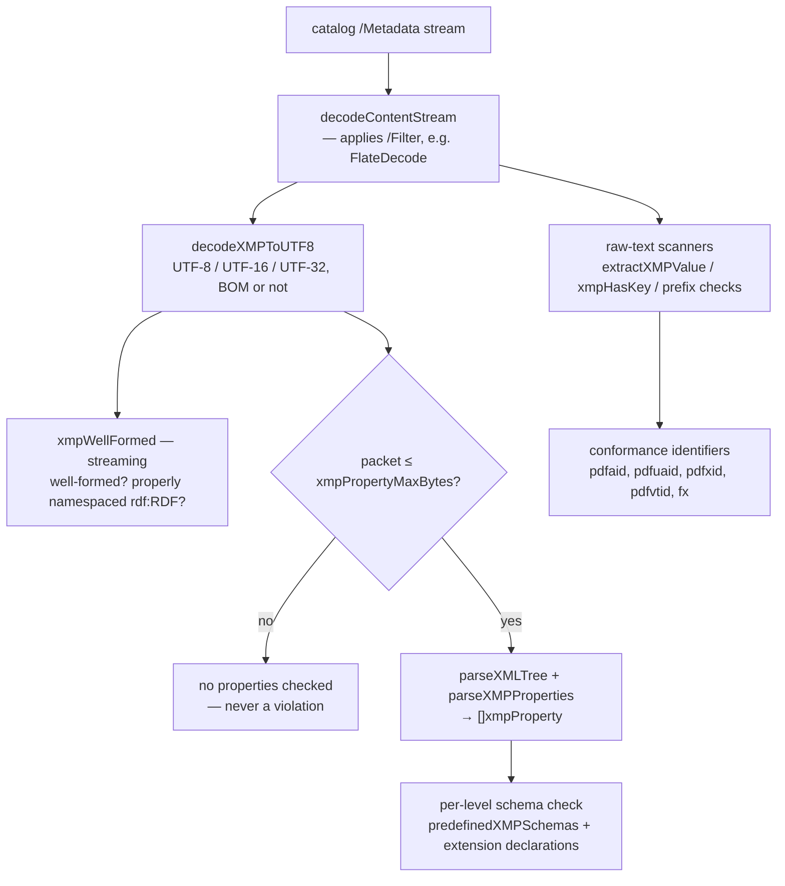

# XMP metadata

Every conformance standard pdf0 validates declares itself in XMP: PDF/A writes
`pdfaid:part`, PDF/UA `pdfuaid:part`, PDF/X `pdfxid:GTS_PDFXVersion`, PDF/VT
`pdfvtid:GTS_PDFVTVersion`, Factur-X the `fx:` block. The XMP subsystem is
therefore load-bearing for all of them, not a PDF/A detail — and it carries
rules of its own, since PDF/A constrains which properties may appear, in which
schema, with which value form. Two files implement it: `xmp.go` (parsing) and
`xmp_schemas.go` (schema tables, property and extension-schema checks), with
the encoding helpers in `pdfa.go`. Open this doc before touching a schema
table, before adding a rule that reads metadata, or when a metadata finding
looks wrong; for how the PDF/A validator runs, see
[validators.md](validators.md).

## The pipeline

Two readers coexist on purpose: the DOM path (`parseXMPProperties`) where
structure matters, and the substring scanners (`extractXMPValue`, `xmpHasKey`
in `pdfa.go`) where one literal value is wanted — which is what every
non-PDF/A validator uses.

## Parsing — `xmp.go`

Parsing is stdlib `encoding/xml` only; the library has no XML dependency.
`parseXMLTree` streams tokens into a minimal `xmlNode` DOM using an explicit
stack rather than recursion, and its `CharsetReader` returns the input
unchanged — packets are already UTF-8 by then, but many still carry an
`encoding=` declaration that would otherwise fail the decoder, and nothing is
fetched from outside. `parseXMPProperties` finds `rdf:RDF` anywhere under the
root (`findRDF`), walks each `rdf:Description` child, and emits one
`xmpProperty` per property in either serialisation: **attribute form** (any
attribute that is neither a namespace declaration nor in the RDF/`xml:`
namespace) and **element form** (any child element outside the RDF namespace).

`parseXMPValue` classifies the value into an `xmpKind` — `xmpSimple`,
`xmpStruct`, `xmpBag`, `xmpSeq`, `xmpAlt`. The subtle cases, each pinned by
`TestParseXMPPropertyForms`:

- `rdf:parseType="Resource"` normally means a structure — **unless** it
  contains an `rdf:value` child, which makes it a *qualified simple value* (the
  siblings are qualifiers, e.g. `xmpidq:Scheme` on `xmp:Identifier` items). The
  same applies to the nested-`rdf:Description` form.
- `rdf:resource="…"` is a simple value flagged `IsURI`; `xml:lang` sets
  `HasLang`, which is what the language-alternative rule tests. Non-RDF children
  with no `parseType` become structure fields, and non-namespace attributes on
  a structure are shorthand fields.

## Encoding normalisation

`decodeXMPToUTF8` (`pdfa.go`) accepts XMP in UTF-8, UTF-16 or UTF-32, with or
without a BOM, and returns UTF-8. Order of tests:

1. UTF-32 BOMs (`00 00 FE FF`, `FF FE 00 00`), then UTF-16 BOMs
   (`FE FF`, `FF FE`), then a UTF-8 BOM (`EF BB BF`, skipped).
2. BOM-less heuristic: UTF-32BE `00 00 00 xx`, UTF-32LE `xx 00 00 00`, then
   UTF-16BE `00 xx`, UTF-16LE `xx 00`.

**UTF-32 must be tested before UTF-16 in both stages, and the source comment
says so.** The byte patterns overlap: the UTF-32LE BOM `FF FE 00 00` *starts
with* the UTF-16LE BOM `FF FE`, and BOM-less UTF-32LE `3C 00 00 00` (`<`) also
matches the UTF-16LE rule `xx 00`, just as UTF-32BE `00 00 00 3C` matches the
UTF-16BE rule `00 xx`. Test UTF-16 first and a legal UTF-32 packet decodes into
interleaved NULs — the XML then fails to parse and a conformant file is
reported as having malformed metadata.

`xmpIsUTF8` is the separate, stricter predicate for the PDF/A-4 UTF-8
requirement: it rejects UTF-16/32 BOMs, a leading `00 00`, and — the audit-C24
case — BOM-less UTF-16, detected because a real UTF-8 packet starts with
printable ASCII (`<?xpacket`, `<x:xmpmeta`), so a NUL in the first two bytes
can only mean UTF-16.

`decodePDFTextString` (`pdfa.go`) is the other half: it converts an
**Info-dictionary** string — UTF-16BE with a BOM (surrogate pairs handled),
UTF-8 with a BOM in PDF 2.0, or PDFDocEncoding — to UTF-8 so it can be compared
against an XMP value; without it every UTF-16 Info entry looked "inconsistent"
with its metadata counterpart. The Info↔XMP consistency check
(`checkInfoXMPConsistency`, ISO 19005-1 6.7.3, **PDF/A-1b only**) uses it on
eight pairs (Title/`dc:title`, Author/`dc:creator`, …), the two dates compared
through `normalizePDFDate` / `normalizeXMPDate` so `+00:00` and `Z` agree.

## The conformance declarations

| Standard | Property read | Notes |
|---|---|---|
| PDF/A | `pdfaid:part`, `pdfaid:conformance`, `pdfaid:rev` | ns `http://www.aiim.org/pdfa/ns/id/`, verified when any `pdfaid:` appears. `conformance` must be `B` at 1b/2b/3b; at A-4 it must be absent, `F` or `E`, and `rev` must be `2020`. The schema table also knows `amd` and `corr` (`corr` is dropped at 1b). |
| PDF/UA | `pdfuaid:part` | ns `http://www.aiim.org/pdfua/ns/id/`. Clause 5 also requires the prefix itself to be `pdfuaid`, checked via `xmpBindsPrefixTo` (`pdfua.go`). |
| PDF/X | `pdfxid:GTS_PDFXVersion` | bare `GTS_PDFXVersion` accepted as a fallback, and Info `/GTS_PDFXVersion` for the older parts. |
| PDF/VT | `pdfvtid:GTS_PDFVTVersion` | XMP only — no Info fallback. |
| Factur-X / ZUGFeRD | `fx:DocumentType`, `fx:Version`, `fx:DocumentFileName`, `fx:ConformanceLevel` | `zf:` is accepted as the ZUGFeRD-era equivalent. |

All of these go through `extractXMPValue`, which handles `<key>value</key>` and
both `key="value"` and `key='value'` attribute forms (single quotes were audit
C32/C33). Because it matches the literal prefixed name it assumes the canonical
prefix — which is why `checkMetadataVersion` separately verifies that
`xmlns:pdfaid` is bound to the right URI, and PDF/UA checks prefix bindings.

## Schema validation — `xmp_schemas.go`

A property in a *predefined* schema must exist in that schema's table and match
its value form; a property in any other namespace must be declared by an
embedded PDF/A extension schema. `predefinedXMPSchemas(level)` returns the
table set, and which XMP edition applies depends on the level:

- **PDF/A-1b — XMP 2004.** dc, xmp (Basic), xmpRights, xmpMM, xmpBJ, xmpTPg,
  pdf, photoshop, tiff, exif, pdfaid, with the 2005-only entries removed:
  `pdfaid:corr` dropped, `xmpTPg` only `MaxPageSize`/`NPages`, `pdf` only
  `Keywords`/`PDFVersion`/`Producer`, photoshop without
  `ColorMode`/`ICCProfile`/`TextLayers`, `SupplementalCategories` simple Text.
- **PDF/A-2b and -3b — XMP 2005.** Adds the exif-aux, xmpDM (Dynamic Media),
  Camera Raw and `xmpidq` schemas plus `xmp:Label` and `xmp:Rating`, and takes
  `SupplementalCategories` as a Bag. `TestValidatePDFA_XMPLevelDependentSchemas`
  pins the split: a `crs:` property fails at 1b and passes at 2b.

Each entry is an `xmpPropType{Form, Lang, Syntax}`. `checkXMPValueForm` requires
the structural form to match exactly, then checks the simple-value syntax:
Integer, Real, Rational (`int/int`), Boolean (strictly `True`/`False`), Date
(`YYYY`, `YYYY-MM`, `YYYY-MM-DD`, or a full date-time with optional seconds and
fraction and a `Z` or `±hh:mm` zone). Array items must be simple (or structures
for the struct-array types), and a language alternative requires `xml:lang` on
every item. Rule IDs come from `metadataClause`: properties are `6.7.2` at 1b
and `6.6.2.3.1` at 2b/3b, extension-schema structure `6.7.8` / `6.6.2.3.3`, an
undefined field on an extension-schema object `6.7.8` / `6.6.2.3.2`.

**Extension schemas.** `extensionDeclared` collects `pdfaExtension:schemas` →
`pdfaSchema:namespaceURI` → `pdfaProperty:name` + `valueType`;
`declaredTypeToPropType` maps declared type names (including `Bag …`, `Seq …`,
`Alt …`, `Lang Alt`) onto the same checkable forms, so a declared `Integer`
property holding a non-integer is flagged. Unknown type names apply no value
check, but a structure value's fields must appear in the type's
`pdfaType:field` list (`extensionTypeFields`). `checkXMPExtensionContainer`
validates the container itself: `schemas` must be a Bag of structures carrying
`schema`/`namespaceURI`/`prefix`; property definitions require
`name`/`valueType`/`category`/`description` with `category` ∈ {`internal`,
`external`}; value types require `type`/`namespaceURI`/`prefix`/`description`;
field definitions require `name`/`valueType`/`description`, and a field's value
type must be a standard XMP type (`standardXMPValueTypes`) or one the same
schema declares (Isartor 6.7.8-t02-fail-j/k).

**The prefix rule is checked against raw text, not the parsed tree.** The
container namespaces must use the prefixes `pdfaExtension`, `pdfaSchema`,
`pdfaProperty`, `pdfaType`, `pdfaField` — binding the right URI to a different
prefix is itself a violation — but `encoding/xml` resolves prefixes to URIs and
discards them, so the tree cannot answer the question. The check scans the
packet text for `="URI"` and `='URI'` (both quote styles: matching only double
quotes let a single-quoted `xmlns` declaration evade the rule, audit C33),
walks back to the `xmlns:` marker and compares the prefix it finds.

## PDF/A-4 deliberately skips property-value validation

`checkXMPProperties` returns `nil` immediately when `level == PDFA4`, and the
comment at the top of the function explains why: this is deliberate, not a TODO
— the veraPDF corpus proves A-4 tolerates non-conforming XMP property values.
The file it names, `PDF_A-4/6.1.5/…6-1-5-t02-pass-a.pdf`, carries
`xmp:CreateDate="D:20221116191452+00'00"` — a PDF date string, not an
XMP/ISO 8601 date — and still passes at A-4 (verified in the corpus copy under
`testdata/verapdf-corpus/PDF_A-4/6.1 File structure/6.1.5 String objects/`).
Enabling these checks at A-4 therefore produces false positives on conformant
files. A-4 XMP is instead governed by the well-formedness and UTF-8
requirements, checked separately in `checkXMPWellFormed`.

**Do not enable strict property validation at A-4** without corpus evidence
that veraPDF requires it — the source says exactly that. It was re-investigated
in 2026-07-12 and the conclusion held even for conservative variants.

## The RelaxNG cross-check

`xmp_rng_test.go` (`TestXMPTablesMatchRNG`) validates pdf0's hand-written
tables against the ISO 16684 RELAX NG schemas vendored in `testdata/xmp-rng/`
(15 `XMP_Properties-*.rng` files from ceztko/XMP-RNG-Schema, MIT; see the
directory's `NOTICE.md`). Unlike the veraPDF corpus and the Arlington model,
these files are **committed to the repository**, so the guard runs on any
checkout — it skips only if they are absent. They are test-only; the library
stays dependency-free.

The test parses each schema with `encoding/xml`, evaluates the schemas'
`condition` attributes (`$IsPDFA1`…`$IsPDFA4`, `$IsPDFAxOrGreater`) at PDF/A
levels 1 and 2, normalises both sides into a common `form/value` vocabulary and
asserts **type drift** (any property both sides type as a clean scalar/array/alt
must agree) plus **presence parity** for the namespaces pdf0 models completely
(dc, xmp, xmpRights, pdf, tiff, photoshop, pdfaid, xmpTPg, xmpBJ). The large
media namespaces — xmpDM, exif, crs — are deliberately partial and checked for
drift only; struct and custom types are skipped on both sides. What that proves
is that the tables are not drifting from an independent statement of the same
schemas: an edit that mistypes a property fails a test instead of silently
changing validation results.

Four deviations are allowlisted in `xmpRNGAllowlist`, pdf0 spec-correct in each:
`xmp:Rating` (Real per ISO 16684-1; the RNG says Integer at A-2/3 and flags its
own uncertainty with a CHECK-ME), `exif:GPSDestDistance` (RATIONAL per EXIF;
the RNG relaxes it to Text), and `pdfaid:part` / `pdfaid:rev` (integers per
PDF/A; the RNG models them as closed string choices). A `pdfuaid` schema is
vendored but pdf0 has no predefined `pdfuaid` table, so the test skips it.

## DoS guards

XMP arrives from untrusted files, and the validator is often the first thing to
touch one.

- **`xmpPropertyMaxBytes` = 2 MiB** (a `var`, so tests can lower it). Building
  the node tree is O(n²) in practice: a large packet yields hundreds of
  thousands of nodes whose incremental construction triggers thousands of GC
  cycles, each rescanning the growing live tree — a 14 MB packet took ~37 s.
  The largest packet in the veraPDF corpus is 66 KB, so the bound sits orders
  of magnitude above anything legitimate. Over the cap `parseXMPProperties`
  errors and callers treat it as "no properties to check" — **never** a
  violation, so a large valid file is not failed.
- **Streaming well-formedness.** `xmpWellFormed` answers "well-formed?" and
  "has a properly namespaced `rdf:RDF`?" from the token stream with no tree, so
  it stays O(n) and those two rules still apply to a packet too big to analyse
  for properties. `TestXMPStreamingMatchesTree` asserts it agrees with the
  older tree-based path, so the optimisation changed no outcome.
- **Entity expansion.** `encoding/xml` in strict mode neither defines nor
  expands DTD entities: a billion-laughs packet fails with `invalid character
  entity` (verified directly), surfacing as a "not well-formed XML" finding
  rather than memory exhaustion. The `CharsetReader` hooks return their input
  unchanged, so nothing external is loaded either.
- **No explicit nesting-depth cap.** `parseXMLTree` is iterative, but
  `parseXMPValue`/`parseXMPFields` recurse once per nesting level, so the size
  cap is the only bound on depth — adequate at 2 MiB, and the guard to revisit
  if that cap is ever raised.

Regression tests: `TestXMPLargePacketBounded` (cap lowered to 4 KiB: property
extraction refused, well-formedness still clean) and `TestXMPManyElementsFast`
(200 000 elements under 5 s; tens of seconds before the tree build was
bypassed).

## Maintenance and limitations

The schema tables are **hand-written** from the XMP specifications — not
generated, unlike `cff_strings.go` and `font_encodings.go`. To change one: edit
the table in `xmp_schemas.go`, run `TestXMPTablesMatchRNG`, add an
`xmpRNGAllowlist` entry *with a rationale* only when pdf0 is deliberately
spec-correct against the RNG, then re-run the corpus ratchet — the corpus, not
a spec reading, is the oracle ([ADR 0001](adr/0001-corpus-as-oracle.md)).

Confirmed limitations:

- Property-value validation is off at PDF/A-4 by design (above).
- `checkXMPProperties` reads only the **catalog** `/Metadata` stream; XMP
  attached to pages or XObjects is not schema-checked.
- The xmpMM, exif, xmpDM and Camera Raw tables are partial: type agreement is
  enforced on what is listed, presence parity is not.
- Structure *fields* are validated only for extension-declared custom types;
  predefined structured types (`ResourceRef`, `Thumbnail`, …) are checked for
  form, not field names.
- Identifier extraction is literal-prefix substring matching, so it assumes the
  canonical prefix; only the pdfaid and pdfuaid bindings are verified separately.
- An oversized packet skips property and extension-schema checks entirely; only
  well-formedness and the packet-header rules still apply.

On the writing side, `GenerateXMPMetadata` (`pdfa_create.go`) emits the packet
pdf0's PDF/A builder embeds: a UTF-8 BOM, an `<?xpacket?>` header with neither
a `bytes` nor an `encoding` attribute (both forbidden by 6.7.5 / 6.6.2.1 /
6.7.2.1), the `pdfaid` part/conformance/rev block, optional `dc:title` and
`dc:creator`, and `xmp:CreatorTool`. `xmlEscape` drops control characters
illegal in XML 1.0 even when escaped, which previously produced malformed XMP.
